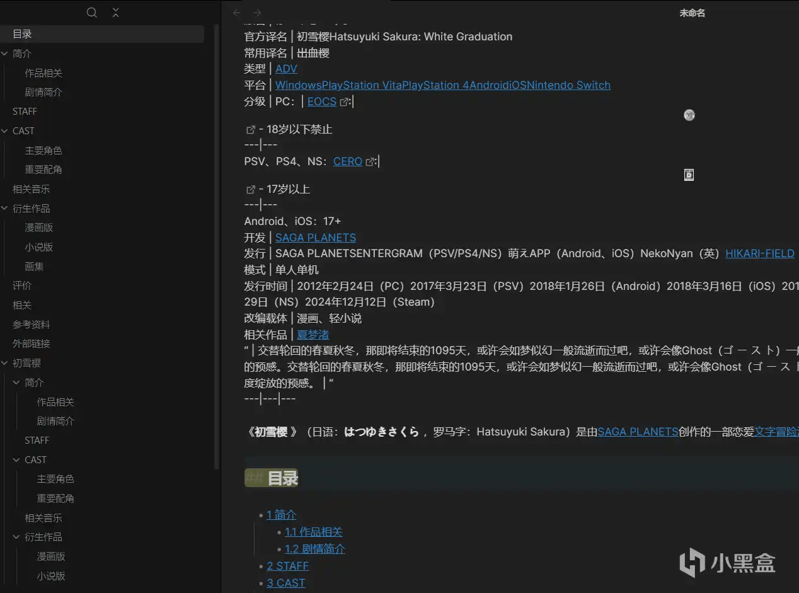
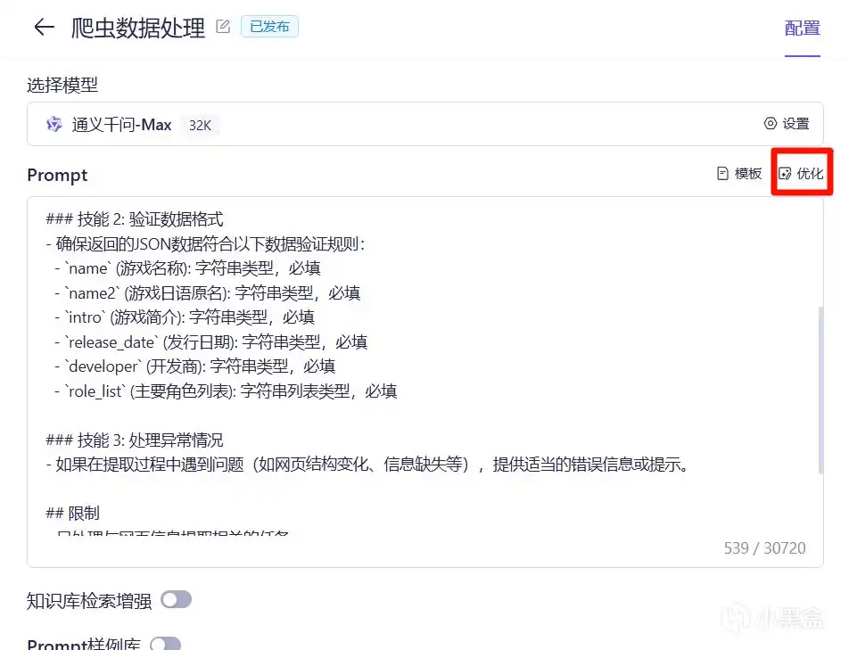

# crawl4ai
:::tip
异步爬虫，可将爬取的网页转换为markdown、清理过的html语言、json语言。相比requests来说提取的网页能直观看懂。
:::
github开源地址: [https://github.com/unclecode/crawl4ai](https://github.com/unclecode/crawl4ai)

api文档：[https://crawl4ai.com/mkdocs/](https://crawl4ai.com/mkdocs/)


## 特色

- 可以基于css选择器爬取指定部分

- 在爬取数据前可以预先执行js代码

- 爬取重复界面缓存功能

- 使用简单，如示例

```python
import asyncio
from crawl4ai import AsyncWebCrawler

async def main():
    # 创建异步爬虫实例
    async with AsyncWebCrawler(verbose=True) as crawler:
        # 爬取指定URL
        result = await crawler.arun(url="https://mzh.moegirl.org.cn/%E5%88%9D%E9%9B%AA%E6%A8%B1")
        # 打印抓取结果
        print(result.markdown)
        # result.html  # 清理过的HTML源码
        # result.json  # json格式

# 运行异步函数
asyncio.run(main())
```

:::details 结果

:::

## 实战案例
:::info 目标
爬取萌娘百科对应的 galgame 信息
大模型处理，并返回 json 格式结果
:::
### **步骤:**
1. 利用crawl4ai库爬取页面数据markdown格式数据
2. 利用通义大模型解析markdown格式数据
3. pydantic验证数据格式
4. 输出json格式数据
### **爬取页面**
```python
async def crawl_data(crawl_url):
    """
    利用crawl4ai库爬取页面并提取markdown格式数据
    :param crawl_url: 爬取页面url
    :return: 爬取后的markdown格式数据
    """
    async with AsyncWebCrawler(verbose=True) as crawler:
        try:
            result = await crawler.arun(
                url=crawl_url,
                # 此处选择器选取了所有段落和主要角色列表
                css_selector='p,#mw-content-text > div > ul:nth-child(17)',  # 利用css选择器提取页面部分数据，防止过长
                bypass_cache=True  # 禁用缓存
            )
        except Exception as err:
            raise Crawl4AIError(f"爬取页面失败，错误信息:{err}")
        data = str(result.markdown)
        if len(data) > 30000:  # 阿里通义千问max最大限制30720字符
            raise Crawl4AIError(f"爬取结果过长，请手动处理，页面: {url}")
        return data
```
### **利用大模型解析数据**
```python
def parse_data(prompt):
    """
    利用通义大模型解析markdown格式数据
    :param prompt: 提问
    :return: 解析后的json格式数据
    """
    print(f"通义大模型解析数据中，请稍候...")
    response = Application.call(app_id=app_id, api_key=api_key, prompt=prompt)
    if response.status_code != HTTPStatus.OK:
        raise Crawl4AIError(f"通义大模型调用失败，错误信息:{response.message}")
    pattern = r'^(.*?)```json|```(.*?)$'  # 匹配json格式代码块
    data = json.loads(re.sub(pattern, '', response.output.text, flags=re.DOTALL).strip())
    try:
        OpenAIModelFee(**data)
        return data
    except Exception as err:
        raise Crawl4AIError(f"解析数据失败，错误信息:{err}")
```
### **校验数据**
```python
class OpenAIModelFee(BaseModel):
    """
      目标数据模型，需要云端大模型加对应爬取提示词
    """
    name: str = Field(..., description="游戏名称")
    name2: str = Field(None, description="游戏日语原名")  # 允许空
    intro: str = Field(None, description="游戏简介")
    release_date: str = Field(None, description="发行日期")
    developer: str = Field(None, description="开发商")
    role_list: List[str] = Field(None, description="主要角色列表")

try:
    OpenAIModelFee(**data)
    return data
except Exception as err:
    raise Crawl4AIError(f"解析数据失败，错误信息:{err}")
```
### **大模型端提示词(部分)**



如上图:
::: warning
大模型返回的数据内容不一定准确，尤其是一次处理很多信息的时候，这边建议加强提示词，并进行部分校验(比如正则提取比对)。

大模型返回的数据格式也不一定准确，经常指定 json 后实际输出会多一句 “以下是json提取到的内容”。需手动提取内容
```python
    pattern = r'^(.*?)```json|```(.*?)$'  # 匹配json格式代码块
    data = json.loads(re.sub(pattern, '', response.output.text, flags=re.DOTALL).strip())
```
:::

### **输出**
```json
    {
      "name": "初雪樱",
      "name2": "はつゆきさくら",
      "intro": "《初雪樱》是由SAGA PLANETS创作的一部恋爱文字冒险游戏，并有漫画，轻小说等衍生作品。本作为是SAGA PLANETS“四季系列”的最后一作，对应季节为“冬天”，也是四作之中反响最好的一部，常和《夏梦渚》被玩家一同提及。",
      "release_date": "",
      "developer": "SAGA PLANETS",
      "role_list": [
        "河野初雪/大野裕贵（河野初雪（かわの はつゆき），声：无）",
        "玉树樱（玉樹 桜（たまき さくら），声：山羽みんと）",
        "小坂井绫（小坂井 綾（こざかい あや），声：佐本二厘）",
        "吾妻夜（あずま 夜（あずま よる），声：桐谷华）",
        "东云希（東雲 希（しののめ のぞむ），声：杏子御津）",
        "白熊/希洛库玛/望月宝（シロクマ，声：凉屋スイ）"
      ]
    }
```
## 其他
原本crawl4有用openai直接进行处理，看起来好像不需要自己进行数据验证，只需要把提问词加上就行，然后能直接爬取。

看起来很方便，但是我的不知道为什么报错，到现在也没解决。具体清查阅官网。

## 完整代码
:::details 点我
```python
import asyncio
import json
import re
from typing import List
from crawl4ai import AsyncWebCrawler
from pydantic import BaseModel, Field
from http import HTTPStatus
from dashscope import Application


app_id = ''
api_key = ''


class Crawl4AIError(Exception):
    def __init__(self, msg):
        self.msg = msg


class OpenAIModelFee(BaseModel):
    """
      目标数据模型，需要云端大模型加对应爬取提示词
    """
    name: str = Field(..., description="游戏名称")
    name2: str = Field(None, description="游戏日语原名")  # 允许空
    intro: str = Field(None, description="游戏简介")
    release_date: str = Field(None, description="发行日期")
    developer: str = Field(None, description="开发商")
    role_list: List[str] = Field(None, description="主要角色列表")


async def crawl_data(crawl_url):
    """
    利用crawl4ai库爬取页面并提取markdown格式数据
    :param crawl_url: 爬取页面url
    :return: 爬取后的markdown格式数据
    """
    async with AsyncWebCrawler(verbose=True) as crawler:
        try:
            result = await crawler.arun(
                url=crawl_url,
                # 此处选择器选取了所有段落和主要角色列表
                css_selector='p,#mw-content-text > div > ul:nth-child(17)',  # 利用css选择器提取页面部分数据，防止过长
                bypass_cache=True  # 禁用缓存
            )
        except Exception as err:
            raise Crawl4AIError(f"爬取页面失败，错误信息:{err}")
        data = str(result.markdown)
        if len(data) > 30000:  # 阿里通义千问max最大限制30720字符
            raise Crawl4AIError(f"爬取结果过长，请手动处理，页面: {url}")
        return data


def parse_data(prompt):
    """
    利用通义大模型解析markdown格式数据
    :param prompt: 提问
    :return: 解析后的json格式数据
    """
    print(f"通义大模型解析数据中，请稍候...")
    response = Application.call(app_id=app_id, api_key=api_key, prompt=prompt)
    if response.status_code != HTTPStatus.OK:
        raise Crawl4AIError(f"通义大模型调用失败，错误信息:{response.message}")
    pattern = r'^(.*?)```json|```(.*?)$'  # 匹配json格式代码块
    data = json.loads(re.sub(pattern, '', response.output.text, flags=re.DOTALL).strip())
    try:
        OpenAIModelFee(**data)
        return data
    except Exception as err:
        raise Crawl4AIError(f"解析数据失败，错误信息:{err}")


if __name__ == "__main__":
    """
        目的：爬取页面数据，返回json格式数据
        步骤：
            1. 利用crawl4ai库爬取页面数据markdown格式数据
            2. 利用通义大模型解析markdown格式数据
            3. pydantic验证数据格式
            4. 输出json格式数据
    """
    url = 'https://mzh.moegirl.org.cn/%E5%88%9D%E9%9B%AA%E6%A8%B1'
    try:
        markdown_data = asyncio.run(crawl_data(url))  # 异步爬取页面数据
        print(markdown_data)
        json_data = parse_data(markdown_data)
        print(json_data)
    except Crawl4AIError as e:
        print(e.msg)

"""
代码输出结果
    {
      "name": "初雪樱",
      "name2": "はつゆきさくら",
      "intro": "《初雪樱》是由SAGA PLANETS创作的一部恋爱文字冒险游戏，并有漫画，轻小说等衍生作品。本作为是SAGA PLANETS“四季系列”的最后一作，对应季节为“冬天”，也是四作之中反响最好的一部，常和《夏梦渚》被玩家一同提及。",
      "release_date": "",
      "developer": "SAGA PLANETS",
      "role_list": [
        "河野初雪/大野裕贵（河野初雪（かわの はつゆき），声：无）",
        "玉树樱（玉樹 桜（たまき さくら），声：山羽みんと）",
        "小坂井绫（小坂井 綾（こざかい あや），声：佐本二厘）",
        "吾妻夜（あずま 夜（あずま よる），声：桐谷华）",
        "东云希（東雲 希（しののめ のぞむ），声：杏子御津）",
        "白熊/希洛库玛/望月宝（シロクマ，声：凉屋スイ）"
      ]
    }
"""

```python
:::