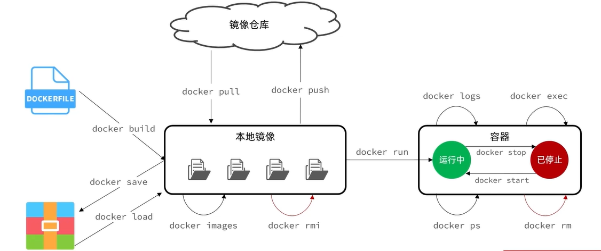
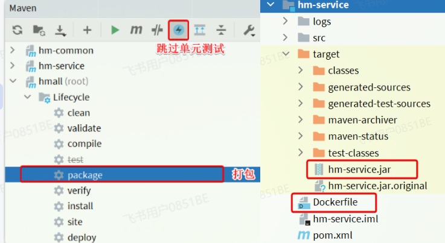

# 下载和配置

## 安装Docker

```Bash
yum install -y docker-ce docker-ce-cli containerd.io docker-buildx-plugin docker-compose-plugin
```

## 验证

```Bash
# 启动Docker
systemctl start docker

# 停止Docker
systemctl stop docker

# 重启
systemctl restart docker

# 设置开机自启
systemctl enable docker

# 执行docker ps命令，如果不报错，说明安装启动成功
docker ps
```

## Docker镜像加速

<https://cr.console.aliyun.com/cn-heyuan/instances/mirrors>

# 常用命令

## 部署mysql

```PowerShell
docker run -d \
  --name mysql \
  -p 3306:3306 \
  -e TZ=Asia/Shanghai \
  -e MYSQL_ROOT_PASSWORD=123 \
  mysql
```

> 解读：
>
> - `docker run -d` ：创建并运行一个容器，`-d`则是让容器以后台进程运行
> - `--name` `mysql` : 给容器起个名字叫`mysql`，你可以叫别的
> - `-p 3306:3306` : 设置端口映射。
>   - **容器是隔离环境**，外界不可访问。但是可以**将宿主机端口映射容器内到端口**，当访问宿主机指定端口时，就是在访问容器内的端口了。
>   - 容器内端口往往是由容器内的进程决定，例如MySQL进程默认端口是3306，因此容器内端口一定是3306；而宿主机端口则可以任意指定，一般与容器内保持一致。
>   - 格式： `-p 宿主机端口:容器内端口`，示例中就是将宿主机的3306映射到容器内的3306端口
> - `-e TZ=Asia/Shanghai` : 配置容器内进程运行时的一些参数
>   - 格式：`-e KEY=VALUE`，KEY和VALUE都由容器内进程决定
>   - 案例中，`TZ``=Asia/Shanghai`是设置时区；`MYSQL_ROOT_PASSWORD=123`是设置MySQL默认密码
> - `mysql` : 设置**镜像**名称，Docker会根据这个名字搜索并下载镜像
>   - 格式：`REPOSITORY:TAG`，例如`mysql:8.0`，其中`REPOSITORY`可以理解为镜像名，`TAG`是版本号
>   - 在未指定`TAG`的情况下，默认是最新版本，也就是`mysql:latest`

## 其他

| **命令**       | **说明**                       | 其他说明                                                               |
| -------------- | ------------------------------ | ---------------------------------------------------------------------- |
| docker pull    | 拉取镜像                       |                                                                        |
| docker push    | 推送镜像到DockerRegistry       |                                                                        |
| docker images  | 查看本地镜像                   |                                                                        |
| docker rmi     | 删除本地镜像                   |                                                                        |
| docker run     | 创建并运行容器（不能重复创建） |                                                                        |
| docker stop    | 停止指定容器                   |                                                                        |
| docker start   | 启动指定容器                   |                                                                        |
| docker restart | 重新启动容器                   |                                                                        |
| docker rm      | 删除指定容器                   | -f 强制删除                                                            |
| docker ps      | 查看容器                       | --format 自定义输出    docker ps -a查看所有(包含停止的)                |
| docker logs    | 查看容器运行日志               | docker logs -f nginx 持续跟踪日志                                      |
| docker exec    | 进入容器                       | docker exec -it nginx bash 进入容器，通过bash进行交互     exit退出容器 |
| docker save    | 保存镜像到本地压缩文件         | docker save -o medi-express.tar medi-express:latest                    |
| docker load    | 加载本地压缩文件到镜像         | docker load -i medi-express.tar                                        |
| docker inspect | 查看容器详细信息               |                                                                        |



## 设置命令别名

::: v-pre
`vi ~/.bashrc`   添加
alias dps='docker ps --format "table {{.ID}}\t{{.Image}}\t{{.Ports}}\t{{.Status}}\t{{.Names}}"'
alias dis='docker images'
`source ~/.bashrc` 立即生效
:::

# 数据卷

## 概念

**数据卷（volume）** 是一个虚拟目录，是**容器内目录**与**宿主机目录**之间映射的桥梁。

`/var/lib/docker/volumes`这个目录就是默认的存放所有容器数据卷的目录，其下再根据数据卷名称创建新目录，格式为`/数据卷名/_data`。

注意：容器与数据卷的挂载要在创建容器时配置，对于创建好的容器，是不能设置数据卷的。而且**创建容器的过程中，数据卷会自动创建**。

## 命令

| 命令                  | 说明                 |
| --------------------- | -------------------- |
| docker volume create  | 创建数据卷           |
| docker volume ls      | 查看所有数据卷       |
| docker volume rm      | 删除指定数据卷       |
| docker volume inspect | 查看某个数据卷的详情 |
| docker volume prune   | 清除数据卷           |

## 事例

```PowerShell
# 1.首先创建容器并指定数据卷，注意通过 -v 参数来指定数据卷
docker run -d --name nginx -p 80:80 -v html:/usr/share/nginx/html nginx

# 2.然后查看数据卷
docker volume ls
# 结果
DRIVER    VOLUME NAME
local     29524ff09715d3688eae3f99803a2796558dbd00ca584a25a4bbc193ca82459f
local     html

# 3.查看数据卷详情
docker volume inspect html
# 结果
[
    {
        "CreatedAt": "2024-05-17T19:57:08+08:00",
        "Driver": "local",
        "Labels": null,
        "Mountpoint": "/var/lib/docker/volumes/html/_data",
        "Name": "html",
        "Options": null,
        "Scope": "local"
    }
]

# 4.查看/var/lib/docker/volumes/html/_data目录
ll /var/lib/docker/volumes/html/_data
# 可以看到与nginx的html目录内容一样，结果如下：
总用量 8
-rw-r--r--. 1 root root 497 12月 28 2021 50x.html
-rw-r--r--. 1 root root 615 12月 28 2021 index.html

# 5.进入该目录，并随意修改index.html内容
cd /var/lib/docker/volumes/html/_data
vi index.html

# 6.打开页面，查看效果

# 7.进入容器内部，查看/usr/share/nginx/html目录内的文件是否变化
docker exec -it nginx bash
```

## 挂载本地目录

挂载本地目录    -v 本地目录:容器内目录
挂载本地文件    -v 本地文件:容器内文件

```Bash
# 3.创建并运行新mysql容器，挂载本地目录
# 挂载了 数据目录，配置文件。初始化脚本
docker run -d \ --name mysql \ 
-p 3306:3306 \ 
-e TZ=Asia/Shanghai \ 
-e MYSQL_ROOT_PASSWORD=123 \ 
-v ./mysql/data:/var/lib/mysql \ 
-v ./mysql/conf:/etc/mysql/conf.d \ 
-v ./mysql/init:/docker-entrypoint-initdb.d \ mysql
```

# 自定义镜像

## 概念

上述步骤中的每一次操作其实都是在生产一些文件（系统运行环境、函数库、配置最终都是磁盘文件），所以**镜像就是一堆文件的集合**。
但需要注意的是，镜像文件不是随意堆放的，而是按照操作的步骤分层叠加而成，每一层形成的文件都会单独打包并标记一个唯一id，称为**Layer**（**层**）。这样，如果我们构建时用到的某些层其他人已经制作过，就可以直接拷贝使用这些层，而不用重复制作。

由于制作镜像的过程中，需要逐层处理和打包，比较复杂，所以Docker就提供了自动打包镜像的功能。我们只需要将打包的过程，每一层要做的事情用固定的语法写下来，交给Docker去执行即可。
而这种记录镜像结构的文件就称为**Dockerfile**，

## 命令

| **指令**       | **说明**                                     | **示例**                     |
| -------------- | -------------------------------------------- | ---------------------------- |
| **FROM**       | 指定基础镜像                                 | `FROM centos:6`              |
| **ENV**        | 设置环境变量，可在后面指令使用               | `ENV key value`              |
| **COPY**       | 拷贝本地文件到镜像的指定目录                 | `COPY ./xx.jar /tmp/app.jar` |
| **RUN**        | 执行Linux的shell命令，一般是安装过程的命令   | `RUN yum install gcc`        |
| **EXPOSE**     | 指定容器运行时监听的端口，是给镜像使用者看的 | EXPOSE 8080                  |
| **ENTRYPOINT** | 镜像中应用的启动命令，容器运行时调用         | ENTRYPOINT java -jar xx.jar  |

## 事例：

_基于Ubuntu镜像来构建一个Java应用_
Dockerfile内容

```Dockerfile
# 指定基础镜像
FROM ubuntu:16.04
# 配置环境变量，JDK的安装目录、容器内时区
ENV JAVA_DIR=/usr/local
ENV TZ=Asia/Shanghai
# 拷贝jdk和java项目的包
COPY ./jdk8.tar.gz $JAVA_DIR/
COPY ./docker-demo.jar /tmp/app.jar
# 设定时区
RUN ln -snf /usr/share/zoneinfo/$TZ /etc/localtime && echo $TZ > /etc/timezone
# 安装JDK
RUN cd $JAVA_DIR \
 && tar -xf ./jdk8.tar.gz \
 && mv ./jdk1.8.0_144 ./java8
# 配置环境变量
ENV JAVA_HOME=$JAVA_DIR/java8
ENV PATH=$PATH:$JAVA_HOME/bin
# 指定项目监听的端口
EXPOSE 8080
# 入口，java项目的启动命令
ENTRYPOINT ["java", "-jar", "/app.jar"]
```

构建镜像

```Bash
# 进入镜像目录
cd /root/demo
# 开始构建
docker build -t docker-demo:1.0 .
```

- `docker build` : 就是构建一个docker镜像
- `-t docker-demo:1.0` ：`-t`参数是指定镜像的名称（`repository`和`tag`）
- `.` : 最后的点是指构建时Dockerfile所在路径，由于我们进入了demo目录，所以指定的是`.`代表当前目录，也可以直接指定Dockerfile目录：

# 网络

## 概念

容器的网络IP其实是一个虚拟的IP，其值并不固定与某一个容器绑定，如果我们在开发时写死某个IP，而在部署时很可能MySQL容器的IP会发生变化，连接会失败。
不同容器网络可以互相访问

## 命令

| **命令**                  | **说明**                 |
| ------------------------- | ------------------------ |
| docker network create     | 创建一个网络             |
| docker network ls         | 查看所有网络             |
| docker network rm         | 删除指定网络             |
| docker network prune      | 清除未使用的网络         |
| docker network connect    | 使指定容器连接加入某网络 |
| docker network disconnect | 使指定容器连接离开某网络 |
| docker network inspect    | 查看网络详细信息         |
| ## 自定义网络             |                          |

```Bash
# 1.首先通过命令创建一个网络
docker network create hmall

# 2.然后查看网络
docker network ls
# 结果：
NETWORK ID     NAME      DRIVER    SCOPE
639bc44d0a87   bridge    bridge    local
403f16ec62a2   hmall     bridge    local
0dc0f72a0fbb   host      host      local
cd8d3e8df47b   none      null      local
# 其中，除了hmall以外，其它都是默认的网络

# 3.让dd和mysql都加入该网络，注意，在加入网络时可以通过--alias给容器起别名
# 这样该网络内的其它容器可以用别名互相访问！
# 3.1.mysql容器，指定别名为db，另外每一个容器都有一个别名是容器名
docker network connect hmall mysql --alias db
# 3.2.db容器，也就是我们的java项目
docker network connect hmall dd

# 4.进入dd容器，尝试利用别名访问db
# 4.1.进入容器
docker exec -it dd bash
# 4.2.用db别名访问
ping db
# 结果
PING db (172.18.0.2) 56(84) bytes of data.
64 bytes from mysql.hmall (172.18.0.2): icmp_seq=1 ttl=64 time=0.070 ms
64 bytes from mysql.hmall (172.18.0.2): icmp_seq=2 ttl=64 time=0.056 ms
# 4.3.用容器名访问
ping mysql
# 结果：
PING mysql (172.18.0.2) 56(84) bytes of data.
64 bytes from mysql.hmall (172.18.0.2): icmp_seq=1 ttl=64 time=0.044 ms
64 bytes from mysql.hmall (172.18.0.2): icmp_seq=2 ttl=64 time=0.054 ms
```

# 案例:部署Java应用

## 说明

项目说明：

- hmall：商城的后端代码
- hmall-portal：商城用户端的前端代码
- hmall-admin：商城管理端的前端代码

| **项目**     | **容器名** | **端口** | **备注**            |
| ------------ | ---------- | -------- | ------------------- |
| hmall        | hmall      | 8080     | 黑马商城后端API入口 |
| hmall-portal | nginx      | 18080    | 黑马商城用户端入口  |
| hmall-admin  | nginx      | 18081    | 黑马商城管理端入口  |
| mysql        | mysql      | 3306     | 数据库              |

mysql容器中已经准备好了商城的数据，所以就不再删除了。

## 部署Java项目

打包


将`hm-service`目录下的`Dockerfile`和`hm-service/target`目录下的`hm-service.jar`一起上传到虚拟机的`root`目录：
部署项目：

```Bash
# 1.构建项目镜像，不指定tag，则默认为latest
docker build -t hmall .

# 2.查看镜像
docker images
# 结果
REPOSITORY    TAG       IMAGE ID       CREATED          SIZE
hmall         latest    0bb07b2c34b9   43 seconds ago   362MB
docker-demo   1.0       49743484da68   24 hours ago     327MB
nginx         latest    605c77e624dd   16 months ago    141MB
mysql         latest    3218b38490ce   17 months ago    516MB

# 3.创建并运行容器，并通过--network将其加入hmall网络，这样才能通过容器名访问mysql
docker run -d --name hmall --network hmall -p 8080:8080 hmall
```

测试，通过浏览器访问：<http://你的虚拟机地址:8080/search/list>

## 部署前端

`hmall-portal`和`hmall-admin`是前端代码，需要基于nginx部署。在课前资料中已经给大家提供了nginx的部署目录：

其中：

- `html`是静态资源目录，我们需要把`hmall-portal`以及`hmall-admin`都复制进去
- `nginx.conf`是nginx的配置文件，主要是完成对`html`下的两个静态资源目录做代理

我们现在要做的就是把整个nginx目录上传到虚拟机的`/root`目录下：

然后创建nginx容器并完成两个挂载：

- 把`/root/nginx/nginx.conf`挂载到`/etc/nginx/ng``inx.conf`
- 把`/root/nginx/html`挂载到`/usr/share/nginx/html`

由于需要让nginx同时代理hmall-portal和hmall-admin两套前端资源，因此我们需要暴露两个端口：

- 18080：对应hmall-portal
- 18081：对应hmall-admin

命令如下：

```Bash
docker run -d \
  --name nginx \
  -p 18080:18080 \
  -p 18081:18081 \
  -v /root/nginx/html:/usr/share/nginx/html \
  -v /root/nginx/nginx.conf:/etc/nginx/nginx.conf \
  --network hmall \
  nginx
```

测试，通过浏览器访问：<http://你的虚拟机ip:18080>

## DockerCompose

大家可以看到，我们部署一个简单的java项目，其中包含3个容器：

- MySQL
- Nginx
- Java项目

而稍微复杂的项目，其中还会有各种各样的其它中间件，需要部署的东西远不止3个。如果还像之前那样手动的逐一部署，就太麻烦了。

而Docker Compose就可以帮助我们实现**多个相互关联的Docker容器的快速部署**。它允许用户通过一个单独的 docker-compose.yml 模板文件（YAML 格式）来定义一组相关联的应用容器。

### 基本语法

docker-compose文件中可以定义多个相互关联的应用容器，每一个应用容器被称为一个服务（service）。由于service就是在定义某个应用的运行时参数，因此与`docker run`参数非常相似。
举例来说，用docker run部署MySQL的命令如下：

```Bash
docker run -d \
  --name mysql \
  -p 3306:3306 \
  -e TZ=Asia/Shanghai \
  -e MYSQL_ROOT_PASSWORD=123 \
  -v ./mysql/data:/var/lib/mysql \
  -v ./mysql/conf:/etc/mysql/conf.d \
  -v ./mysql/init:/docker-entrypoint-initdb.d \
  --network hmall
  mysql
```

如果用`docker-compose.yml`文件来定义，就是这样：

```YAML
version: "3.8"

services:
  mysql:
    image: mysql
    container_name: mysql
    ports:
      - "3306:3306"
    environment:
      TZ: Asia/Shanghai
      MYSQL_ROOT_PASSWORD: 123
    volumes:
      - "./mysql/conf:/etc/mysql/conf.d"
      - "./mysql/data:/var/lib/mysql"
    networks:
      - new
networks:
  new:
    name: hmall
```

对比如下：

| **docker run 参数** | **docker compose 指令** | **说明**   |
| ------------------- | ----------------------- | ---------- |
| --name              | container_name          | 容器名称   |
| -p                  | ports                   | 端口映射   |
| -e                  | environment             | 环境变量   |
| -v                  | volumes                 | 数据卷配置 |
| --network           | networks                | 网络       |

黑马商城部署文件：

```YAML
version: "3.8"

services:
  mysql:
    image: mysql
    container_name: mysql
    ports:
      - "3306:3306"
    environment:
      TZ: Asia/Shanghai
      MYSQL_ROOT_PASSWORD: 123
    volumes:
      - "./mysql/conf:/etc/mysql/conf.d"
      - "./mysql/data:/var/lib/mysql"
      - "./mysql/init:/docker-entrypoint-initdb.d"
    networks:
      - hm-net
  hmall:
    build: 
      context: .
      dockerfile: Dockerfile
    container_name: hmall
    ports:
      - "8080:8080"
    networks:
      - hm-net
    depends_on:
      - mysql
  nginx:
    image: nginx
    container_name: nginx
    ports:
      - "18080:18080"
      - "18081:18081"
    volumes:
      - "./nginx/nginx.conf:/etc/nginx/nginx.conf"
      - "./nginx/html:/usr/share/nginx/html"
    depends_on:
      - hmall
    networks:
      - hm-net
networks:
  hm-net:
    name: hmall
```

### 基础命令

编写好docker-compose.yml文件，就可以部署项目了。常见的命令：

基本语法如下：

```Bash
docker compose [OPTIONS] [COMMAND]
```

其中，OPTIONS和COMMAND都是可选参数，比较常见的有：

| **类型** | **参数或指令**                                                                   | **说明**                    |
| -------- | -------------------------------------------------------------------------------- | --------------------------- |
| Options  | -f                                                                               | 指定compose文件的路径和名称 |
| -p       | 指定project名称。project就是当前compose文件中设置的多个service的集合，是逻辑概念 |                             |
| Commands | up                                                                               | 创建并启动所有service容器   |
| down     | 停止并移除所有容器、网络                                                         |                             |
| ps       | 列出所有启动的容器                                                               |                             |
| logs     | 查看指定容器的日志                                                               |                             |
| stop     | 停止容器                                                                         |                             |
| start    | 启动容器                                                                         |                             |
| restart  | 重启容器                                                                         |                             |
| top      | 查看运行的进程                                                                   |                             |
| exec     | 在指定的运行中容器中执行命令                                                     |                             |

```Bash
# 1.进入root目录
cd /root

# 2.删除旧容器
docker rm -f $(docker ps -qa)

# 3.删除hmall镜像
docker rmi hmall

# 4.清空MySQL数据
rm -rf mysql/data

# 5.启动所有, -d 参数是后台启动
docker compose up -d
# 结果：
[+] Building 15.5s (8/8) FINISHED
 => [internal] load build definition from Dockerfile                                    0.0s
 => => transferring dockerfile: 358B                                                    0.0s
 => [internal] load .dockerignore                                                       0.0s
 => => transferring context: 2B                                                         0.0s
 => [internal] load metadata for docker.io/library/openjdk:11.0-jre-buster             15.4s
 => [1/3] FROM docker.io/library/openjdk:11.0-jre-buster@sha256:3546a17e6fb4ff4fa681c3  0.0s
 => [internal] load build context                                                       0.0s
 => => transferring context: 98B                                                        0.0s
 => CACHED [2/3] RUN ln -snf /usr/share/zoneinfo/Asia/Shanghai /etc/localtime && echo   0.0s
 => CACHED [3/3] COPY hm-service.jar /app.jar                                           0.0s
 => exporting to image                                                                  0.0s
 => => exporting layers                                                                 0.0s
 => => writing image sha256:32eebee16acde22550232f2eb80c69d2ce813ed099640e4cfed2193f71  0.0s
 => => naming to docker.io/library/root-hmall                                           0.0s
[+] Running 4/4
 ✔ Network hmall    Created                                                             0.2s
 ✔ Container mysql  Started                                                             0.5s
 ✔ Container hmall  Started                                                             0.9s
 ✔ Container nginx  Started                                                             1.5s
# 6.查看镜像
docker compose images
# 结果
CONTAINER           REPOSITORY          TAG                 IMAGE ID            SIZE
hmall               root-hmall          latest              32eebee16acd        362MB
mysql               mysql               latest              3218b38490ce        516MB
nginx               nginx               latest              605c77e624dd        141MB

# 7.查看容器
docker compose ps
# 结果
NAME                IMAGE               COMMAND                  SERVICE             CREATED             STATUS              PORTS
hmall               root-hmall          "java -jar /app.jar"     hmall               54 seconds ago      Up 52 seconds       0.0.0.0:8080->8080/tcp, :::8080->8080/tcp
mysql               mysql               "docker-entrypoint.s…"   mysql               54 seconds ago      Up 53 seconds       0.0.0.0:3306->3306/tcp, :::3306->3306/tcp, 33060/tcp
nginx               nginx               "/docker-entrypoint.…"   nginx               54 seconds ago      Up 52 seconds       80/tcp, 0.0.0.0:18080-18081->18080-18081/tcp, :::18080-18081->18080-18081/tcp
```

打开浏览器，访问：<http://yourIp:8080>

# 应用案例

## 案例一

### 本地

1. 构建Dockerfile
2. 构建Docker镜像`docker build -t medi-express .`
3. 保存镜像`docker save -o medi-express.tar medi-express:latest`
4. 将镜像上传到云服务器

### 云服务器

1. 解压镜像 `docker load -i medi-express.tar`
2. 运行容器

`docker run -d -p 80:3000 --name medi-graph medi-express`
**说明**

- docker run : 启动一个新的容器。
- -d : 让容器在后台运行（不占用终端）。
- -p 80:3000 : 把宿主机的 80 端口映射到容器的 3000 端口，云服务器通过80端口访问软件
- --name medi-graph : 给容器起个名字叫 medi-graph，方便管理。
- medi-express : 使用名为 medi-express 的镜像来启动容器。

**持续跟踪日志:**`docker logs -f medi-graph`

## 案例二

docker update --restart=always <容器ID或名称>

### 网络处理

1. 创建自定义网络 `docker network create medi-bridge-network`
2. 查看网络`docker network ls`
3. 将现有容器加入网络

`docker network connect medi-bridge-network mysql-container`

`docker network connect medi-bridge-network medi-springboot`

4. 查看网络详情`docker network inspect medi-bridge-network`

### springboot

`mvn clean package -DskipTests`

`docker build -t medi-springboot .`

`docker save -o medi-springboot.tar medi-springboot:latest`

`docker load -i medi-springboot.tar`

`docker run -d -p 80:3000 --name medi-springboot medi-springboot`

`docker run -d -p 81:3000 --name roug-dabian2 --restart always roug-dabian2`
