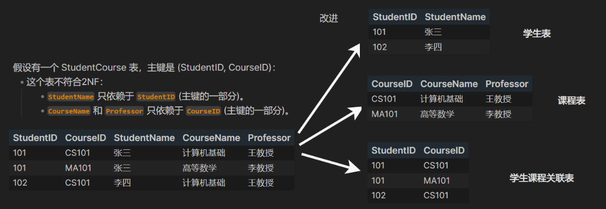

# 数据库知识体系结构

## 框架图


## 范式

### 简介与核心概念

数据库范式（Database Normalization）是关系型数据库设计中的一系列规则，旨在通过消除数据冗余和提高数据完整性来优化数据库结构。简单来说，范式就是一套指导原则，帮助我们更好地组织数据库中的数据，避免数据重复和更新异常。

### 1. 第一范式 (1NF: First Normal Form)

**定义**：一个关系（表）中的所有属性（列）都是**原子性的**，不可再分。这意味着每个字段都应该只包含一个值，而不是一组值或多个值的组合。


### 2. 第二范式 (2NF: Second Normal Form)

**定义**：

- **满足1NF**。
- **所有的非主属性都必须完全依赖于主键**。也就是说，如果主键是复合主键（由多个列组成），那么任何非主属性都不能只依赖于主键中的一部分。



### 3. 第三范式 (3NF: Third Normal Form)

**定义**：

- **满足2NF**。
- **所有的非主属性都不能存在对主键的传递依赖**。这意味着非主属性不能依赖于另一个非主属性。


### 更高级的范式（了解即可）

除了1NF、2NF和3NF，还有一些更高级的范式：

- **BCNF (Boyce-Codd Normal Form)**：比3NF更严格，要求所有决定因素（Determinant）都是候选键。
- **4NF (Fourth Normal Form)**：处理多值依赖。
- **5NF (Fifth Normal Form)**：处理连接依赖。

### 范式化的权衡

范式化是一个权衡的过程。虽然它能消除冗余和提高数据完整性，但有时也会引入复杂性：

- **优点**：减少数据冗余、提高数据完整性、更容易进行数据维护。
- **缺点**：增加表的数量，可能导致查询需要更多的表连接（Join）操作，从而影响查询性能。

因此，在设计数据库时，需要根据具体的业务需求和性能要求来决定范式化的程度。有时为了查询性能，会选择性地违反一些范式规则，进行**反范式化（Denormalization）**。

# Sql规范

## 命名通用规则

- **使用小写字母**：避免大小写敏感问题
- **使用下划线分隔**：如 `user_info` 而不是 `userInfo`
- **名称要有意义**：能够清楚表达用途
- **保持简洁**：避免过长的名称

## 1. 数据库命名示例

```sql
-- 推荐格式
myapp_production    -- 应用名_环境
company_erp         -- 公司名_系统名
blog_system         -- 功能描述

-- 避免的命名
MyDatabase          -- 避免大写
database1           -- 避免无意义数字
temp_db_2023        -- 避免时间戳后缀
```

## 2. 表命名示例

```sql
-- 使用复数名词
users               -- 用户表
orders              -- 订单表
product_categories  -- 产品分类表

-- 关系表（多对多）
user_roles          -- 用户角色关联表
order_products      -- 订单产品关联表

-- 按业务模块划分 （表前缀)
user_profiles       -- 用户模块
order_items         -- 订单模块
payment_records     -- 支付模块
```

## 3. 字段命名示例

```sql
-- 主键
id                  -- 主键ID

-- 时间字段
created_at          -- 创建时间
updated_at          -- 更新时间
deleted_at          -- 删除时间（软删除）

-- 常用业务字段
user_name           -- 用户名
email_address       -- 邮箱地址
phone_number        -- 电话号码
is_active           -- 状态标识

-- 布尔类型 (类型相关)
is_deleted          -- 是否删除
is_verified         -- 是否验证
has_permission      -- 是否有权限

-- 数量相关 (类型相关)
total_amount        -- 总金额
item_count          -- 项目数量
```

## 4. 索引命名规范

```sql
-- 主键索引
pk_table_name       -- 主键索引

-- 唯一索引
uk_table_column     -- uk_users_email

-- 普通索引
idx_table_column    -- idx_users_created_at

-- 复合索引
idx_table_col1_col2 -- idx_orders_user_id_status
```

## 5. 约束命名规范

```sql
-- 外键约束
fk_table_ref_table  -- fk_orders_user_id_users

-- 检查约束
ck_table_column     -- ck_users_age

-- 唯一约束
uk_table_column     -- uk_users_username
```

# 数据库命令

## MySQL

### 查询数据库

```bash
# 登录后查看
mysql -u username -p
SHOW DATABASES;

# 或者直接在命令行执行
mysql -u username -p -e "SHOW DATABASES;"
```

### 创建数据库

```bash
mysql -u username -p -e "CREATE DATABASE database_name;"
```

### 删除数据库

```bash
mysql -u username -p -e "DROP DATABASE database_name;"
```

### 修改数据库

```bash
# 修改字符集等属性
mysql -u username -p -e "ALTER DATABASE database_name CHARACTER SET utf8mb4;"
```

## PostgreSQL

### 查询数据库

```bash
# 列出所有数据库
psql -U username -l

# 或者登录后执行
psql -U username \l
```

### 创建数据库

```bash
createdb -U username database_name
```

### 删除数据库

```bash
dropdb -U username database_name
```

### 修改数据库

```bash
# 修改数据库属性
psql -U username -c "ALTER DATABASE database_name OWNER TO new_owner;"
```

# 表CURD

## 1. 创建表

### 基本语法

```sql
CREATE TABLE table_name (
    column1 datatype [constraints],
    column2 datatype [constraints],
    ...
    [table_constraints]
);

-- 创建用户表
CREATE TABLE users (
    id INT AUTO_INCREMENT PRIMARY KEY,
    username VARCHAR(50) NOT NULL UNIQUE,
    email VARCHAR(100) NOT NULL UNIQUE,
    password VARCHAR(255) NOT NULL,
    age INT DEFAULT 18 CHECK (age >= 0 AND age <= 150),
    gender ENUM('M', 'F', 'Other'),
    created_at TIMESTAMP DEFAULT CURRENT_TIMESTAMP,
    updated_at TIMESTAMP DEFAULT CURRENT_TIMESTAMP ON UPDATE CURRENT_TIMESTAMP --MySql特有: 时间戳字段的自动更新机制
);
```

### 数据类型

```sql
-- 整数类型
TINYINT      -- 1字节，-128到127
SMALLINT     -- 2字节，-32768到32767
MEDIUMINT    -- 3字节，-8388608到8388607
INT/INTEGER  -- 4字节，-2147483648到2147483647
BIGINT       -- 8字节，大整数

-- 浮点类型
FLOAT        -- 4字节单精度浮点数
DOUBLE       -- 8字节双精度浮点数
DECIMAL(M,D) -- 精确的小数，M是总位数，D是小数位数

-- 字符串类型
CHAR(n)      -- 固定长度字符串，最大255字符
VARCHAR(n)   -- 可变长度字符串，最大65535字符
TEXT         -- 长文本数据
MEDIUMTEXT   -- 中等长度文本
LONGTEXT     -- 超长文本

-- 日期时间类型
DATE         -- 日期格式：YYYY-MM-DD
TIME         -- 时间格式：HH:MM:SS
DATETIME     -- 日期时间：YYYY-MM-DD HH:MM:SS
TIMESTAMP    -- 时间戳
YEAR         -- 年份
```

### 列约束

```sql
-- 基本约束
name VARCHAR(50) NOT NULL                       -- NOT NULL：非空约束
age INT DEFAULT 18                              -- DEFAULT：默认值
email VARCHAR(100) UNIQUE                       -- UNIQUE：唯一约束，字段值必须唯一
id INT PRIMARY KEY                              -- PRIMARY KEY：主键约束，唯一且非空
dept_id INT REFERENCES department(id)           -- REFERENCES：外键约束，引用其他表的字段
age INT CHECK (age >= 0 AND age <= 150)         -- CHECK：检查约束，满足条件才能插入 （MySQL不支持）
id INT AUTO_INCREMENT PRIMARY KEY               -- AUTO_INCREMENT：自增（MySQL）

-- 表级约束
PRIMARY KEY (column1, column2)                  -- 联合主键约束
UNIQUE (column1, column2)                       -- 联合唯一约束
FOREIGN KEY (dept_id) REFERENCES department(id) -- 表级外键约束
CHECK (salary >= 0 AND bonus >= 0)              -- 表级检查约束
```

### 外键约束选项

```sql
CREATE TABLE orders (
    id INT PRIMARY KEY,
    user_id INT,
    FOREIGN KEY (user_id) REFERENCES users(id)
        ON DELETE CASCADE      -- 级联删除
        ON UPDATE CASCADE      -- 级联更新
)
-- ON DELETE CASCADE：父表删除，子表对应记录也删除
-- ON DELETE SET NULL：父表删除，子表对应字段设为 NULL
-- ON DELETE RESTRICT：父表有子记录时不允许删除
-- ON DELETE NO ACTION：与 RESTRICT 类似，但在某些数据库中稍有区别

-- ON UPDATE CASCADE：父表更新主键，子表同步更新
-- ON UPDATE SET NULL：父表更新主键，子表设为 NULL
```

### 索引

```sql
-- 创建表时直接定义索引
CREATE TABLE users (
    id INT PRIMARY KEY,                           -- 主键索引（自动创建）
    name VARCHAR(50),
    email VARCHAR(100) UNIQUE,                    -- 唯一索引（自动创建）
    age INT,

    -- 在创建表时定义索引
    INDEX idx_name (name),                        -- 普通索引
    INDEX idx_age (age),                          -- 普通索引
    INDEX idx_name_age (name, age),              -- 复合索引
);
```

## 2. 修改表

```sql
-- 添加
ALTER TABLE users ADD COLUMN phone VARCHAR(20);                    -- 添加新字段
ALTER TABLE users ADD COLUMN created_at TIMESTAMP DEFAULT CURRENT_TIMESTAMP; -- 添加带默认值的字段
ALTER TABLE users ADD CONSTRAINT uk_email UNIQUE (email);         -- 添加唯一约束
ALTER TABLE users ADD CONSTRAINT fk_dept FOREIGN KEY (dept_id) REFERENCES department(id); -- 添加外键约束
ALTER TABLE users ADD CONSTRAINT chk_age CHECK (age >= 0);        -- 添加检查约束
ALTER TABLE users ALTER COLUMN name SET NOT NULL;                 -- 添加非空约束

-- 删除
ALTER TABLE users DROP COLUMN phone;                              -- 删除字段
ALTER TABLE users DROP CONSTRAINT uk_email;                       -- 删除约束
ALTER TABLE users ALTER COLUMN email DROP NOT NULL;               -- 删除非空约束

-- 修改
ALTER TABLE users MODIFY COLUMN age INT DEFAULT 25;               -- 修改字段类型和属性（MySQL）
ALTER TABLE users ALTER COLUMN age SET DEFAULT 30;                -- 修改字段默认值（PostgreSQL/SQL Server）
ALTER TABLE users CHANGE COLUMN name username VARCHAR(50);        -- 修改字段名和类型（MySQL）

-- 重命名
ALTER TABLE users RENAME TO customers;                            -- 重命名表
ALTER TABLE users RENAME COLUMN name TO username;                 -- 重命名字段（PostgreSQL）
```

## 3. 删除表

```sql
-- DROP TABLE：删除表
DROP TABLE users;                                                 -- 删除表（如果存在则删除）
DROP TABLE IF EXISTS users;                                       -- 如果表存在则删除（避免报错）
DROP TABLE users, orders, products;                              -- 同时删除多个表

-- TRUNCATE TABLE：清空表数据
TRUNCATE TABLE users;                                             -- 清空表数据，保留表结构
TRUNCATE TABLE users RESTART IDENTITY;                           -- 清空数据并重置自增ID（PostgreSQL）

-- DELETE：删除表数据
DELETE FROM users;                                               -- 删除表中所有数据（逐行删除）
DELETE FROM users WHERE age < 18;                                -- 按条件删除数据
DELETE FROM users WHERE id IN (1, 2, 3);                         -- 删除指定ID的数据

-- DROP TABLE相关选项
DROP TABLE users CASCADE;                                        -- 级联删除（删除被其他表引用的表）
DROP TABLE users RESTRICT;                                       -- 限制删除（如果有外键引用则禁止删除）
```

## 4.查询表

```sql
-- SHOW语句：查看表信息
SHOW TABLES;                                                     -- 显示所有表
SHOW TABLES LIKE 'user%';                                        -- 模糊查询表名
SHOW CREATE TABLE users;                                         -- 显示创建表的SQL语句
SHOW COLUMNS FROM users;                                         -- 显示表的字段信息
SHOW FIELDS FROM users;                                          -- 显示表的字段信息（同上）
SHOW INDEX FROM users;                                           -- 显示表的索引信息

-- DESCRIBE语句：查看表结构
DESCRIBE users;                                                  -- 查看表结构
DESC users;                                                      -- 查看表结构（简写）

-- INFORMATION_SCHEMA查询：查询元数据
SELECT * FROM INFORMATION_SCHEMA.TABLES WHERE TABLE_NAME = 'users'; -- 查询表元数据
SELECT * FROM INFORMATION_SCHEMA.COLUMNS WHERE TABLE_NAME = 'users'; -- 查询字段元数据
SELECT * FROM INFORMATION_SCHEMA.KEY_COLUMN_USAGE WHERE TABLE_NAME = 'users'; -- 查询键约束信息
SELECT * FROM INFORMATION_SCHEMA.REFERENTIAL_CONSTRAINTS;        -- 查询外键约束信息

-- 系统表查询（不同数据库）
SELECT * FROM sys.tables WHERE name = 'users';                   -- SQL Server查询表
SELECT tablename FROM pg_tables WHERE tablename = 'users';       -- PostgreSQL查询表
SELECT * FROM sqlite_master WHERE type = 'table' AND name = 'users'; -- SQLite查询表
```

# 数据的增删改

## 1. 插入

```sql
-- 插入单行数据
INSERT INTO users (id, name, email, age) VALUES (1, '张三', 'zhangsan@example.com', 25);  -- 插入部分列据 （可以省略可为空或有默认值的列)
INSERT INTO users VALUES (2, '王五', 'wangwu@example.com', 28);                          -- 插入所有列数据

-- 批量插入数据(MySQL特有)
INSERT INTO users (id, name, email, age) VALUES 
    (3, '赵六', 'zhaoliu@example.com', 32),
    (4, '孙七', 'sunqi@example.com', 27),
    (5, '周八', 'zhouba@example.com', 29);                                               -- 一次插入多行数据

-- 插入默认值和NULL值
INSERT INTO users (id, name, email, age) VALUES (7, '钱十一', DEFAULT, 31);               -- 使用默认值
INSERT INTO users (id, name, email, age) VALUES (8, '孙十二', NULL, 25);                  -- 插入NULL值

-- 插入查询结果
INSERT INTO backup_users (id, name, email, age)
SELECT id, name, email, age FROM users WHERE age > 25;                                   -- 从其他表查询并插入

-- 条件插入（避免重复）
INSERT IGNORE INTO users (id, name, email) VALUES (1, '新张三', 'new@example.com');       -- MySQL忽略重复键错误
INSERT INTO users (id, name, email) VALUES (1, '新张三', 'new@example.com') 
ON CONFLICT (id) DO NOTHING;                                                             -- PostgreSQL忽略冲突

-- 存在则更新，不存在则插入（UPSERT）
INSERT INTO users (id, name, email, age) VALUES (1, '张三更新', 'new@example.com', 26)
ON DUPLICATE KEY UPDATE name = VALUES(name), email = VALUES(email);                      -- MySQL的ON DUPLICATE KEY UPDATE

INSERT INTO users (id, name, email, age) VALUES (1, '张三更新', 'new@example.com', 26)
ON CONFLICT (id) DO UPDATE SET name = EXCLUDED.name, email = EXCLUDED.email;             -- PostgreSQL的ON CONFLICT

-- 使用SET语法插入（MySQL特有）
INSERT INTO users SET id = 9, name = 'MySQL用户', email = 'mysql@example.com';           -- MySQL的SET语法

-- 返回插入的数据（PostgreSQL特有）
INSERT INTO users (name, email) VALUES ('返回用户', 'return@example.com') 
RETURNING id, name;                                                                      -- 插入后返回指定字段
```

## 2. 更新

```sql
-- 基本更新
UPDATE users SET name = 'John' WHERE id = 1;
UPDATE users SET name = 'John', age = 25 WHERE id = 1;

-- 表达式更新
UPDATE products SET price = price * 1.1 WHERE category = 'electronics';
UPDATE users SET score = score + 10 WHERE active = 1;

-- 条件更新
UPDATE users SET level = CASE 
    WHEN score >= 90 THEN 'A'
    WHEN score >= 80 THEN 'B'
    ELSE 'C'
END WHERE active = 1;

-- 多表关联更新
UPDATE users u JOIN departments d ON u.dept_id = d.id 
SET u.dept_name = d.name WHERE d.active = 1;

-- 安全设置
SET SQL_SAFE_UPDATES = 1;  -- 启用安全模式
UPDATE users SET status = 'processed' LIMIT 10;  -- 限制更新条数

-- 重要提醒：始终使用WHERE条件，避免全表更新！
```

## 3. 删除

```sql
DELETE FROM users;                                               -- 删除表中所有数据（逐行删除）
DELETE FROM users WHERE age < 18;                                -- 按条件删除数据
DELETE FROM users WHERE id IN (1, 2, 3);                         -- 删除指定ID的数据
```

# SQL查询语句详解

## 1. 基本查询语句

```sql
-- 基础语句
SELECT * FROM employees;                                                     -- 查询所有列
SELECT first_name, last_name, salary FROM employees;                         -- 查询特定列
SELECT first_name AS 姓名, salary AS 薪资 FROM employees;                    -- 查询并重命名列

-- 条件查询
SELECT * FROM employees WHERE salary = 5000;                                 -- 等于
SELECT * FROM employees WHERE salary != 5000;                                -- 不等于
SELECT * FROM employees WHERE salary <> 5000;                                -- 不等于
SELECT * FROM employees WHERE salary > 5000;                                 -- 大于、小于
SELECT * FROM employees WHERE age < 30;                                      -- 大于、小于
SELECT * FROM employees WHERE salary BETWEEN 3000 AND 8000;                  -- 范围查询
SELECT * FROM employees WHERE email IS NULL;                                 -- 空值判断
SELECT * FROM employees WHERE email IS NOT NULL;                             -- 空值判断
SELECT * FROM employees WHERE salary > 5000 AND department = 'IT';          -- AND运算符
SELECT * FROM employees WHERE department = 'IT' OR department = 'HR';       -- OR运算符
SELECT * FROM employees WHERE NOT department = 'IT';                        -- NOT运算符
SELECT * FROM employees WHERE department IN ('IT', 'HR', 'Finance');        -- IN操作符
SELECT * FROM employees WHERE department NOT IN ('IT', 'HR');               -- NOT IN操作符

-- LIKI模糊查询
SELECT * FROM employees WHERE first_name LIKE 'J%';                          -- 匹配以某字符开头
SELECT * FROM employees WHERE first_name LIKE '%n';                          -- 匹配以某字符结尾
SELECT * FROM employees WHERE first_name LIKE '%oh%';                        -- 匹配包含某字符
SELECT * FROM employees WHERE first_name LIKE 'J_hn';                        -- 匹配单个字符
SELECT * FROM employees WHERE first_name NOT LIKE 'J%';                      -- NOT LIKE
```

## 2. 排序，分页，分组

```sql
-- ORDER BY排序
SELECT * FROM employees ORDER BY salary;                                      -- 升序排序（默认）
SELECT * FROM employees ORDER BY salary DESC;                                 -- 降序排序
SELECT * FROM employees ORDER BY department ASC, salary DESC;                 -- 多列排序
SELECT first_name, last_name, salary FROM employees ORDER BY salary * 12 DESC;-- 按表达式排序

-- LIMIT和OFFSET（分页）
SELECT * FROM employees LIMIT 10;                                             -- 限制返回行数
SELECT * FROM employees LIMIT 10 OFFSET 20;                                   -- 跳过前几行并限制返回数量
SELECT * FROM employees LIMIT 20, 10;                                         -- MySQL简写语法

-- GROUP BY分组
/*
基础语法：
	SELECT column1, aggregate_function(column2)
	FROM table_name
	WHERE condition
	GROUP BY column1, column2, ...
	HAVING condition
	ORDER BY column_name;
常用聚合函数：COUNT、SUM、AVERAGE、MAX、MIN
*/*
SELECT department, COUNT(*) as employee_count FROM employees GROUP BY department;-- 按部门分组统计人数
SELECT department, AVG(salary) as avg_salary FROM employees GROUP BY department; -- 按部门分组计算平均薪资
SELECT department, gender, COUNT(*) FROM employees GROUP BY department, gender;  -- 多列分组

-- HAVING子句：用于过滤分组结果
SELECT department, AVG(salary) as avg_salary
FROM employees
GROUP BY department
HAVING AVG(salary) > 6000;
```

## 3. JOIN连接查询

```sql
-- FROM employees e 表别名，省略as

-- INNER JOIN（内连接） 只返回两个表中都有匹配记录的数据    默认join就是inner join
SELECT e.first_name, e.last_name, d.department_name
FROM employees e
INNER JOIN departments d ON e.department_id = d.department_id;

-- LEFT JOIN（左连接） 返回左表（employees）的所有记录，以及右表中匹配的记录 
-- 如果右表有多行匹配，就会产生多行结果（左边这一行会被重复，和右边的多行一一对应）
SELECT e.first_name, e.last_name, d.department_name
FROM employees e
LEFT JOIN departments d ON e.department_id = d.department_id;

-- RIGHT JOIN（右连接） 返回右表（departments）的所有记录，以及左表中匹配的记录
SELECT e.first_name, e.last_name, d.department_name
FROM employees e
RIGHT JOIN departments d ON e.department_id = d.department_id;

-- FULL OUTER JOIN（全外连接） 返回两个表中的所有记录
SELECT e.first_name, e.last_name, d.department_name
FROM employees e
FULL OUTER JOIN departments d ON e.department_id = d.department_id;

-- 自连接 同一张表与自己连接
SELECT e1.first_name, e2.first_name as manager_name
FROM employees e1
LEFT JOIN employees e2 ON e1.manager_id = e2.employee_id;
```

## 4. 子查询

```sql
-- 按子查询，例(SELECT AVG(salary) FROM employees) 返回值分类

-- 标量子查询：子查询返回单个值
SELECT first_name, salary
FROM employees
WHERE salary > (SELECT AVG(salary) FROM employees);

-- 行子查询：子查询返回一行多列的数据
SELECT first_name, last_name
FROM employees
WHERE (first_name, last_name) = (
    SELECT first_name, last_name 
    FROM employees 
    WHERE employee_id = 100
); 
-- 两个查询都在同一个表，此处子查询可直接优化成 WHERE employee_id = 100;

-- 列子查询：子查询返回一列多个值
-- 主查询筛选通常是IN或使用ANY与ALL关键词
-- 子查询IN中NULL值不能被筛选出来，NOT IN中如果有NULL值查询不出任何数据
SELECT first_name, last_name
FROM employees
WHERE department_id IN (
    SELECT department_id 
    FROM departments 
    WHERE location = 'New York'
);
-- 两个查询在不同表，此处可优化为 JOIN departments d ON e.department_id = d.department_id WHERE d.location = 'New York';


-- 表子查询：子查询返回一个完整的表（临时视图）
SELECT emp_name, salary
FROM (
    SELECT first_name || ' ' || last_name as emp_name, salary
    FROM employees
) emp_salary
WHERE salary > 5000; -- 此处可优化直接在主查询筛选

-- 相关子查询
-- 子查询必须依赖主查询的数据才能执行
SELECT c.course_id, c.course_name
FROM courses c
WHERE EXISTS (
    SELECT 1
    FROM student_course sc
    WHERE sc.course_id = c.course_id
);
```

## 5. UNION、CASE

```sql
-- UNION（去重） 合并两个查询结果集、自动去除重复的记录、结果按默认顺序排序（除非指定ORDER BY）
SELECT first_name FROM employees
UNION
SELECT customer_name FROM customers;

-- UNION ALL（不去重） 合并结果集的同时保留重复的
SELECT first_name FROM employees
UNION ALL
SELECT customer_name FROM customers;

-- CASE语句
SELECT first_name, salary,
CASE 
    WHEN salary > 8000 THEN '高薪'
    WHEN salary > 5000 THEN '中薪'
    ELSE '低薪'
END as salary_level
FROM employees;
```

## 6. 复杂查询示例

```sql
-- 查询2020年以后入职的员工中，统计各部门员工数量、平均工资和最高工资，筛选出员工数超过5人的部门，按平均工资降序排列显示前10个部门
SELECT 
    d.department_name,
    COUNT(e.employee_id) as employee_count,
    AVG(e.salary) as avg_salary,
    MAX(e.salary) as max_salary
FROM employees e
INNER JOIN departments d ON e.department_id = d.department_id
WHERE e.hire_date >= '2020-01-01'
GROUP BY d.department_name
HAVING COUNT(e.employee_id) > 5
ORDER BY avg_salary DESC
LIMIT 10;

-- 查询所有在职员工的基本信息、所在部门及工资与全公司平均工资的对比情况，按工资降序排列
SELECT 
    e.first_name,
    e.last_name,
    e.salary,
    d.department_name,
    CASE 
        WHEN e.salary > (SELECT AVG(salary) FROM employees) 
        THEN '高于平均'
        ELSE '低于平均'
    END as salary_status
FROM employees e
LEFT JOIN departments d ON e.department_id = d.department_id
WHERE e.status = 'ACTIVE'
ORDER BY e.salary DESC;


-- 3.查询班级人数高于 各班级平均人数的 班级编号，班级名称
-- 思路：
/*
1. 先查询出各个班级的人数 COUNT
2. 通过子查询对第1步的查询进行求平均 子查询+AVG
3. 学生表和班级表关联，对班级ID和班级名分组，计算人数COUNT
4. 第3步利用HAVING语句，对COUNT结果与第2步数据比较
*/

select CLASS_ID,CLASS_NAME
from SCLASS s
	join student s2 on(s.CLASS_ID = s2.STU_CLASS)
group by CLASS_ID
having count(STU_NAME) > (
	select avg(cnt)
	from (
		select CLASS_ID,count(STU_NAME) as cnt
		from SCLASS s
			join student s2 on(s.CLASS_ID = s2.STU_CLASS)
		group by CLASS_ID
	) t
);

-- 6.查询与Lu同班级，平均分高于他的其他学员的信息
-- 思路：
/*
1. 求得各个学生的平均分
2. 学生表与第1步关联，得到学生信息+学生平均分
3. where中学生的班级与Lu同班级 子查询1
4. where中学生平均分 高于 Lu的平均分 子查询2
*/
select *
from student s
where STU_ID in (
	select s.STU_ID
	from student s
		join stu_course sc on(s.STU_ID = sc.STU_ID)
	where s.STU_CLASS = (
		select STU_CLASS
		from STUDENT
		where STU_NAME = 'lu'
	)
	group by s.STU_ID,s.STU_CLASS
	having avg(SCORE) > (
		select avg(SCORE)
		from STUDENT st
		join stu_course sct on(st.STU_ID = sct.STU_ID)
		where st.STU_NAME = 'lu'
	)
);
```

## 7. 性能优化建议

1. **使用索引**：在经常查询的列上创建索引
2. **避免SELECT**：只选择需要的列
3. **合理使用WHERE**：尽早过滤数据
4. **避免在WHERE中使用函数**：可能导致索引失效
5. **使用EXISTS替代IN**：在某些情况下性能更好
6. **合理使用LIMIT**：避免返回大量数据

# 其他高级功能

## 索引(INDEX)

### 概念

**索引** = 数据库的"目录"，用于快速查找数据

- **原理**：通过B+树等数据结构，建立列值到数据行的映射
- **代价**：占用存储空间，降低写入性能

**核心策略**：每表控制5-6个索引以内，优先为高选择性、高频查询的列建索引，复合索引要把最常用的列放前面。根据业务场景权衡读写性能和存储成本，避免盲目建索引和重复索引，定期清理无用索引，做到"该建则建，该删则删"。

### 索引类型

- 按结构分类
  - **B+树索引**：支持范围查询、排序 （最常用）
  - **哈希索引**：等值查询快(O(1)) （精确匹配）
  - **位图索引**：存储小，适合组合查询 （低基数列）
- 按功能分类
  - **主键索引**：自动创建，唯一标识
  - **唯一索引**：保证列值唯一
  - **普通索引**：基本索引类型
  - **复合索引**：多个列组合
  - **全文索引**：文本内容搜索

### 创建语法

```sql
-- 创建表时定义
CREATE TABLE users (
    id INT PRIMARY KEY,
    name VARCHAR(50),
    INDEX idx_name (name)
);

-- 单独创建索引
CREATE INDEX idx_name ON users(name);
CREATE UNIQUE INDEX idx_email ON users(email);
CREATE INDEX idx_name_age ON users(name, age); -- 复合索引
```

### 优化原则

- 什么时候建索引
  - 经常在WHERE中出现的列
  - 经常用于JOIN的列
  - 经常用于ORDER BY的列
  - 高选择性列（值分布广）
- 什么时候不建索引
  - 数据量小的表（< 1000行）
  - 经常修改的列
  - 低选择性列（如性别）
  - 不在查询条件中的列

### 索引使用

```sql
CREATE INDEX idx_a_b_c ON table(a, b, c);

-- 能使用索引的查询 （自动使用）
WHERE a = 1
WHERE a = 1 AND b = 2  
WHERE a = 1 AND b = 2 AND c = 3

-- 不能使用索引 
WHERE b = 2
WHERE c = 3
WHERE a = 1 AND c = 3

-- 使用函数
WHERE YEAR(date) = 2023  -- ❌
WHERE date >= '2023-01-01' AND date < '2024-01-01'  -- ✅

-- 类型转换
WHERE phone = 123456789  -- ❌
WHERE phone = '123456789'  -- ✅

-- 使用模糊查询
WHERE name LIKE '%John%'  -- ❌
WHERE name LIKE 'John%'   -- ✅
```

### 性能监控

```sql
-- 查看执行计划
EXPLAIN SELECT * FROM users WHERE name = 'John';

-- 查看索引信息
SHOW INDEX FROM users;
```

## 函数

### 函数分类

- **聚合函数**：对一组值进行计算并返回单个结果值的函数，它们通常与GROUP BY子句一起使用，用于对数据进行分组统计
- **标量函数**：对单个值进行操作并返回单个值的函数，通常用于数据转换和计算。标量函数是**逐行处理**数据的。
- **分析函数**：用于执行复杂分析计算的函数，支持窗口操作和排名统计
- **转换函数**：用于数据类型转换和格式转换的函数，实现不同数据格式间的相互转换
- **系统函数**：提供系统信息和元数据访问的函数，用于获取数据库系统状态和配置信息
- **自定义函数**

### 1. 聚合函数

常用函数：`COUNT()`、`SUM()`、`AVG()`、`MAX()/MIN()`

### 2. 标量函数

#### 常用字符串函数

```sql
-- 长度和大小写
SELECT LENGTH('Hello World');           -- 返回字符串长度
SELECT UPPER('hello');                  -- 转大写：HELLO
SELECT LOWER('HELLO');                  -- 转小写：hello
SELECT INITCAP('hello world');          -- 首字母大写（Oracle）

-- 截取和连接
SELECT SUBSTRING('Hello World', 1, 5);  -- 截取子串：Hello
SELECT LEFT('Hello World', 5);          -- 左边5个字符：Hello
SELECT RIGHT('Hello World', 5);         -- 右边5个字符：World
SELECT CONCAT('Hello', ' ', 'World');   -- 连接字符串
SELECT 'Hello' || ' ' || 'World';       -- Oracle连接符

-- 去除空格和替换
SELECT TRIM('  Hello  ');               -- 去除两端空格
SELECT LTRIM('  Hello');                -- 去除左端空格
SELECT RTRIM('Hello  ');                -- 去除右端空格
SELECT REPLACE('Hello World', 'World', 'SQL');  -- 替换

-- 查找和定位
SELECT POSITION('World' IN 'Hello World');      -- 查找位置
SELECT LOCATE('World', 'Hello World');          -- 查找位置（MySQL）
```

#### 数学运算函数

```sql
-- 基本数学函数
SELECT ABS(-10);            -- 绝对值：10
SELECT CEIL(4.2);           -- 向上取整：5
SELECT FLOOR(4.8);          -- 向下取整：4
SELECT ROUND(4.567, 2);     -- 四舍五入到小数点后2位：4.57
SELECT TRUNCATE(4.567, 2);  -- 截断到小数点后2位：4.56 (MySQL)

-- 幂运算和根运算
SELECT POWER(2, 3);         -- 2的3次方：8
SELECT SQRT(16);            -- 平方根：4
SELECT EXP(1);              -- e的1次方
SELECT LOG(10);             -- 自然对数
SELECT LOG10(100);          -- 以10为底的对数：2

-- 三角函数
SELECT SIN(PI()/2);         -- 正弦值
SELECT COS(0);              -- 余弦值
SELECT TAN(PI()/4);         -- 正切值
```

#### 日期函数

```sql
-- 当前日期时间
SELECT CURRENT_DATE;        -- 当前日期
SELECT CURRENT_TIME;        -- 当前时间
SELECT CURRENT_TIMESTAMP;   -- 当前日期时间戳
SELECT NOW();               -- MySQL当前时间

-- 日期提取
SELECT YEAR('2023-12-25');          -- 年份：2023
SELECT MONTH('2023-12-25');         -- 月份：12
SELECT DAY('2023-12-25');           -- 日期：25
SELECT HOUR('14:30:00');            -- 小时：14
SELECT MINUTE('14:30:00');          -- 分钟：30
SELECT SECOND('14:30:45');          -- 秒：45

-- 日期加减
SELECT DATE_ADD('2023-12-25', INTERVAL 7 DAY);    -- 加7天
SELECT DATE_SUB('2023-12-25', INTERVAL 1 MONTH);  -- 减1个月
SELECT ADD_MONTHS('2023-12-25', 3);               -- 加3个月（Oracle）

-- 日期差值
SELECT DATEDIFF('2023-12-31', '2023-12-25');      -- 天数差：6
SELECT TIMESTAMPDIFF(YEAR, '2020-01-01', '2023-12-25');  -- 年数差

-- 日期格式化
SELECT DATE_FORMAT('2023-12-25', '%Y年%m月%d日');  -- 格式化（MySQL）
SELECT TO_CHAR(SYSDATE, 'YYYY年MM月DD日') FROM DUAL;  -- 格式化（Oracle）
```

#### NULL处理函数

```sql
-- COALESCE：返回第一个非NULL值
SELECT COALESCE(commission, 0) as actual_commission FROM employees;

-- NULLIF：如果两个值相等返回NULL
SELECT NULLIF(salary, 0) as safe_salary FROM employees;

-- ISNULL/CASE处理
SELECT ISNULL(commission, 0) as commission_value  -- SQL Server FROM employees;
```

### 3. 分析函数（窗口函数）

#### 排名函数

```sql
-- ROW_NUMBER：行号
SELECT name, salary,
       ROW_NUMBER() OVER (ORDER BY salary DESC) as row_num
FROM employees;

-- RANK：排名（相同值排名相同，跳过后续排名）
SELECT name, salary,
       RANK() OVER (ORDER BY salary DESC) as rank_num
FROM employees;

-- DENSE_RANK：密集排名（不跳过排名）
SELECT name, salary,
       DENSE_RANK() OVER (ORDER BY salary DESC) as dense_rank_num
FROM employees;
```

#### 窗口聚合函数

```sql
-- 累计求和
SELECT name, salary,
       SUM(salary) OVER (ORDER BY salary ROWS UNBOUNDED PRECEDING) as cum_sum
FROM employees;

-- 移动平均
SELECT date, sales,
       AVG(sales) OVER (ORDER BY date ROWS BETWEEN 2 PRECEDING AND CURRENT ROW) as moving_avg
FROM daily_sales;
```

### 4. 转换函数

```sql
-- 显式类型转换
SELECT CAST('123' AS INTEGER);          -- 字符串转整数
SELECT CONVERT(INT, '123');             -- SQL Server转换
SELECT TO_NUMBER('123.45') FROM DUAL;   -- Oracle转换

-- 日期转换
SELECT STR_TO_DATE('2023-12-25', '%Y-%m-%d');  -- MySQL字符串转日期
SELECT TO_DATE('2023-12-25', 'YYYY-MM-DD') FROM DUAL;  -- Oracle转换
```

### 5. 系统函数

```sql
-- 获取当前系统时间
SELECT GETDATE() AS CurrentTime;
SELECT SYSDATE FROM DUAL; -- Oracle

-- 获取当前用户名
SELECT USER_NAME() AS CurrentUser;
SELECT USER FROM DUAL; -- Oracle

-- 获取当前数据库名称
SELECT DB_NAME() AS DatabaseName;
SELECT DATABASE() FROM DUAL; -- MySQL

-- 获取数据库版本信息
SELECT @@VERSION AS VersionInfo;

-- 获取数据库对象的标识符
SELECT OBJECT_ID('TableName') AS TableID;

-- 获取服务器名称
SELECT @@SERVERNAME AS ServerName;

-- 获取连接的会话ID
SELECT @@SPID AS SessionID;
```

### 6. 自定义函数

#### 语法格式

```sql
CREATE
    [DEFINER = { user | CURRENT_USER }]
    FUNCTION functionName (varName varType [, ...])
    RETURNS returnVarType
    [characteristic ...]
    routine_body


```

- functionName：函数名，同MySQL内置函数一样，大小写不敏感
- varName: 形参名
- varType: 形参类型，其与varName配对使用。形参数量不限( $\geq 0$)
- returnVarType: 返回值类型。函数**必须有且只能有一个**返回值
- characteristic：函数特性，下将详述
- routine_body：函数体。函数体中必须含有 **return** 语句，当函数体为复合结构时，需要使用begin ... end 语句
- characteristic 可选值
  - `LANGUAGE SQL` 函数语言（目前仅支持 SQL）
  - `[NOT] DETERMINISTIC`  是否确定性函数（相同输入是否一定返回相同结果）
  - `CONTAINS SQL``NO SQL``READS SQL DATA``MODIFIES SQL DATA` SQL 使用限制，默认为`contains sql`
     - `contains sql`意为函数体包含sql语句，但不包含读写数据的sql语句；
    - `no sql`意为函数体不包含sql语句；
    - `reads sql data`意为函数体包含读数据sql语句；
    - `modifies sql data`意为函数体包含写数据的sql语句。
  - `SQL SECURITY {DEFINER | INVOKER}` 指明谁有权限执行该函数，默认为`definer`
    - `definer`意为只有定义者才能执行；
    - `invoker`意为拥有权限的调用者可以执行
  - `COMMENT '...'`  函数注释

#### 变量和流程控制

##### 局部变量（`DECLARE`）

- 作用域：`BEGIN ... END` 块内
- 默认初值为 `NULL`，可使用 `DEFAULT` 设置初值
- 赋值
  - `SET` 语句（= 或 :=）
  - `SELECT ... INTO`

```sql
DECLARE var1 INT DEFAULT 0;
DECLARE a, b INT DEFAULT 5;

SET var1 = 10;
SET var2 := 20;

SELECT col1, col2 INTO var1, var2 FROM table WHERE id = 1;
```

> 注意：结果为空 → 不赋值；结果多条 → 报错。

##### 用户变量（以 `@` 开头）

- 作用域：当前连接有效
- 不需预先声明

```sql
SET @x = 5;
SELECT @x;
SELECT @y := col FROM table WHERE id = 1;
```

##### IF 语句

```sql
IF condition THEN
    ...
[ELSEIF condition THEN
    ...]
[ELSE
    ...]
END IF;
```

##### WHILE 循环

控制指定 label 的循环

- `LEAVE label;` 跳出循环（相当于 `break`）
- `ITERATE label;` 继续下一轮（相当于 `continue`）

```sql
[label:] WHILE condition DO
    ...
END WHILE [label];
```

##### 循环控制：LEAVE / ITERATE

#### 函数相关操作

##### 查看函数状态

```sql
SHOW FUNCTION STATUS [LIKE 'funcName'];
```

##### 查看函数定义

```sql
SHOW CREATE FUNCTION funcName;
```

##### 修改函数特性

```sql
ALTER FUNCTION funcName [characteristic ...];
```

> 注意：不能用于修改函数体内容

##### 删除函数

```sql
DROP FUNCTION [IF EXISTS] funcName;
```

#### 命令行使用注意事项

MySQL 默认以 `;` 作为语句结束符，**创建函数时建议更改结束符**：

```sql
DELIMITER $$

CREATE FUNCTION myFunction(...) RETURNS ...
BEGIN
    ...
END $$

DELIMITER ;
```

#### 示例

```sql
DELIMITER $$

CREATE FUNCTION get_user_topN_total(p_user_id INT, p_limit INT)
RETURNS DECIMAL(10,2)
DETERMINISTIC
READS SQL DATA
COMMENT '返回用户前N个订单金额总和（按订单日期升序）'
BEGIN
    -- 声明变量
    DECLARE done INT DEFAULT 0;               -- 游标读取结束标志，0=未结束，1=结束
    DECLARE total DECIMAL(10,2) DEFAULT 0.00;-- 用于累计订单金额总和，初始为0
    DECLARE i INT DEFAULT 0;                   -- 计数器，记录已累计订单数
    DECLARE order_amt DECIMAL(10,2);          -- 游标当前读取的订单金额

    -- 定义游标，查询指定用户订单金额，按订单日期升序排列
    DECLARE order_cursor CURSOR FOR
        SELECT amount FROM orders
        WHERE user_id = p_user_id
        ORDER BY order_date ASC;

    -- 声明当游标读取不到更多数据时的处理器，将 done 设为1
    DECLARE CONTINUE HANDLER FOR NOT FOUND SET done = 1;

    -- 打开游标，准备开始读取数据
    OPEN order_cursor;

    -- 循环标签，方便使用 LEAVE 跳出循环
    order_loop: WHILE i < p_limit DO
        -- 从游标取一条记录，赋值给 order_amt
        FETCH order_cursor INTO order_amt;

        -- 如果没有更多记录（done=1），跳出循环
        IF done = 1 THEN
            LEAVE order_loop;
        END IF;

        -- 累加当前订单金额，使用 IFNULL 避免 NULL 导致错误
        SET total = total + IFNULL(order_amt, 0);

        -- 订单计数器加1
        SET i = i + 1;
    END WHILE order_loop;

    -- 关闭游标，释放资源
    CLOSE order_cursor;

    -- 返回累计的订单金额总和
    RETURN total;
END $$

DELIMITER ;

```

## 视图(VIEW)

### 介绍

**概念与特点**

> 视图是基于SQL查询结果集的虚拟表，它不存储实际数据，而是在使用时动态执行预定义的SQL查询语句来生成结果。_视图本质上是一个保存的查询_，对外表现为一张表，但数据来源于一个或多个实际表。

**核心优势**

> 视图能够简化复杂的SQL查询操作，让用户无需编写冗长的多表关联语句；提供数据安全保护机制，可以限制用户只能访问特定的列或行；增强数据库的逻辑独立性，当底层表结构发生变化时，通过调整视图定义可以保持应用接口的稳定性；同时支持代码重用，避免重复编写相同的查询逻辑。

**使用注意**

> 视图在每次查询时都需要重新执行底层SQL语句，可能会带来性能开销；并非所有视图都支持更新操作，只有满足特定条件的简单视图才能进行INSERT、UPDATE、DELETE操作；过度使用嵌套视图可能导致逻辑复杂难以维护和调试。

**应用场景**

> 视图广泛应用于简化复杂的多表关联查询、隐藏敏感数据字段以保护隐私信息、为不同用户角色提供定制化的数据访问接口、以及在数据库重构时保持应用程序的向后兼容性。

### 基本操作语法

```sql
-- 创建视图
CREATE VIEW view_name AS SELECT 查询语句;

-- 使用视图（当作普通表查询）
SELECT * FROM view_name WHERE 条件;

-- 修改视图（替换现有定义）
CREATE OR REPLACE VIEW view_name AS SELECT 新查询语句;

-- 删除视图
DROP VIEW view_name;
```

## 游标(CURSOR)

### 介绍

**概念与特点**

> 游标是数据库系统中用于逐行处理查询结果集的数据库对象，_它提供了一种在程序中逐条读取和操作数据的方法_。与普通查询一次性返回所有结果不同，游标允许开发者按需逐行处理数据，特别适用于需要对每一行数据进行复杂处理的场景。

**核心优势**

> 游标能够实现对查询结果集的逐行精确控制，支持定位到特定行、向前或向后移动；适合处理大量数据时的内存管理，避免一次性加载所有数据；提供灵活的数据操作方式，可以在处理过程中根据条件动态修改、删除或插入数据；特别适用于需要基于当前行数据值来决定后续操作逻辑的复杂业务场景。

**使用注意**

> 游标会消耗较多的系统资源和内存，处理大量数据时可能影响性能；逐行处理方式比集合操作慢得多，应优先考虑使用SQL集合操作；需要手动管理游标的生命周期，包括打开、关闭和释放资源；在高并发环境下使用游标可能导致锁等待和性能瓶颈。

**应用场景**

> 游标主要用于需要逐行处理数据的复杂业务逻辑、数据迁移和转换操作、基于当前行数据动态生成其他数据、批量数据的验证和清理工作、以及需要在处理过程中与其他系统进行交互的场景。

### 基本操作语法

```sql
-- 声明游标
DECLARE cursor_name CURSOR FOR SELECT 查询语句;

-- 打开游标
OPEN cursor_name;

-- 读取数据
FETCH NEXT FROM cursor_name INTO variable_list;

-- 关闭游标
CLOSE cursor_name;

-- 释放游标
DEALLOCATE cursor_name;
```

## 存储过程(PROCEDURE)

### 简介

**SQL 存储过程** 是一组预编译的 SQL 语句，它们被命名、存储在数据库中，并且可以像函数一样被调用。它们本质上是为了执行特定任务而编写的 SQL 代码块。

### 优缺点

> **性能提升**是其核心优势，因为它们被预先编译，减少了重复解析。它们还能提高**代码重用性**，减少重复编码。在**安全性**方面，存储过程允许你通过控制执行权限来保护底层数据。此外，它们能**减少网络流量**并有助于**封装业务逻辑**，确保数据一致性。

> 主要缺点在于**可移植性差**，不同数据库系统间的语法差异大。**调试困难**也是一个挑战，且**版本控制**不如应用程序代码方便。最后，设计不当的存储过程可能**增加数据库负担**。

### 存储过程的基本结构

1. **定义**

```sql
CREATE PROCEDURE procedure_name
AS
BEGIN
	-- SQL 语句
END;

-- 某些系统如MySQL
DELIMITER //
CREATE PROCEDURE procedure_name (parameter1 datatype, parameter2 datatype, ...)
BEGIN
	-- SQL 语句
END //
DELIMITER ;
```

2. **参数：** 存储过程可以接受输入参数 (IN)、输出参数 (OUT) 或输入/输出参数 (INOUT)，以便在执行时传递数据或返回结果。
   - **IN 参数：** 默认类型，用于向存储过程传递值。
   - **OUT 参数：** 用于从存储过程返回值。
   - **INOUT 参数：** 既可以作为输入也可以作为输出。
3. **SQL 语句：** 存储过程中包含各种 SQL 语句，例如 `SELECT`, `INSERT`, `UPDATE`, `DELETE`, `CREATE TABLE` 等，以及流程控制语句（如 `IF`, `WHILE`, `CASE` 等）。

### 示例

```sql
DELIMITER //
CREATE PROCEDURE GetProductDetails (IN ProductID INT)
BEGIN
    SELECT ProductName, Price, StockQuantity
    FROM Products
    WHERE ProductID = ProductID;
END //
DELIMITER ;
```

**调用存储过程：**

```sql
CALL GetProductDetails(5);
```

## 触发器(TRIGGER)

### 简介

**SQL 触发器** 是一种特殊的存储过程，它不是被手动调用执行的，而是由特定的数据库事件自动触发执行的。这些事件通常包括对表的 `INSERT`（插入）、`UPDATE`（更新）或 `DELETE`（删除）操作，也可以是 DDL（数据定义语言）事件，如 `CREATE TABLE` 或 `ALTER TABLE`，甚至可以是数据库启动或关闭等事件（尽管这些在不同数据库系统中的支持程度不同）。

它们的**优点**在于能强制执行复杂的**业务规则**、实现**数据审计**、自动**同步数据**和封装**复杂逻辑**；然而，其**缺点**也显而易见，即**隐式执行**的特性导致**调试困难**，可能产生**性能开销**，并增加系统的**复杂性**和**维护挑战**。简而言之，触发器功能强大但需谨慎使用。

### 触发器的执行时机

触发器可以根据事件发生的时机分为两大类：

- **`BEFORE` 触发器：** 在 SQL 操作（`INSERT`, `UPDATE`, `DELETE`）发生**之前**执行。这允许你在实际操作执行前验证或修改数据。如果 `BEFORE` 触发器中的逻辑导致错误，那么原始的 SQL 操作将被回滚。
- **`AFTER` 触发器：** 在 SQL 操作（`INSERT`, `UPDATE`, `DELETE`）发生**之后**执行。这通常用于在数据已经改变后执行额外的操作，例如更新相关表或记录日志。

### 触发器的基本结构

```sql
DELIMITER //
CREATE TRIGGER trg_CheckProductPrice
BEFORE INSERT ON Products
FOR EACH ROW
BEGIN
    IF NEW.Price <= 0 THEN
        SIGNAL SQLSTATE '45000' SET MESSAGE_TEXT = 'Product price must be greater than zero.';
    END IF;
END //
DELIMITER ;
```

这个触发器会在 `Products` 表插入新记录**之前**执行，如果新产品的价格小于或等于零，则阻止插入并抛出错误。

### 触发器中的特殊表/变量

在 `INSERT`、`UPDATE`、`DELETE` 触发器中，通常会有一些特殊的“虚拟表”或变量来表示数据更改：

- **MySQL:**
  - `NEW`：对于 `INSERT` 和 `UPDATE` 操作，代表新插入或修改后的行数据。
  - `OLD`：对于 `DELETE` 和 `UPDATE` 操作，代表被删除或修改前的行数据。

## 事务管理

### 简介

在 SQL 中，**事务（Transaction）** 是一个或多个 SQL 语句的序列，这些语句被当作一个单一的、不可分割的逻辑工作单元来执行。简单来说，事务中的所有操作要么全部成功执行，要么全部失败回滚，不会出现只执行了一部分的情况。

### 事务的四大特性 (ACID)

| 特性                     | 英文        | 描述                                                                                                                                                                                                                             |
| ------------------------ | ----------- | -------------------------------------------------------------------------------------------------------------------------------------------------------------------------------------------------------------------------------- |
| **原子性 (Atomicity)**   | Atomicity   | 一个事务是一个不可分割的工作单元。事务中的所有操作要么全部提交成功，要么全部失败回滚。即使发生错误，数据库也必须能够回到事务开始前的状态。                                                                                       |
| **一致性 (Consistency)** | Consistency | 事务必须使数据库从一个一致性状态转变到另一个一致性状态。在事务开始之前和事务结束以后，数据库的完整性约束没有被破坏。例如，在转账前后，银行系统中所有账户的总金额应该是不变的。                                                   |
| **隔离性 (Isolation)**   | Isolation   | 隔离性保证了多个并发事务同时对数据库进行读写时，一个事务的执行不应被其他事务干扰。事务处理过程中的中间状态对其他事务是不可见的。换句话说，对于任何一个事务来说，其他并发事务要么在它开始之前就已经结束，要么在它结束之后才开始。 |
| **持久性 (Durability)**  | Durability  | 一旦事务被成功提交，它对数据库的改变就是永久性的。即使后续系统发生故障（如断电或系统崩溃），已提交的数据也不会丢失。                                                                                                             |

### SQL 中的事务控制命令

- **`BEGIN TRANSACTION`** 或 **`START TRANSACTION`** 显式地开始一个新事务。

```sql
START TRANSACTION;
```

- **`COMMIT`** 提交事务。将事务中所有已执行的 SQL 操作永久地保存到数据库中，并结束当前事务。

```sql
COMMIT;
```

- **`ROLLBACK`** 回滚事务。撤销当前事务中所有已执行但未提交的操作，使数据库恢复到事务开始前的状态，并结束当前事务。

```sql
ROLLBACK;
```

- **`SAVEPOINT savepoint_name`** 在事务内部创建一个保存点。这允许你在事务的某个点设置一个“书签”，如果后续操作出现问题，你可以选择只回滚到这个保存点，而不必撤销整个事务。

```sql
SAVEPOINT my_savepoint;
```

- **`ROLLBACK TO SAVEPOINT savepoint_name`** 回滚到指定的保存点。这会撤销从该保存点到当前位置之间的所有操作。

```sql
ROLLBACK TO SAVEPOINT my_savepoint;
```

### 事务管理示例

```sql
-- 假设存在一个名为 'accounts' 的表，包含 'account_id' 和 'balance' 字段

-- 1. 开始一个新事务
START TRANSACTION;

-- 2. 检查账户 A 是否有足够余额 (这部分逻辑通常在应用代码中完成，这里为了演示省略)

-- 3. 从账户 A (ID: 1) 扣款 100 元
UPDATE accounts SET balance = balance - 100 WHERE account_id = 1;

-- 4. 向账户 B (ID: 2) 存款 100 元
UPDATE accounts SET balance = balance + 100 WHERE account_id = 2;

-- 假设在执行完上述两条更新后，我们进行检查
-- 如果发现账户 B 不存在或者其他问题，我们可以回滚，如果一切正常，提交事务
IF some_error_condition THEN
     ROLLBACK;
ELSE
     COMMIT;
END IF;
```

在这个例子中：

- 如果 `COMMIT` 被执行，那么两个 `UPDATE` 语句的修改将永久生效。
- 如果在 `COMMIT` 之前发生了任何错误（例如数据库连接中断，或者应用代码检测到异常），我们可以执行 `ROLLBACK`，数据库将撤销这两个 `UPDATE` 操作，两个账户的余额都会恢复到事务开始前的状态。

### 事务隔离级别 (Isolation Levels)

为了解决多个事务并发执行时可能出现的问题（如脏读、不可重复读、幻读），SQL 标准定义了四种不同的**隔离级别**。隔离级别越高，数据的完整性越好，但并发性能可能会越低。使用 `SET TRANSACTION ISOLATION LEVEL` 命令来设置当前事务的隔离级别

1. **读未提交 (Read Uncommitted)**：最低级别。一个事务可以读取到另一个事务尚未提交的更改。这可能导致“脏读”（Dirty Read）。
2. **读已提交 (Read Committed)**：一个事务只能读取到其他事务已经提交的数据。这是大多数数据库系统默认的隔离级别（如 Oracle, SQL Server, PostgreSQL）。它可以避免脏读，但可能出现“不可重复读”。
3. **可重复读 (Repeatable Read)**：保证在同一个事务中多次读取同一行数据时，结果总是一致的。它可以避免脏读和不可重复读，但仍可能出现“幻读”。这是 MySQL (InnoDB) 的默认隔离级别。
4. **可串行化 (Serializable)**：最高级别。强制事务串行执行，完全避免了脏读、不可重复读和幻读。但由于它极大地限制了并发，因此性能开销最大。

## 字符集

### 介绍

在SQL中，**字符集**（Character Set）是定义文本数据如何存储和处理的一套规则。它决定了哪些字符可以被表示，以及每个字符在计算机内存中如何编码（即对应的二进制值）。理解字符集对于正确处理多语言数据、避免乱码以及优化数据库性能至关重要。

简单来说，字符集就像一个巨大的字典，里面列出了所有可以使用的字符（字母、数字、符号、特殊字符等）以及它们对应的唯一数字编码。例如，字符 'A' 可能被编码为数字 65，字符 'B' 编码为 66。

### 为什么字符集很重要？

1. **数据准确性**：如果数据库和应用程序使用的字符集不一致，存储和检索的数据可能会出现乱码或数据丢失。例如，一个用UTF-8编码的字符在用GBK编码的系统上显示，就可能出现乱码。
2. **国际化支持**：不同的语言有不同的字符。一个支持多种语言的数据库需要使用能够涵盖这些语言所有字符的字符集，如UTF-8。
3. **排序和比较**：字符集还会影响文本数据的排序和比较规则。例如，在某些字符集中 'a' 和 'A' 可能被认为是相同的，而在另一些字符集中则被认为是不同的。这由字符集相关的**排序规则**（Collation）决定。
4. **存储效率**：不同的字符集对同一字符可能使用不同数量的字节来存储。选择合适的字符集可以影响存储空间的使用效率。

### 常见的字符集

- **ASCII**：最古老的字符集之一，只包含128个字符（0-127），主要用于英文字符和基本符号。
- **Latin1 (ISO-8859-1)**：在ASCII基础上扩展了欧洲常用字符，包含256个字符（0-255）。
- **GBK/GB2312**：主要用于简体中文。GBK是GB2312的扩展，包含了更多的汉字。
- **BIG5**：主要用于繁体中文。
- **UTF-8**：目前最推荐和广泛使用的字符集。它是一种变长编码，可以表示Unicode标准中的所有字符，包括世界上几乎所有的语言文字。它的优势在于：
  - **兼容性好**：能处理多种语言，避免乱码。
  - **节省空间**：对于ASCII字符，UTF-8只占用1个字节，对于其他字符则根据需要占用2到4个字节，因此在存储英文和中文混合数据时比较高效。

### SQL中字符集的应用

字符集可以在SQL数据库的多个层面进行设置：

1. **服务器级别**：整个数据库服务器的默认字符集。
2. **数据库级别**：特定数据库的默认字符集。
3. **表级别**：特定数据表的默认字符集。
4. **列级别**：特定列的字符集，这是最细粒度的设置。

```sql
-- 创建一个使用UTF-8字符集的数据库
CREATE DATABASE mydatabase CHARACTER SET utf8mb4 COLLATE utf8mb4_unicode_ci;

-- 创建一个使用UTF-8字符集的表
CREATE TABLE mytable (
    id INT PRIMARY KEY,
    name VARCHAR(255) CHARACTER SET utf8mb4
);

-- 修改列的字符集
ALTER TABLE mytable MODIFY COLUMN name VARCHAR(255) CHARACTER SET utf8mb4;
```

### 字符集与排序规则 (Collation)

字符集通常与**排序规则**（Collation）紧密相关。一个字符集可以有多个排序规则。排序规则定义了如何比较和排序字符数据，包括是否区分大小写、重音符号等。
例如，`utf8mb4_unicode_ci` 是一个常见的UTF-8排序规则，其中的 `ci` 表示 `case-insensitive` (不区分大小写)，而 `cs` 则表示 `case-sensitive` (区分大小写)。

## 权限管理

### 介绍

SQL 权限管理是数据库安全的核心组成部分，它决定了哪些用户可以对数据库中的哪些对象（如表、视图、存储过程等）执行哪些操作。通过精细的权限控制，可以保护数据的机密性、完整性和可用性，防止未经授权的访问和恶意操作。

### 核心概念

#### 1. 用户 (Users) 和 角色 (Roles)

- **用户 (Users)：** 数据库中独立存在的个体，通常对应于实际的个人或应用程序。每个用户都有自己的登录凭据和与之关联的权限。
- **角色 (Roles)：** 权限的集合。通过将权限赋予角色，然后将角色赋予用户，可以简化权限管理。当需要修改一组用户的权限时，只需修改角色的权限即可，而无需逐一修改每个用户的权限。这种方式也称为 **RBAC (Role-Based Access Control)**。

#### 2. 权限 (Privileges)

权限是指用户或角色可以执行的特定操作。常见的权限类型包括：

- **数据操作语言 (DML) 权限**：SELECT、INSERT、UPDATE、DELETE
- **数据定义语言 (DDL) 权限**：CREATE、ALTER、DROP
- **数据控制语言 (DCL) 权限**：GRANT(授予权限)、REVOKE(撤销权限)
- **管理权限：**
  - **ALL PRIVILEGES：** 授予所有权限（通常不推荐在生产环境中使用）
  - **SUPER/DBA：** 数据库管理员权限，拥有最高权限
  - **EXECUTE：** 执行存储过程或函数
  - **REFERENCES：** 引用其他表或视图

#### 3. 授予 (GRANT) 和 撤销 (REVOKE)

```sql
-- 授予用户 'john_doe' 对 'employees' 表的 SELECT 权限
GRANT SELECT ON employees TO john_doe;
-- 授予角色 'data_analyst' 对 'sales' 数据库中所有表的 SELECT 和 INSERT 权限
GRANT SELECT, INSERT ON DATABASE sales TO data_analyst;
-- 授予用户 'app_user' 执行 'calculate_total_sales' 存储过程的权限
GRANT EXECUTE ON PROCEDURE calculate_total_sales TO app_user;
-- 授予用户 'mary_smith' 对 'products' 表的 UPDATE 权限，并允许她将此权限授予其他用户
GRANT UPDATE ON products TO mary_smith WITH GRANT OPTION;


-- 撤销用户 'john_doe' 对 'employees' 表的 SELECT 权限
REVOKE SELECT ON employees FROM john_doe;
-- 撤销角色 'data_analyst' 对 'sales' 数据库中所有表的 SELECT 权限
REVOKE SELECT ON DATABASE sales FROM data_analyst;
-- 撤销用户 'mary_smith' 对 'products' 表的 UPDATE 权限，即使她之前拥有 WITH GRANT OPTION
REVOKE UPDATE ON products FROM mary_smith CASCADE;
```

- `WITH GRANT OPTION` 允许被授予权限的用户将此权限再授予其他用户。
- `CASCADE` 关键字表示如果被撤销权限的用户曾将此权限授予其他用户，那么这些用户的权限也会被级联撤销。

### 最佳实践

1. **最小权限原则 (Principle of Least Privilege)：** 只授予用户完成其工作所需的最小权限。不要授予不必要的权限，特别是 `ALL PRIVILEGES` 或 `SUPER` 权限。
2. **使用角色管理权限：** 优先使用角色来管理权限，而不是直接将权限授予每个用户。这大大简化了权限管理，特别是当用户数量众多或权限需求频繁变动时。
3. **定期审查权限：** 定期检查并更新用户和角色的权限，确保其与当前职责保持一致。当用户离职或职责发生变化时，及时调整或撤销其权限。
4. **避免共享账户：** 每个用户都应该有独立的账户。共享账户难以审计，且无法追溯具体操作人员。
5. **强密码策略：** 强制用户使用复杂且定期的密码，并定期更换。
6. **记录和审计：** 启用数据库审计功能，记录重要的权限变更和用户操作，以便在发生安全事件时进行追溯和分析。
7. **区分开发、测试和生产环境：** 在不同的环境中设置不同的权限策略，生产环境的权限控制应最为严格。
8. **考虑行级安全 (Row-Level Security)：** 对于需要更细粒度控制的场景，可以使用行级安全，即根据用户身份限制其只能访问特定行的数据。
