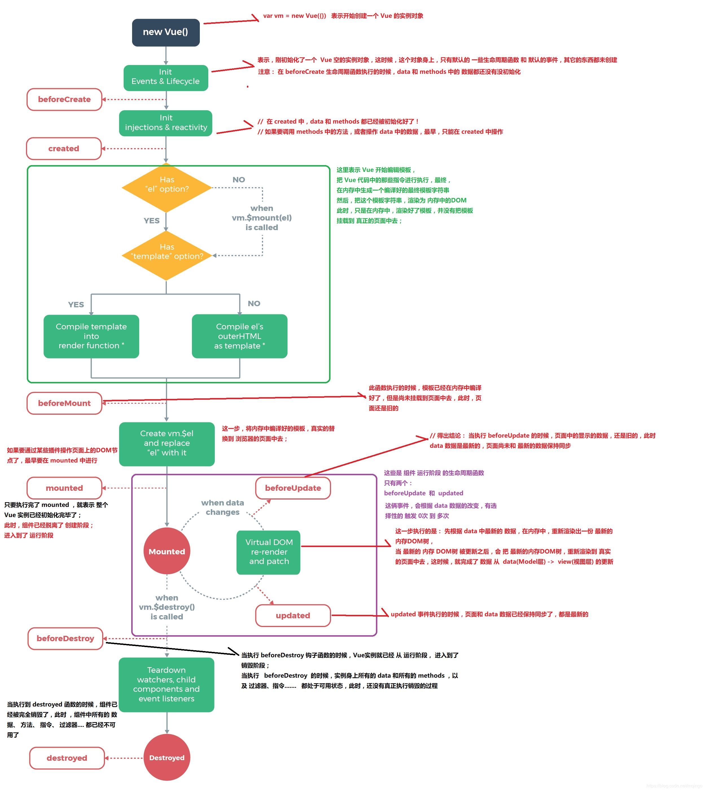

# Vue2

## 生命周期



## Vue 脚手架

1. 安装Vue CLI`npm install -g @vue/cli`       仅第一次需要全局安装
2. 创建项目`vue create my-project`
3. 运行项目`npm run serve`

参考文档：[Vue CLI 配置](https://cli.vuejs.org/zh)

## ref属性

1. 被用来给元素或子组件注册引用信息（id的替代者）
2. 应用在html标签上获取的是真实DOM元素，应用在组件标签上是组件实例对象（vc）
3. 使用方式：

   - 打标识：`<h1 ref="xxx">.....</h1>` 或 `<School ref="xxx"></School>`
   - 获取：`this.$refs.xxx`

## nextTick

1. 语法：`this.$nextTick(回调函数)`
2. 作用：在下一次DOM更新结束后执行其指定的回调。
3. 什么时候用：当改变数据后，要基于更新后的新DOM进行某些操作时，要在nextTick所指定的回调函数中执行。

## 配置项props

**功能**：让组件接收外部传过来的数据

1. 传递数据：`<Demo name="xxx"/>`
2. 接收数据：
   - `props:['name']`
   - `props:{name:Number}`
   - `props:{name:{type:String,required:true,default:'老王'}}`

**备注**：props是只读的，Vue底层会监测你对props的修改，如果进行了修改，就会发出警告。若业务需求确实需要修改，那么请复制props的内容到data中一份，然后去修改data中的数据。

## mixin（混入）

**功能**：可以把多个组件共用的配置提取成一个混入对象
**使用方式**：

1. 第一步定义混合，例如：{data()(....),methods:{....}}
2. 第二步使用混入，例如：

- 全局混入：Vue.mixin（xxx）
- 局部混入：mixins：['xxx']

## 插件

**功能**：用于增强vue
**本质**：包含install方法的一个对象，install的第一个参数是Vue，第二个以后的参数是插件使用者传递的数据。
**定义插件**：

```js
	对象.install = function（Vue，options）{
		// 1.添加全局过滤器
		Vue.filter(....)
		// 2.添加全局指令
		Vue.directive(....)
		// 3.配置全局混入（合）
		Vue.mixin(....)
		// 4.添加实例方法
		Vue.prototype.$myMethod = function () {...)
		Vue.prototype.$myProperty = xxxx
	}
```

**使用插件**:Vue.use()

## Scoped样式

**作用**：让样式在局部生效，防止冲突。
**写法**：`<style scoped>`
父组件的scoped样式会影响以下内容：
- 父组件自身的所有元素
- 子组件的**根元素**（这是特例）
- 使用`/deep/`、`::v-deep`或`:deep()`选择器指定的元素

## 自定义事件

父子组件传递休息

- 绑定 `this.$on('name',回调函数)`  或  `<Demo @atguigu="test"/>`
- 触发 `this.$emit('name',数据)`
- 解绑 `this.$off('name')` 不加name为解绑所有

**注意事项:**

- 只触发一次: 可以使用`once`修饰符或者`$once`方法。
- 在组件上绑定原生DOM事件时，需要添加`native`修饰符
- 当使用`this.$refs.xxx.$on('atguigu', 回调)`方式绑定自定义事件时，确保回调函数配置在`methods`选项中或使用箭头函数，以避免`this`指向问题。

## 全局事件总线

**安装全局事件总线**

```javascript
new Vue({
    beforeCreate() {
        Vue.prototype.$bus = this; // 装全局事件总线，$bus就是当前应用的vm
    },
});
```

**使用事件总线：**

1. **接收数据：** A组件想接收数据，则在A组件中给$bus绑定自定义事件，事件的回调留在A组件自身。
   ```javascript
   methods() {
       demo(data) { ... }
   }
   ...
   mounted() {
       this.$bus.$on('xxxx', this.demo)
   }
   ```
2. **提供数据：** `this.$bus.$emit('xxxx', 数据)`
3. 最好在beforeDestroy钩子中，用$off去解绑当前组件所用到的事件。

## pubsub-js消息

安装和导入：`npm i pubsub-js`  `import PubSub from 'pubsub-js'`
接受消息:`PubSub.subscribe('name', (name, data) => {})`
发送消息:`PubSub.publish('name', data)`
**备注:** 接受消息语句写在mounted里

## Vue封装的过渡与动画

**作用**：

- 在插入、更新或移除 DOM 素时，在合适的时候给元素添加样式类名。

**图示**：

- Enter：元素进入时的过渡效果。
  - `v-enter`：进入的起点，初始状态（如 opacity: 0）。
  - `v-enter-active`：进入过程中的状态。
  - `v-enter-to`：进入的终点，最终状态（如 opacity: 1）。
- Leave：元素离开时的过渡效果。
  - `v-leave`：离开的起点，初始状态（如 opacity: 1）。
  - `v-leave-active`：离开过程中的状态。
  - `v-leave-to`：离开的终点，最终状态（如 opacity: 0）。

**写法**：

1. 准备好样式：
2. 使用 `<transition>` 裹要过渡的元素，并配置 `name` 性：
   ```html
   <transition name="hello">
     <h1 v-show="isShow">你好啊！</h1>
   </transition>
   ```

**备注**：若有多个元素需要过渡，则需要使用 `<transition-group>`，且每个元素都要指定 `key` 值。

## 配置代理

方式一：在 `vue.config.js` 中添加如下配置：

```javascript
devServer: {
  proxy: "http://localhost:5000"
} // 请求资源时直接发给前端（8080）即可；不能配置多个代理；优先匹配前端资源
```

方式二：编写 `vue.config.js` 配置具体代理规则：

```javascript
module.exports = {
  devServer: {
    proxy: {
      '/api1': { // 匹配所有以 '/api1' 开头的请求路径
        target: 'http://localhost:5000', // 代理目标的基础路径
        changeOrigin: true,  // 是否改变请求的主机头（Host Header）为目标URL的主机头,默认为true
        pathRewrite: {'^/api1': ''} // 正则匹配，替换请求路径中的字符
      },
      // ....
    }
  }
} // 可以匹配多个代理
```

## 插槽Slot

父组件

```html
  <my-component>
    这是默认插槽的内容 <!-- 默认插槽内容 -->
    <template v-slot:header>头部内容</template><!-- 具名插槽内容 -->
    <template v-slot:footer="slotProps">
      用户信息：{{ slotProps.user.name }}，{{ slotProps.user.age }}岁
    </template><!-- 作用域插槽内容 -->
  </my-component>
```

子组件

```html
<div>
	<slot>默认内容</slot><!-- 默认插槽 -->
	<slot name="header">默认头部</slot><!-- 具名插槽 -->
	<slot name="footer" :user="user">默认尾部</slot><!-- 作用域插槽 -->
</div>
<script>//data user: { name: 'Alice', age: 25 }</script>
```

## Vuex

`mapState` 和 `mapGetters` 用于将 Vuex 的状态和 getter 映射到组件的计算属性中。

```javascript
import { mapState,mapGetters } from 'vuex';
export default {
  computed: {
    ...mapState(['count']),   // 对象写法mapState({count:'count'})
	...mapGetters(['doubleCount']),
	
  }
};
```

`mapMutations` 和 `mapActions` 用于将 Vuex 的 mutation 和 action 映射到组件的方法中。html标签中需要手动传参

```javascript
import { mapMutations,mapActions } from 'vuex';
export default {
  methods: {
    ...mapMutations(['increment']),    // 对象写法同上
	...mapActions(['incrementAsync']),
  }
};
```

模块化

```javascript
const moduleA = { 
	namespaced: true, 
	state: { ... }, 
	mutations: { ... }, 
	actions: { ... }, 
	getters: { ... } 
} 
const store = new Vuex.Store({ 
	modules: { a: moduleA } 
}) 
// 使用命名空间调用模块A内的action 
this.$store.dispatch('a/someAction')
// map映射
...mapState('a',[...])
```

## 路由

### 路由的基本使用

**作用**：实现单页面应用中的页面切换和组件展示。
**基本步骤**：

1. 安装 `vue-router`：`npm install vue-router@3`
2. 创建路由实例并配置路由规则：
   ```javascript
   import Vue from 'vue';
   import VueRouter from 'vue-router';
   import Home from './components/Home.vue';
   import About from './components/About.vue';
   Vue.use(VueRouter);
   const router = new VueRouter({
       routes: [
           { path: '/home', component: Home },
           { path: '/about', component: About }
       ]
   });
   export default router;
   ```
3. 在 `main.js` 中挂载路由实例：
   ```javascript
   import router from './router';
   new Vue({
       el: '#app',
       router,
       render: h => h(App)
   });
   ```
4. 使用 `<router-link>` 和 `<router-view>`：
   ```html
   <router-link to="/home">Home</router-link>
   <router-view></router-view>
   ```

### 嵌套路由

**作用**：实现多级路由结构。

```javascript
{
    path: '/parent',
    component: Parent,
    children: [
        { path: 'child', component: Child }
    ]
}
```

**访问路径**：`/parent/child`。

### Query参数

**传递参数**：

```html
<router-link :to="{ path: '/detail', query: { id: 123 }}">Detail</router-link>
```

**接收参数**：

```javascript
this.$route.query.id
```

### 命名路由

**作用**：简化路径书写。
**配置方法**：

```javascript
{ path: '/user', component: User, name: 'user' }
```

**使用方法**：

```html
<router-link :to="{ name: 'user', params: { id: 123 }}">User</router-link>
```

### Props配置

**作用**：将路由参数映射为组件的props。
**配置方法**：

```javascript
{ path: '/user/:id', component: User, props: true }
```

或自定义映射：

```javascript
{ path: '/user/:id', component: User, props: route => ({ id: route.params.id }) }
```

### Router-link的replace

**作用**：阻止历史记录堆栈增加。

```html
<router-link to="/home" replace>Home</router-link>
```

### 编程式路由导航

```javascript
this.$router.push('/home'); // 添加历史记录
this.$router.replace('/home'); // 不添加历史记录
this.$router.go(-1); // 前进或后退
```

### 缓存路由组件

**作用**：保留组件状态，避免重新渲染。

```html
<keep-alive>
    <router-view></router-view>
</keep-alive>
```

**缓存特定组件**：

```html
<keep-alive include="Home">
    <router-view></router-view>
</keep-alive>
```

### 两个新生命周期

- `activated`：组件被激活时调用。
- `deactivated`：组件被停用时调用。

### 路由守卫

#### 全局前置守卫

**作用**：在路由跳转前进行权限控制。

```javascript
router.beforeEach((to, from, next) => {
    if (to.meta.requiresAuth && !isAuthenticated) {
        next('/login');
    } else {
        next();
    }
});
```

#### 全局后置守卫

**作用**：在路由跳转后执行操作。

```javascript
router.afterEach((to, from) => {
    document.title = to.meta.title || 'Default Title';
});
```

#### 独享守卫

**作用**：针对某个路由单独设置守卫。

```javascript
{
    path: '/admin',
    component: Admin,
    beforeEnter: (to, from, next) => {
        if (isAdmin) next();
        else next('/home');
    }
}
```

#### 组件内守卫

**作用**：在组件内部定义守卫逻辑。

```javascript
beforeRouteEnter(to, from, next) { ... }
beforeRouteUpdate(to, from, next) { ... }
beforeRouteLeave(to, from, next) { ... }
```

### History模式与Hash模式

- **Hash模式**：URL中带有 `#`，兼容性好。
- **History模式**：URL干净美观，但需要后端支持。

```javascript
const router = new VueRouter({
    mode: 'history',
    routes: [...]
});
```

# Vue3 其他 API 笔记

## shallowReactive 与 shallowRef

### 1. shallowReactive

- **定义**：浅层响应式，只处理对象最外层属性的响应式（仅对根级别属性进行响应式追踪）
- **使用场景**：当数据结构较深但只需关注顶层字段变化时
- **注意**：嵌套对象不会自动转为响应式

```javascript
const state = shallowReactive({
  a: 1,          // 响应式
  nested: { b: 2 } // 非响应式
})
```

### 2. shallowRef

- **定义**：仅对 `.value` 进行响应式处理，不处理内部值
- **使用场景**：需要整体替换的大型对象/数组，或外部库管理的实例
- **注意**：需通过 `.value` 访问，内部值变更不会触发更新

```javascript
const data = shallowRef({ count: 1 })
data.value.count = 2 // 不会触发更新
data.value = { count: 3 } // 会触发更新
```

## readonly 与 shallowReadonly

### 1. readonly

- **定义**：创建深层次只读代理对象
- **使用场景**：防止组件意外修改props/全局配置
- **注意**：任何层级修改都会失败（开发环境警告）

```javascript
const original = reactive({ a: 1 })
const copy = readonly(original)
```

### 2. shallowReadonly

- **定义**：仅创建浅层只读代理（仅根级别只读）
- **使用场景**：允许修改嵌套对象但保护顶层字段

```javascript
const state = shallowReadonly({
  config: { theme: 'dark' }
})
state.config.theme = 'light' // 允许修改
state.config = {} // 禁止修改
```

## toRaw 与 markRaw

### 1. toRaw

- **作用**：返回 reactive/readonly 代理的原始对象
- **使用场景**：需要操作原始数据且不希望触发更新
- **注意**：可能返回多层代理的原始对象

```javascript
const proxy = reactive({ a: 1 })
const raw = toRaw(proxy) // { a: 1 }
```

### 2. markRaw

- **作用**：标记对象永不转换为响应式代理
- **使用场景**：第三方库实例/不可变数据/性能优化
- **注意**：标记是永久性的

```javascript
const foo = markRaw({ complex: object })
const state = reactive({ data: foo }) // data 保持非响应式
```

## customRef 自定义响应式引用

- **作用**：创建带有自定义 get/set 逻辑的 ref
- **典型应用**：防抖、异步数据处理

```javascript
function useDebouncedRef(value, delay = 200) { // 定义一个自定义的防抖引用（debounced ref）函数
  let timeout;// 存储定时器 ID
  // 使用 Vue 3 的 customRef 创建一个自定义的响应式引用
  return customRef((track, trigger) => {
    return {
      get() {
        track();// 调用 track 函数，通知 Vue 当前的依赖需要被追踪
        return value;// 返回当前的值
      },
      set(newValue) {
        clearTimeout(timeout);
        timeout = setTimeout(() => {
          value = newValue;
          trigger();// 调用 trigger 函数，通知 Vue 值已经发生变化，触发视图更新
        }, delay);
      }
    };
  });
}
```

## provide 与 inject

### 1. 组件通信

- **provide**：在父组件提供数据
- **inject**：在子孙组件注入数据
- **特点**：跨层级传递、响应式数据保持响应性

### 2. 基本用法

```javascript
// 父组件
import { provide } from 'vue'
setup() {
  provide('theme', 'dark')
}
// 子组件
import { inject } from 'vue'
setup() {
  const theme = inject('theme', 'light') // 默认值 light
  return { theme }
}
```

### 3. 最佳实践

- 推荐使用 Symbol 作为键名避免命名冲突
- 复杂数据建议配合响应式 API 使用

```javascript
// keys.js
export const THEME_KEY = Symbol()
// 父组件
provide(THEME_KEY, reactive({ color: '#333' }))
// 子组件
const theme = inject(THEME_KEY)
```

## 响应式数据判断

`isRef` `isReactive` `isReadonly` `isProxy`

# Vue3常用组件

## Fragment

- Vue 3 允许组件拥有多个根节点，而不需要额外的包裹元素。
- `Fragment` 是一个虚拟的容器，它不会在 DOM 中渲染任何实际的元素。

## Teleport

允许将组件的内容渲染到 DOM 树中的任意位置，而不是默认的父级容器内。

- 模态框（Modal）、弹出层（Tooltip）、通知栏（Notification）等需要脱离当前组件层级结构的场景。
- 解决 CSS 嵌套层级过深或样式冲突的问题。

**示例**：模态框会被渲染到 `<body>` 标签下，而不是当前组件的 DOM 结构中。

```vue
<template>
  <button @click="showModal = true">打开模态框</button>
  <teleport to="body">
    <div v-if="showModal" class="modal">
      <p>这是一个模态框</p>
      <button @click="showModal = false">关闭</button>
    </div>
  </teleport>
</template>

<script>
export default {
  data() {
    return {
      showModal: false,
    };
  },
};
</script>
```

## Suspense

`Suspense` 是一个用于处理异步依赖的组件，允许在等待异步操作完成时显示一个占位内容（fallback）。

- 懒加载组件（如通过 `defineAsyncComponent` 定义的异步组件）。
- 异步数据获取时显示加载状态。

**示例：**当 `AsyncComponent` 还未加载完成时，会显示 "加载中..." 的占位内容

```vue
<template>
  <suspense>
    <template #default>
      <async-component />
    </template>
    <template #fallback>
      <div>加载中...</div>
    </template>
  </suspense>
</template>

<script>
import { defineAsyncComponent } from 'vue';

const AsyncComponent = defineAsyncComponent(() =>
  import('./components/MyComponent.vue')
);

export default {
  components: {
    AsyncComponent,
  },
};
</script>
```

## 总结对比

| 组件         | 功能描述                              | 使用场景                     |
| ------------ | ------------------------------------- | ---------------------------- |
| **Fragment** | 允许多个根节点，不渲染额外的 DOM 元素 | 多根节点组件、减少 DOM 嵌套  |
| **Teleport** | 将组件内容渲染到指定的 DOM 位置       | 模态框、弹出层、全局通知栏等 |
| **Suspense** | 处理异步依赖，支持占位内容和异步加载  | 懒加载组件、异步数据加载     |

# Vue3其他变化

## 全局API转移

app.config.xxx
app.component
app.directive
app.mixin
app.use
app.congif.globalProperties

## 其他

data始终声明为一个函数
动画过渡类名 v-enter ->  v-enter-from
移除keyCode
移除v-on.native
移除过滤器

