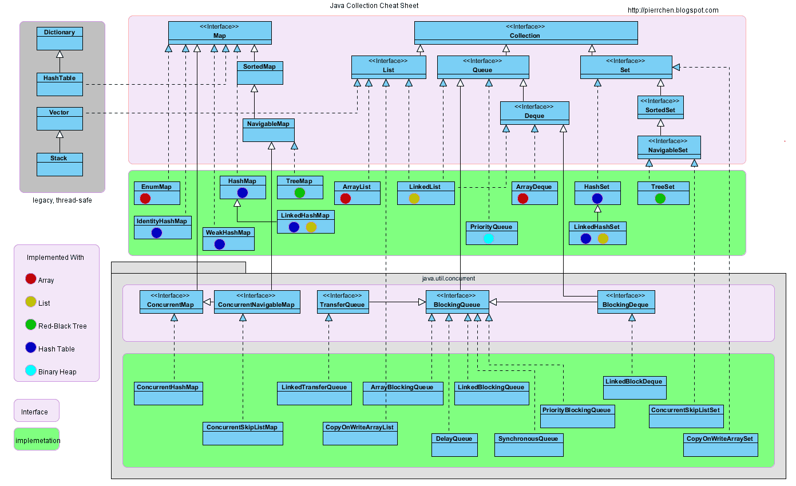
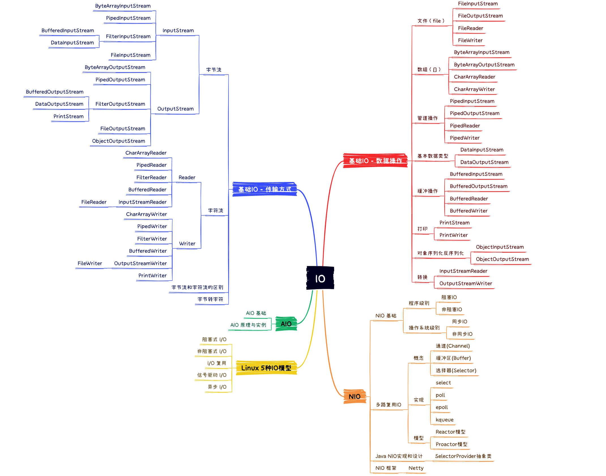
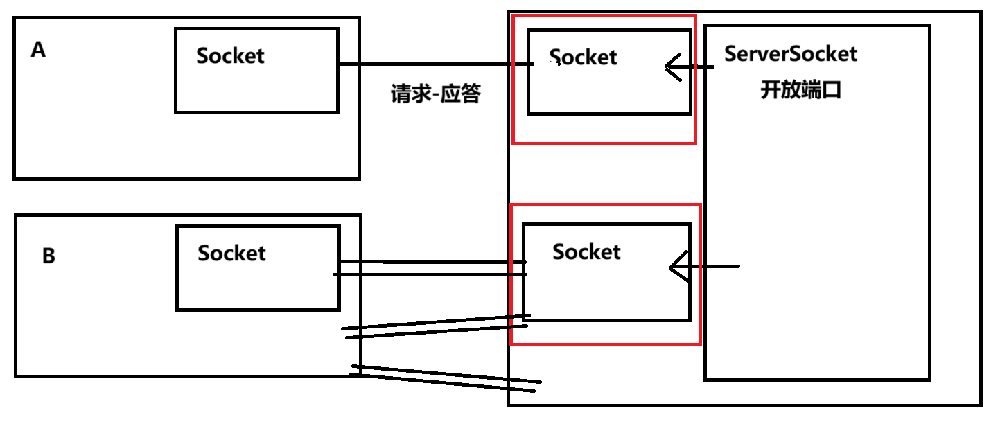
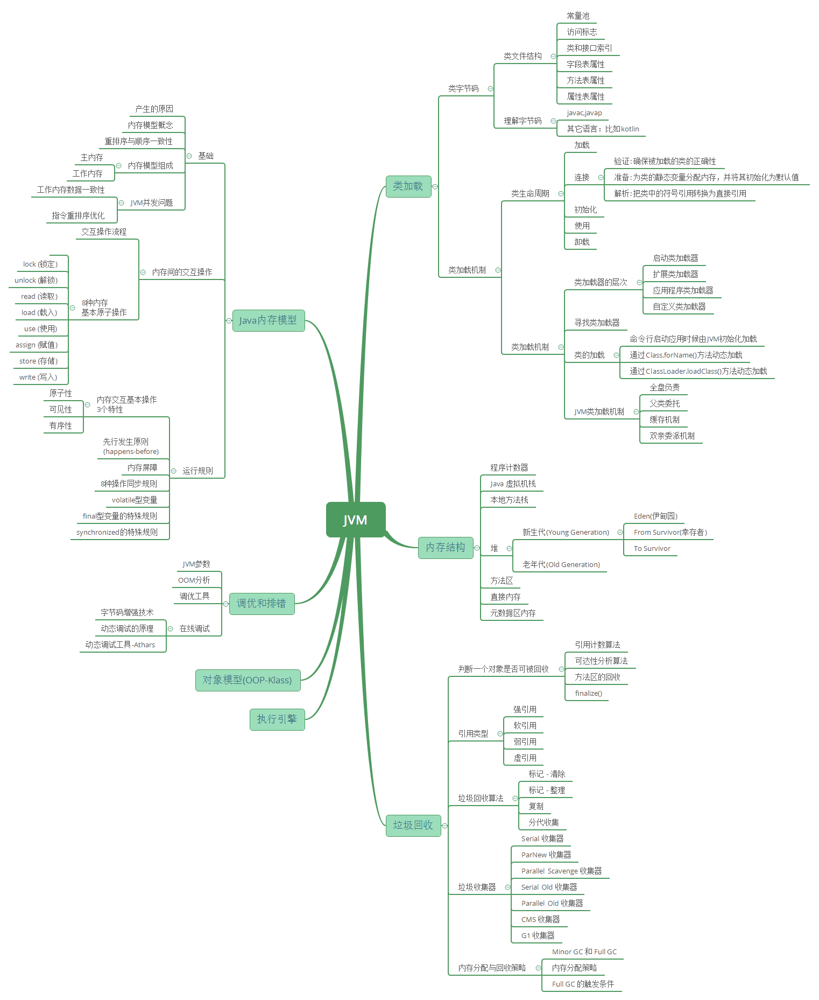
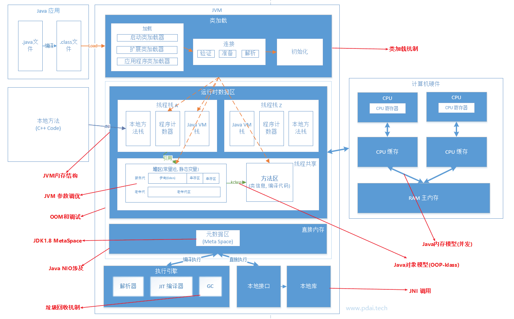

# 小知识点

## 代码初始化块

Java中的代码初始化块（也叫“初始化块”或“初始化代码块”）是类中定义的一段没有方法名的代码块，用花括号`{}`包裹。它会在类实例化时被自动执行，用来对对象进行统一的初始化操作。初始化块分为两种：

1. **实例初始化块**：定义在类中，没有static修饰。每次创建对象时都会执行，且先于构造方法执行(实际上是放到构造方法里靠前的位置调用)。
2. **静态初始化块**：使用`static { ... }`定义，类加载时执行一次，用于初始化静态变量或做一些只需执行一次的操作。

## 内部类

定义在另一个类的内部的类

::: v-pre
`List<String> list = new ArrayList<String>() {{ add("a"); add("b"); }};` 内部类+代码初始化块。不推荐，会产生额外开销：其他类.class
:::

```java
public class Test2 {  
    public static void main(String[] args) {  
        class A { }  
        A a = new A();  
        A b = new A();  
        A c = new A() {};  // 本质是继承于A的另一个类
        A d = new A() {};  // 和c不同
  
        System.out.println("a: " + a.getClass()); // a: class Test2$1A  
        System.out.println("b: " + b.getClass()); // b: class Test2$1A  
        System.out.println("c: " + c.getClass()); // c: class Test2$1  
        System.out.println("d: " + d.getClass()); // d: class Test2$2  
    }  
}
```

## 语法糖

Java 里的“语法糖”（syntactic sugar）指的是语言设计上为简化开发者代码书写和阅读而提供的一些方便写法，底层其实是等价的，但写起来更简洁、更直观。

| 语法糖名称                      | 代码示例                                 | 底层等价/说明                                   |
| ------------------------------- | ---------------------------------------- | ----------------------------------------------- |
| 增强型 for 循环                 | `for (int x : arr) { ... }`              | 传统 for 循环遍历数组或集合                     |
| 自动装箱/拆箱                   | `Integer i = 10; int j = i;`             | `Integer.valueOf(10)` 和 `i.intValue()`         |
| 字符串拼接 + 运算符             | `"a" + "b"`                              | 编译成 `StringBuilder` 追加调用                 |
| 匿名内部类                      | `new Runnable() { ... }`                 | 匿名类的简写形式                                |
| Lambda 表达式                   | `() -> System.out.println("Run")`        | 匿名内部类的简化形式                            |
| 可变参数 (varargs)              | `void foo(String... args)`               | 接收一个数组参数                                |
| try-with-resources              | `try (Resource r = ...) { ... }`         | 自动调用 `close()`，等价于 try-finally 关闭资源 |
| 数字下划线分隔                  | `int n = 1_000_000;`                     | 仅为提高可读性，编译后不影响数值                |
| Unicode 转义                    | `String s = "\u0041";`                   | 直接表示 Unicode 字符                           |
| 枚举支持 switch                 | `switch (enumVal) { case ...: }`         | 底层通过映射实现                                |
| 钻石语法 (泛型类型推断)         | `List<String> list = new ArrayList<>();` | 省略泛型右侧具体类型参数                        |
| 接口默认方法                    | `default void method() { ... }`          | 接口中带有默认实现，避免全部实现                |
| # 日期                          |                                          |                                                 |
| ## 1. `java.util.Date` (老 API) |                                          |                                                 |

- **来源**：Java 1.0 引入。
- **特点**：
  - 表示时间点（时间戳，内部用 `long` 保存毫秒值）。
  - 大部分方法（如 `getYear()`、`getMonth()`）早已**废弃**，因为设计混乱、不够直观。
  - **时区、格式化需要依赖 `java.text.SimpleDateFormat` 等外部类**。
  - 线程不安全。
- **典型用法**：
  ```java
  Date date = new Date();
  System.out.println(date);  // Fri Jul 22 10:30:00 CET 2025
  ```

## 2. `java.util.Calendar` (老 API)

- **引入版本**：Java 1.1
- **为什么出现**：用来弥补 `Date` 设计缺陷（比如 `Date` 不能直接加减天数、不能直接处理时区）。
- **特点**：
  - 是一个**抽象类**，常用实现类是 `GregorianCalendar`。
  - 支持日期的加减、字段修改（例如加1天、减3个月）。
  - 内置了对**时区**和**本地化**的支持。
  - API 复杂、容易出错（如月份从 **0 开始**，`January == 0`）。
  - 线程不安全。
- **典型用法**：
  ```java
  Calendar cal = Calendar.getInstance(); // 获取当前时间
  cal.set(2025, Calendar.JULY, 22);      // 设置 2025-07-22
  cal.add(Calendar.DAY_OF_MONTH, 5);     // 加5天
  Date date = cal.getTime();             // 转换成 Date
  System.out.println(date);
  ```

## 3. `java.time` (新 API)

- **来源**：Java 8 引入（JSR-310），属于 **Java Date and Time API**，在 `java.time` 包下。
- **特点**：
  - **更现代化**，设计清晰、线程安全。
  - **核心类**：
    - `LocalDate`：只表示**日期**（不带时间）。
    - `LocalTime`：只表示**时间**（不带日期）。
    - `LocalDateTime`：日期 + 时间（不带时区）。
    - `ZonedDateTime`：日期 + 时间 + 时区。
    - `Instant`：时间戳（UTC 标准时间）。
  - **格式化与解析**：`DateTimeFormatter`。
  - **计算方便**：支持加减、比较、`Period`/`Duration` 间隔计算。
- **典型用法**：
  ```java
  LocalDateTime now = LocalDateTime.now();
  System.out.println(now);  // 2025-07-22T10:30:00

  String formatted = now.format(DateTimeFormatter.ofPattern("yyyy-MM-dd HH:mm:ss"));
  System.out.println(formatted);  // 2025-07-22 10:30:00
  ```

## 对比

| 特性                                                                                        | `Date`              | `Calendar`             | `java.time`                      |
| ------------------------------------------------------------------------------------------- | ------------------- | ---------------------- | -------------------------------- |
| **引入版本**                                                                                | Java 1.0            | Java 1.1               | Java 8                           |
| **时间点表示**                                                                              | 毫秒时间戳          | 字段集合（年/月/日等） | 不可变对象（LocalDate、Instant） |
| **时区支持**                                                                                | 需要配合 `TimeZone` | 内置支持               | 内置支持 (ZonedDateTime)         |
| **加减时间**                                                                                | 不支持              | ✅ 支持（`add()`）      | ✅ 支持（`plus()`, `minus()`）    |
| **线程安全**                                                                                | ❌ 否                | ❌ 否                   | ✅ 是                             |
| **API设计**                                                                                 | 过时（部分已废弃）  | 笨重且易错             | 现代化、易用                     |
| **月份起始**                                                                                | 1                   | **0**（January = 0）   | 1                                |
| **是否推荐使用**                                                                            | 🚫 不推荐            | 🚫 不推荐               | ✅ 推荐                           |
| ## api转换                                                                                  |                     |                        |                                  |
| ```java                                                                                     |                     |                        |                                  |
| // Calendar → LocalDateTime                                                                 |                     |                        |                                  |
| Calendar cal = Calendar.getInstance();                                                      |                     |                        |                                  |
| LocalDateTime ldt = LocalDateTime.ofInstant(cal.toInstant(), cal.getTimeZone().toZoneId()); |                     |                        |                                  |
| System.out.println(ldt);                                                                    |                     |                        |                                  |

// LocalDateTime → Calendar
LocalDateTime now = LocalDateTime.now();
ZonedDateTime zdt = now.atZone(ZoneId.systemDefault());
Calendar c = GregorianCalendar.from(zdt);
System.out.println(c.getTime());

````
## 格式化
### `java.util.Date` + SimpleDateFormat (旧版)
```java
Date date = new Date();
SimpleDateFormat sdf = new SimpleDateFormat("yyyy-MM-dd HH:mm:ss");
String formatted = sdf.format(date); // 格式化
````

### `java.time` + DateTimeFormatter (新版)

```java
LocalDateTime now = LocalDateTime.now();
DateTimeFormatter formatter = DateTimeFormatter.ofPattern("yyyy-MM-dd HH:mm:ss");
String formatted = now.format(formatter); // 格式化
```

### 常用格式化符号总结

| **符号** | **意义**             | **示例**                              | 说明                           |
| -------- | -------------------- | ------------------------------------- | ------------------------------ |
| `y`      | 年（Year）           | `yyyy` → 2025、`yy` → 25              | `yyyy` 四位，`yy` 两位         |
| `M`      | 月（Month）          | `MM` → 07、`MMM` → Jul、`MMMM` → July | `MM` 补零，`MMM/MMMM` 英文月份 |
| `d`      | 日（Day）            | `dd` → 09、`d` → 9                    | `DDD` 年中日                   |
| `E`      | 星期（Day of Week）  | `E` → Tue、`EEEE` → Tuesday           | `E` 简称，`EEEE` 全称          |
| `H`      | 24小时制（Hour）     | `HH` → 14                             | 00~23                          |
| `h`      | 12小时制（Hour）     | `hh` → 02                             | 01~12                          |
| `m`      | 分钟（Minute）       | `mm` → 05                             |                                |
| `s`      | 秒（Second）         | `ss` → 07                             |                                |
| `S`      | 毫秒（Millisecond）  | `SSS` → 235                           | 0~999                          |
| `a`      | 上下午（AM/PM）      | `a` → PM                              |                                |
| `z`      | 时区简称             | `z` → CST                             | China Standard Time            |
| `Z`      | 时区偏移             | `Z` → +0800                           | RFC 822 格式                   |
| `X`      | 时区偏移（ISO 8601） | `X` → +08、`XXX` → +08:00             | ISO 标准格式                   |

- **`SimpleDateFormat`** 不支持 `u`（周的年份）、`n`（纳秒）。
- **`DateTimeFormatter`** 扩展了支持，比如 `u`、`n`、`VV`（时区ID）等。

# 正则表达式

## 流程

1. **编译正则** → `Pattern.compile(regex)`
2. **创建匹配器** → `pattern.matcher(input)`
3. **执行操作**：
   - `matches()` / `find()` 检查匹配
   - `group()` 提取结果
   - `replaceAll()` / `split()` 处理字符串

## 一、核心类

1. **`Pattern`**
   - 正则表达式的编译表示（线程安全）
   - 通过 `Pattern.compile()` 创建
   - 常用方法：
     ```java
     Pattern pattern = Pattern.compile("a*b"); // 编译正则
     ```
2. **`Matcher`**
   - 通过 `pattern.matcher(input)` 创建
   - 执行匹配操作的核心类
     ```java
     Matcher matcher = pattern.matcher("aaaaab");
     ```

## 二、常用操作

### 1. 匹配检查

- **完整匹配**（整个字符串需匹配正则）
  ```java
  boolean isMatch = matcher.matches(); // true
  ```
- **部分匹配**（查找子串）
  ```java
  boolean found = matcher.find(); // 查找下一个匹配项
  ```

### 2. 提取匹配结果

```java
while (matcher.find()) {
    String match = matcher.group(); // 获取匹配的完整字符串
    int start = matcher.start();    // 匹配开始索引
    int end = matcher.end();        // 匹配结束索引
}
```

### 3. 分组提取

```java
Pattern p = Pattern.compile("(\\d+)-(\\w+)");
Matcher m = p.matcher("123-abc");
if (m.matches()) {
    String full = m.group(0); // "123-abc"  分组索引从 1 开始（0 为完整匹配）
    String num = m.group(1);  // "123"
    String text = m.group(2); // "abc"
}
```

### 4. 字符串替换

- **替换所有匹配项**
  ```java
  String result = "a1b2c3".replaceAll("\\d", "X"); // "aXbXcX"
  ```
- **替换首个匹配项**
  ```java
  String result = "a1b2".replaceFirst("\\d", "X"); // "aXb2"
  ```
- **动态替换**（通过 `Matcher`）
  ```java
  Matcher m = Pattern.compile("\\d+").matcher("a1b2");
  String result = m.replaceAll(match -> "[" + match.group() + "]"); // "a[1]b[2]"
  ```

### 5. 字符串分割

```java
String[] parts = "one,two,three".split(","); 
// ["one", "two", "three"]

// 使用正则分割
String[] parts = "a1b2c".split("\\d"); // ["a", "b", "c"]
```

## 三、高效实践

1. **复用 `Pattern` 对象**
   - 避免重复编译（编译开销大）：
     ```java
     public class Validator {
         private static final Pattern EMAIL_PATTERN = 
             Pattern.compile("^[a-zA-Z0-9._%+-]+@[a-zA-Z0-9.-]+\\.[a-zA-Z]{2,6}$");
         
         public static boolean isValidEmail(String email) {
             return EMAIL_PATTERN.matcher(email).matches();
         }
     }
     ```
2. **处理大文本**
   - 使用 `Matcher` 的 `region()` 限制搜索范围：
     ```java
     matcher.region(10, 100); // 只在索引 [10,100) 内匹配
     ```

## 四、异常处理

- 非法正则抛出 `PatternSyntaxException`：
  ```java
  try {
      Pattern.compile("\\"); // 错误：未闭合转义
  } catch (PatternSyntaxException e) {
      System.err.println("正则语法错误: " + e.getDescription());
  }
  ```

# 反射与动态代理

## 一、反射机制

### 1. 反射概述

- **专业解释**：在运行状态中，对于任意类都能获取所有属性和方法；对于任意对象都能调用其任意属性和方法
- **通俗理解**：
  1. **无视修饰符**：反射创建的对象可访问私有成员
  2. **结合配置文件**：实现需求变更时只需修改配置文件，无需改动代码

### 2. 获取Class对象的三种方式

```java
// 1. Class.forName("全类名") - 最常用
Class<?> clazz1 = Class.forName("com.example.Student");

// 2. 类名.class
Class<?> clazz2 = Student.class;

// 3. 对象.getClass()
Student stu = new Student();
Class<?> clazz3 = stu.getClass();

System.out.println(clazz1 == clazz2); // true
System.out.println(clazz2 == clazz3); // true
```

> **重要概念**：
>
> - 字节码文件：硬盘上的.class文件
> - 字节码文件对象：JVM加载.class后创建的对象（内存唯一）

### 3. 操作构造方法

| 方法名                                       | 说明                          |
| -------------------------------------------- | ----------------------------- |
| `Constructor<?>[] getConstructors()`         | 获取所有public构造方法        |
| `Constructor<?>[] getDeclaredConstructors()` | 获取所有构造方法（含private） |
| `getConstructor(Class<?>... params)`         | 获取指定public构造方法        |
| `getDeclaredConstructor(Class<?>... params)` | 获取指定构造方法（含private） |

```java
// 获取私有构造并创建对象
Constructor<?> con = clazz.getDeclaredConstructor(String.class, int.class);
con.setAccessible(true); // 暴力反射
Object obj = con.newInstance("张三", 23);
```

### 4. 操作成员变量

| 方法名                          | 说明                          |
| ------------------------------- | ----------------------------- |
| `Field[] getFields()`           | 获取所有public成员变量        |
| `Field[] getDeclaredFields()`   | 获取所有成员变量（含private） |
| `getField(String name)`         | 获取指定public成员变量        |
| `getDeclaredField(String name)` | 获取指定成员变量（含private） |

```java
Field field = clazz.getDeclaredField("name");
field.setAccessible(true);
field.set(obj, "李四");  // 赋值
String value = (String) field.get(obj);  // 取值
```

### 5. 操作成员方法

| 方法名                                               | 说明                         |
| ---------------------------------------------------- | ---------------------------- |
| `Method[] getMethods()`                              | 获取所有public方法（含父类） |
| `Method[] getDeclaredMethods()`                      | 获取所有方法（含private）    |
| `getMethod(String name, Class<?>... params)`         | 获取指定public方法           |
| `getDeclaredMethod(String name, Class<?>... params)` | 获取指定方法（含private）    |

```java
Method method = clazz.getDeclaredMethod("study");
method.setAccessible(true);
method.invoke(obj);  // 调用无参方法

Method eatMethod = clazz.getMethod("eat", String.class);
String result = (String) eatMethod.invoke(obj, "苹果"); // 调用有参方法
```

## 二、动态代理

### 1. 核心价值

**无侵入式增强方法功能**，符合开闭原则（对扩展开放，对修改关闭）

### 2. 三要素

1. **真实对象**：实际干活的对象
2. **代理对象**：增强功能的对象
3. **方法调用**：通过代理调用目标方法

### 3. 实现步骤

```java
public class ProxyUtil {
    public static Star createProxy(BigStar bigStar) {
        return (Star) Proxy.newProxyInstance(
            ProxyUtil.class.getClassLoader(),
            new Class[]{Star.class}, // 代理的接口
            new InvocationHandler() {
                @Override
                public Object invoke(Object proxy, Method method, Object[] args) {
                    // 方法增强逻辑
                    if("sing".equals(method.getName())) {
                        System.out.println("准备话筒，收钱");
                    }
                    
                    // 调用真实对象的方法
                    return method.invoke(bigStar, args);
                }
            }
        );
    }
}
```

### 4. 方法拦截

```java
new InvocationHandler() {
    @Override
    public Object invoke(...) {
        if("cleanWC".equals(method.getName())) {
            System.out.println("拦截不合法请求");
            return null; // 拦截方法
        }
        return method.invoke(bigStar, args);
    }
}
```

### 5. 实战案例：增强add/拦截remove

```java
List proxyList = (List) Proxy.newProxyInstance(...,
    new InvocationHandler() {
        public Object invoke(...) {
            if("add".equals(method.getName())) {
                // 增强add方法
                long start = System.currentTimeMillis();
                Object result = method.invoke(list, args);
                System.out.println("耗时：" + (System.currentTimeMillis()-start));
                return result;
            } else if("remove".equals(method.getName())) {
                // 拦截remove方法
                System.out.println("拦截删除操作");
                return false; 
            }
            return method.invoke(list, args);
        }
    }
);
```

# 集合和流

## 框架图

> 容器主要包括 Collection 和 Map 两种，Collection 存储着对象的集合，而 Map 存储着键值对(两个对象)的映射表。



## 常用集合

### Collection

#### Set

- **HashSet：** 基于哈希表实现，支持快速查找，但不支持有序性操作。失去了元素的插入顺序信息，使用 Iterator 遍历 HashSet 得到的结果是不确定的。
- **LinkedHashSet：** 具有 HashSet 的查找效率，且内部使用双向链表维护元素的插入顺序。
- **TreeSet：** 基于红黑树实现，支持有序性操作，例如根据一个范围查找元素的操作。但查找效率不如 HashSet，HashSet 查找时间复杂度为 O(1)，TreeSet 则为 O(logN)。

#### List

- **ArrayList：** 基于动态数组实现，支持随机访问，适合查找多、增删少的场景。
- **Vector：** 和 ArrayList 类似，但它是线程安全的，适合多线程环境。
- **LinkedList：** 基于双向链表实现，只能顺序访问，但支持快速在链表中间插入和删除。还可以用作栈、队列和双向队列。

#### Queue

- **LinkedList：** 可以用来实现双向队列（Deque）。
- **PriorityQueue：** 基于堆结构实现，可以用它来实现优先队列。

### Map

- **HashMap：** 基于哈希表实现，键值对无序，允许一个 null 键和多个 null 值。
- **LinkedHashMap：** 使用双向链表维护元素顺序，顺序为插入顺序或最近最少使用(LRU)顺序。
- **TreeMap：** 基于红黑树实现，键值对有序（按键排序）。
- **HashTable：** 和 HashMap 类似，但它是线程安全的，属于遗留类。不推荐使用，可用 ConcurrentHashMap 替代。
- **ConcurrentHashMap：** 支持高并发的线程安全 Map，实现了分段锁机制，提高了效率。

## Java 集合类常用方法

### 创建时完成初始化

::: v-pre
| 集合类型 | 写法                                                                                  | Java 版本 | 是否可修改                       |
| -------- | ------------------------------------------------------------------------------------- | --------- | -------------------------------- |
| **List** | `List<String> list = Arrays.asList("a", "b", "c");`                                   | Java 8+   | ❌ 不可增删，只能改值             |
|          | `List<String> list = new ArrayList<>(Arrays.asList("a", "b", "c"));`                  | Java 8+   | ✅ 可修改                         |
|          | `List<String> list = List.of("a", "b", "c");`                                         | Java 9+   | ❌ 不可修改                       |
|          | `List<String> list = new LinkedList<>(Arrays.asList("a", "b", "c"));`                 | Java 8+   | ✅ 可修改                         |
| **Set**  | `Set<String> set = new HashSet<>(Arrays.asList("a", "b", "c"));`                      | Java 8+   | ✅ 可修改                         |
|          | `Set<String> set = Set.of("a", "b", "c");`                                            | Java 9+   | ❌ 不可修改                       |
|          | `Set<String> set = new LinkedHashSet<>(Arrays.asList("a", "b", "c"));`                | Java 8+   | ✅ 可修改                         |
| **Map**  | `Map<String, Integer> map = new HashMap<>(); map.put("a", 1); map.put("b", 2);`       | Java 8+   | ✅ 可修改                         |
|          | `Map<String, Integer> map = Map.of("a", 1, "b", 2);`                                  | Java 9+   | ❌ 不可修改                       |
|          | `Map<String, Integer> map = Map.ofEntries(Map.entry("a", 1), Map.entry("b", 2));`     | Java 9+   | ❌ 不可修改                       |
|          | `Map<String, Integer> map = new LinkedHashMap<>(); map.put("a", 1); map.put("b", 2);` | Java 8+   | ✅ 可修改                         |
| **通用** | `List<String> list = new ArrayList<String>() {{ add("a"); add("b"); }};`              | Java 8+   | ✅ 可修改 ⚠️（不推荐：匿名内部类） |
:::

### Collection

| 方法签名                                | 描述             | 示例                                                   | 备注           |
| --------------------------------------- | ---------------- | ------------------------------------------------------ | -------------- |
| `add(E e)`                              | 添加元素         | `collection.add("a")`                                  |                |
| `addAll(Collection<? extends E> c)`     | 添加集合所有元素 | `collection.addAll(Arrays.asList("b", "c"))`           |                |
| `clear()`                               | 清空集合         | `collection.clear()`                                   |                |
| `contains(Object o)`                    | 检查元素是否存在 | `collection.contains("a")`                             |                |
| `containsAll(Collection<?> c)`          | 检查是否包含子集 | `collection.containsAll(Arrays.asList("a", "b"))`      |                |
| `isEmpty()`                             | 判断集合是否为空 | `collection.isEmpty()`                                 |                |
| `iterator()`                            | 返回迭代器       | `Iterator<String> it = collection.iterator()`          |                |
| `remove(Object o)`                      | 移除元素         | `collection.remove("a")`                               |                |
| `removeAll(Collection<?> c)`            | 移除子集所有元素 | `collection.removeAll(Arrays.asList("a", "b"))`        |                |
| `retainAll(Collection<?> c)`            | 保留子集元素     | `collection.retainAll(Arrays.asList("a"))`             | 求交集操作     |
| `size()`                                | 返回元素数量     | `int size = collection.size()`                         |                |
| `toArray()`                             | 转为数组         | `Object[] array = collection.toArray()`                |                |
| `toArray(T[] a)`                        | 转为指定类型数组 | `String[] array = collection.toArray(new String[0])`   | 推荐空数组写法 |
| `stream()`                              | 返回顺序流       | `Stream<String> stream = collection.stream()`          | **Java 8新增** |
| `parallelStream()`                      | 返回并行流       | `Stream<String> pStream = collection.parallelStream()` | **Java 8新增** |
| `removeIf(Predicate<? super E> filter)` | 移除满足条件元素 | `collection.removeIf(s -> s.isEmpty())`                | **Java 8新增** |
| `forEach(Consumer<? super E> action)`   | 遍历元素         | `collection.forEach(System.out::println)`              | **Java 8新增** |

### List

| 方法签名                                       | 描述                     | 示例                                             | 备注           |
| ---------------------------------------------- | ------------------------ | ------------------------------------------------ | -------------- |
| `add(int index, E element)`                    | 在指定索引插入元素       | `list.add(0, "a")`                               |                |
| `addAll(int index, Collection<? extends E> c)` | 在指定索引插入子集       | `list.addAll(0, Arrays.asList("b", "c"))`        |                |
| `get(int index)`                               | 获取指定索引元素         | `String s = list.get(0)`                         |                |
| `indexOf(Object o)`                            | 返回元素首次出现索引     | `int idx = list.indexOf("a")`                    |                |
| `lastIndexOf(Object o)`                        | 返回元素最后出现索引     | `int lastIdx = list.lastIndexOf("a")`            |                |
| `listIterator()`                               | 返回列表迭代器           | `ListIterator<String> it = list.listIterator()`  | 支持双向遍历   |
| `listIterator(int index)`                      | 从指定索引返回列表迭代器 | `ListIterator<String> it = list.listIterator(1)` |                |
| `remove(int index)`                            | 移除指定索引元素         | `String removed = list.remove(0)`                | 返回被删除元素 |
| `set(int index, E element)`                    | 替换指定索引元素         | `String oldVal = list.set(0, "x")`               | 返回旧值       |
| `sort(Comparator<? super E> c)`                | 排序元素                 | `list.sort(Comparator.naturalOrder())`           | **Java 8新增** |
| `subList(int fromIndex, int toIndex)`          | 返回子列表视图           | `List<String> sub = list.subList(0, 2)`          | 修改影响原列表 |
| `replaceAll(UnaryOperator<E> operator)`        | 替换所有元素             | `list.replaceAll(s -> s.toUpperCase())`          | **Java 8新增** |

### Set

> **无新增方法**（直接继承Collection接口）

### Queue

| 方法签名     | 描述                   | 示例                         | 备注                             |
| ------------ | ---------------------- | ---------------------------- | -------------------------------- |
| `offer(E e)` | 添加元素               | `queue.offer("a")`           | 队列满时返回`false`              |
| `poll()`     | 移除并返回队头元素     | `String s = queue.poll()`    | 空队列返回`null`                 |
| `remove()`   | 移除并返回队头元素     | `String s = queue.remove()`  | 空队列抛`NoSuchElementException` |
| `peek()`     | 返回队头元素（不删除） | `String s = queue.peek()`    | 空队列返回`null`                 |
| `element()`  | 返回队头元素（不删除） | `String s = queue.element()` | 空队列抛`NoSuchElementException` |

### Map

| 方法签名                                                                                 | 描述                   | 示例                                                      | 备注                 |
| ---------------------------------------------------------------------------------------- | ---------------------- | --------------------------------------------------------- | -------------------- |
| `put(K key, V value)`                                                                    | 添加键值对             | `map.put("k1", "v1")`                                     | 返回旧值（可能null） |
| `putAll(Map<? extends K, ? extends V> m)`                                                | 添加所有键值对         | `map.putAll(otherMap)`                                    |                      |
| `get(Object key)`                                                                        | 获取键对应的值         | `String v = map.get("k1")`                                | 键不存在返回`null`   |
| `getOrDefault(Object key, V defaultValue)`                                               | 获取值或默认值         | `map.getOrDefault("k2", "default")`                       | **Java 8新增**       |
| `remove(Object key)`                                                                     | 移除指定键值对         | `map.remove("k1")`                                        | 返回被删除的值       |
| `remove(Object key, Object value)`                                                       | 键值匹配时才移除       | `map.remove("k1", "v1")`                                  | **Java 8新增**       |
| `containsKey(Object key)`                                                                | 检查键是否存在         | `map.containsKey("k1")`                                   |                      |
| `containsValue(Object value)`                                                            | 检查值是否存在         | `map.containsValue("v1")`                                 |                      |
| `keySet()`                                                                               | 返回键的Set视图        | `Set<String> keys = map.keySet()`                         | 修改影响原Map        |
| `values()`                                                                               | 返回值的Collection视图 | `Collection<String> vals = map.values()`                  | 修改影响原Map        |
| `entrySet()`                                                                             | 返回键值对的Set视图    | `Set<Map.Entry<String, String>> entries = map.entrySet()` | 修改影响原Map        |
| `size()`                                                                                 | 返回键值对数量         | `int size = map.size()`                                   |                      |
| `isEmpty()`                                                                              | 判断Map是否为空        | `map.isEmpty()`                                           |                      |
| `clear()`                                                                                | 清空Map                | `map.clear()`                                             |                      |
| `replace(K key, V value)`                                                                | 替换键对应的值         | `map.replace("k1", "newVal")`                             | **Java 8新增**       |
| `replace(K key, V oldValue, V newValue)`                                                 | 键值匹配时才替换       | `map.replace("k1", "v1", "newVal")`                       | **Java 8新增**       |
| `putIfAbsent(K key, V value)`                                                            | 键不存在时添加         | `map.putIfAbsent("k2", "v2")`                             | **Java 8新增**       |
| `forEach(BiConsumer<? super K, ? super V> action)`                                       | 遍历键值对             | `map.forEach((k, v) -> System.out.println(k + ":" + v))`  | **Java 8新增**       |
| `compute(K key, BiFunction<? super K, ? super V, ? extends V> remappingFunction)`        | 计算新值               | `map.compute("k1", (k, v) -> v + "_new")`                 | **Java 8新增**       |
| `merge(K key, V value, BiFunction<? super V, ? super V, ? extends V> remappingFunction)` | 合并值                 | `map.merge("k1", "new", String::concat)`                  | **Java 8新增**       |

## Java Stream 常用方法

### 1. 流的创建

| 方法                               | 说明         | 示例                                 |
| ---------------------------------- | ------------ | ------------------------------------ |
| `collection.stream()`              | 集合转流     | `list.stream()`                      |
| `Arrays.stream(array)`             | 数组转流     | `Arrays.stream(new int[]{1,2,3})`    |
| `Stream.of(values)`                | 值序列转流   | `Stream.of("a", "b", "c")`           |
| `Stream.generate(supplier)`        | 无限生成流   | `Stream.generate(Math::random)`      |
| `Stream.iterate(seed, function)`   | 迭代生成流   | `Stream.iterate(1, n->n*2)`          |
| `IntStream.range(start,end)`       | 整数范围流   | `IntStream.range(1,10)`              |
| `IntStream.rangeClosed(start,end)` | 闭区间整数流 | `IntStream.rangeClosed(1,5)`         |
| `Random.ints()`                    | 随机数流     | `new Random().ints(100)`             |
| `Files.lines(path)`                | 文件行流     | `Files.lines(Paths.get("file.txt"))` |

### 2. 中间操作（返回新流）

| 类别         | 方法                            | 说明                               | 示例                                   |
| ------------ | ------------------------------- | ---------------------------------- | -------------------------------------- |
| **筛选**     | `filter(Predicate)`             | 条件过滤                           | `.filter(s -> s.length()>5)`           |
|              | `distinct()`                    | 元素去重                           | `.distinct()`                          |
|              | `skip(n)`                       | 跳过前n元素                        | `.skip(5)`                             |
|              | `limit(maxSize)`                | 限制元素数量                       | `.limit(100)`                          |
| **映射**     | `map(Function)`                 | 元素转换                           | `.map(String::toUpperCase)`            |
|              | `flatMap(Function)`             | 扁平化映射                         | `.flatMap(s->Stream.of(s.split(",")))` |
|              | `mapToInt(ToIntFunction)`       | 转IntStream                        | `.mapToInt(Integer::parseInt)`         |
|              | `mapToDouble(ToDoubleFunction)` | 转DoubleStream                     | `.mapToDouble(Product::getPrice)`      |
| **类型转换** | `boxed()`                       | 基本类型流装箱成对象流             | `IntStream.range(1,5) .boxed()`        |
|              | `asLongStream()`                | DoubleStream转LongStream           | `doubleStream.asLongStream()`          |
|              | `asDoubleStream()`              | IntStream/LongStream转DoubleStream | `intStream.asDoubleStream()`           |
| **排序**     | `sorted()`                      | 自然排序                           | `.sorted()`                            |
|              | `sorted(Comparator)`            | 自定义排序                         | `.sorted(Comparator.reverseOrder())`   |
| **调试**     | `peek(Consumer)`                | 调试观察                           | `.peek(System.out::println)`           |

### 3. 终止操作（返回结果或副作用）

| 类别     | 方法                                    | 说明           | 示例                                                      |
| -------- | --------------------------------------- | -------------- | --------------------------------------------------------- |
| **匹配** | `anyMatch(Predicate)`                   | 任意元素匹配   | `.anyMatch(s -> s.contains("a"))`                         |
|          | `allMatch(Predicate)`                   | 所有元素匹配   | `.allMatch(n -> n>0)`                                     |
|          | `noneMatch(Predicate)`                  | 无元素匹配     | `.noneMatch(Objects::isNull)`                             |
| **查找** | `findFirst()`                           | 返回首元素     | `.findFirst()`                                            |
|          | `findAny()`                             | 返回任意元素   | `.findAny()`                                              |
| **归约** | `count()`                               | 元素计数       | `.count()`                                                |
|          | `min(Comparator)`                       | 最小值         | `.min(Integer::compare)`                                  |
|          | `max(Comparator)`                       | 最大值         | `.max(Comparator.comparing(Employee::getSalary))`         |
|          | `reduce(BinaryOperator)`                | 归并计算       | `.reduce(0, Integer::sum)`                                |
|          | `sum()`                                 | 求和(数值流)   | `intStream.sum()`                                         |
|          | `average()`                             | 平均值(数值流) | `doubleStream.average()`                                  |
| **收集** | `collect(Collectors.toList())`          | 转List         | `.collect(Collectors.toList())`                           |
|          | `collect(Collectors.toSet())`           | 转Set          | `.collect(Collectors.toSet())`                            |
|          | `collect(Collectors.toMap(k,v))`        | 转Map          | `.collect(Collectors.toMap(Product::id, Product::price))` |
|          | `collect(Collectors.joining(delim))`    | 字符串拼接     | `.collect(Collectors.joining(", "))`                      |
|          | `collect(Collectors.groupingBy(F))`     | 分组(Map)      | `.collect(Collectors.groupingBy(Employee::getDept))`      |
|          | `collect(Collectors.partitioningBy(P))` | 分区(Map)      | `.collect(Collectors.partitioningBy(n->n>50))`            |
|          | `collect(Collectors.summingInt(T))`     | 分组求和       | `Collectors.summingInt(Order::getQuantity)`               |
| **遍历** | `forEach(Consumer)`                     | 遍历元素       | `.forEach(System.out::println)`                           |
|          | `forEachOrdered()`                      | 顺序遍历       | `.forEachOrdered()`                                       |

### 核心特性总结：

1. **惰性求值**：中间操作不立即执行，终端操作触发计算
2. **流不可复用**：终端操作后流即关闭
3. **短路操作**：`limit/findFirst/anyMatch`等可提前终止
4. **无状态操作**：`filter/map`等不依赖外部状态
5. **有状态操作**：`distinct/sorted/skip/limit`需维护状态
6. **并行处理**：`parallelStream()`自动并行化处理

### 基本类型流vs对象流

Java Stream 分为 **基本类型流**（`IntStream`、`LongStream`、`DoubleStream`）和 **对象流**（`Stream<T>`）。基本类型流专门处理 `int`、`long`、`double`，避免频繁装箱/拆箱，支持数值方法如 `sum()`、`average()`，性能更高；通过 **`boxed()`** 方法可以把基本类型流转为对应包装类的对象流（如 `IntStream` → `Stream<Integer>`），方便与引用类型通用 API 配合使用。对象流则用于处理任意引用类型数据。

## Optional

`findFirst()`、`findAny()`、`min(Comparator)`、`max(Comparator)`、`reduce(BinaryOperator)`会返回Optional对象

Java 的 **`Optional`** 是一个容器对象，用于表示一个值可能存在也可能不存在，常用来避免 **`NullPointerException`**。常见用法：

- **创建 Optional**
  - `Optional.of(value)`：创建非空值的 Optional（值不能为 null）。
  - `Optional.ofNullable(value)`：值允许为 null，为 null 时返回空 Optional。
  - `Optional.empty()`：创建一个空 Optional。
- **获取值**
  - `get()`：直接获取值，值不存在会抛出异常（不推荐）。
  - `orElse(default)`：值存在返回它，否则返回默认值。
  - `orElseGet(Supplier)`：值不存在时调用 Supplier 提供默认值。
  - `orElseThrow()`：值不存在时抛出异常。
- **判断是否有值**
  - `isPresent()`：是否有值。
  - `ifPresent(Consumer)`：有值时执行 Consumer 逻辑。
- **链式操作**
  - `map(Function)`：对值进行转换并返回新的 Optional。
  - `flatMap(Function)`：类似 map，但避免嵌套 Optional。
  - `filter(Predicate)`：值满足条件时返回原 Optional，否则返回空。

## 常用工具类和接口

### 一、集合工具类

#### `java.util.Collections`

| **方法分类**   | **方法签名**                                                 | **功能说明**             |
| -------------- | ------------------------------------------------------------ | ------------------------ |
| **排序/查找**  | `sort(List<T> list)`                                         | 自然顺序排序             |
|                | `sort(List<T> list, Comparator<? super T> c)`                | 自定义比较器排序         |
|                | `binarySearch(List<? extends Comparable> list, T key)`       | 二分查找（自然顺序）     |
|                | `binarySearch(List<?> list, T key, Comparator<? super T> c)` | 二分查找（自定义比较器） |
| **不可变集合** | `unmodifiableCollection(Collection c)`                       | 创建不可修改集合         |
|                | `unmodifiableList(List list)`                                | 创建不可修改列表         |
|                | `unmodifiableSet(Set s)`                                     | 创建不可修改Set          |
|                | `unmodifiableMap(Map m)`                                     | 创建不可修改Map          |
| **同步包装**   | `synchronizedCollection(Collection c)`                       | 创建线程安全集合         |
|                | `synchronizedList(List list)`                                | 创建线程安全列表         |
|                | `synchronizedSet(Set s)`                                     | 创建线程安全Set          |
|                | `synchronizedMap(Map m)`                                     | 创建线程安全Map          |
| **单元素集合** | `singleton(T o)`                                             | 创建不可变单元素Set      |
|                | `singletonList(T o)`                                         | 创建不可变单元素列表     |
|                | `singletonMap(K key, V value)`                               | 创建不可变单元素Map      |
| **空集合**     | `emptyList()`, `emptySet()`, `emptyMap()`                    | 创建空集合实例           |
| **集合操作**   | `reverse(List<?> list)`                                      | 反转列表顺序             |
|                | `shuffle(List<?> list)`                                      | 随机打乱列表             |
|                | `swap(List<?> list, int i, int j)`                           | 交换元素位置             |
|                | `rotate(List<?> list, int distance)`                         | 循环移位                 |
|                | `replaceAll(List<T> list, T oldVal, T newVal)`               | 替换所有匹配元素         |
|                | `fill(List<? super T> list, T obj)`                          | 用指定元素填充列表       |
| **集合检查**   | `frequency(Collection<?> c, Object o)`                       | 统计元素出现次数         |
|                | `disjoint(Collection<?> c1, Collection<?> c2)`               | 检查两个集合是否无交集   |
|                | `indexOfSubList(List<?> source, List<?> target)`             | 查找子列表位置           |
|                | `lastIndexOfSubList(List<?> source, List<?> target)`         | 查找子列表最后出现位置   |

#### **`java.util.Arrays`**

| **方法分类**    | **方法签名**                                         | **功能说明**                  |
| --------------- | ---------------------------------------------------- | ----------------------------- |
| **数组转集合**  | `asList(T... a)`                                     | 数组转固定大小List            |
| **排序**        | `sort(int[] a)`                                      | 数组自然排序                  |
|                 | `sort(T[] a, Comparator<? super T> c)`               | 自定义比较器排序              |
|                 | `parallelSort(T[] a)`                                | 并行排序（Java 8+）           |
| **查找**        | `binarySearch(int[] a, int key)`                     | 二分查找                      |
| **比较**        | `equals(int[] a, int[] b)`                           | 比较数组内容是否相等          |
|                 | `deepEquals(Object[] a, Object[] b)`                 | 深度比较多维数组              |
| **填充**        | `fill(int[] a, int val)`                             | 用指定值填充数组              |
|                 | `fill(int[] a, int fromIndex, int toIndex, int val)` | 填充数组指定区间              |
| **复制**        | `copyOf(int[] original, int newLength)`              | 复制指定长度数组              |
|                 | `copyOfRange(int[] original, int from, int to)`      | 复制数组指定范围              |
| **哈希/字符串** | `hashCode(int[] a)`                                  | 计算数组哈希值                |
|                 | `deepHashCode(Object[] a)`                           | 计算多维数组哈希值            |
|                 | `toString(int[] a)`                                  | 数组转字符串                  |
|                 | `deepToString(Object[] a)`                           | 多维数组转字符串              |
| **比较器支持**  | `compare(int[] a, int[] b)`                          | 按字典顺序比较数组（Java 9+） |
|                 | `mismatch(int[] a, int[] b)`                         | 查找首个不匹配索引（Java 9+） |

### 二、核心函数式接口

#### 基础接口（`java.util.function`包）

| **接口类型** | **接口定义**        | **核心方法**             | **常见使用场景**        |
| ------------ | ------------------- | ------------------------ | ----------------------- |
| **消费型**   | `Consumer<T>`       | `void accept(T t)`       | `Iterable.forEach()`    |
|              | `BiConsumer<T,U>`   | `void accept(T t, U u)`  | `Map.forEach()`         |
| **供给型**   | `Supplier<T>`       | `T get()`                | 工厂方法/延迟初始化     |
| **函数型**   | `Function<T,R>`     | `R apply(T t)`           | 转换操作                |
|              | `BiFunction<T,U,R>` | `R apply(T t, U u)`      | Map合并操作             |
| **操作符**   | `UnaryOperator<T>`  | `T apply(T t)`           | 集合元素修改            |
|              | `BinaryOperator<T>` | `T apply(T t1, T t2)`    | 归约操作                |
| **断言型**   | `Predicate<T>`      | `boolean test(T t)`      | `Collection.removeIf()` |
|              | `BiPredicate<T,U>`  | `boolean test(T t, U u)` | 双参数条件检查          |

#### 扩展函数式接口

| **接口类型**      | **接口定义**           | **核心方法**                   | **常见使用场景** |
| ----------------- | ---------------------- | ------------------------------ | ---------------- |
| **原始类型特化**  | `IntConsumer`          | `void accept(int value)`       | 避免装箱开销     |
|                   | `LongFunction<R>`      | `R apply(long value)`          | 处理long类型数据 |
|                   | `DoublePredicate`      | `boolean test(double v)`       | 双精度条件判断   |
| **对象-原始转换** | `ToIntFunction<T>`     | `int applyAsInt(T v)`          | 对象转int        |
|                   | `LongToDoubleFunction` | `double applyAsDouble(long v)` | long转double     |

#### 其他重要接口

| **接口**        | **包路径**  | **核心方法**                    | **常见使用场景**                |
| --------------- | ----------- | ------------------------------- | ------------------------------- |
| `Comparator<T>` | `java.util` | `int compare(T o1, T o2)`       | `Collections.sort()`, `TreeSet` |
| `Runnable`      | `java.lang` | `void run()`                    | 线程任务                        |
| `Iterable<T>`   | `java.lang` | `Iterator<T> iterator()`        | 增强for循环支持                 |
| `Iterator<E>`   | `java.util` | `boolean hasNext()`, `E next()` | 集合遍历                        |

### 三、典型使用示例

```java
// 1. Collections 排序
List<String> names = Arrays.asList("Bob", "Alice", "David");
Collections.sort(names, Comparator.reverseOrder());  // 自定义排序

// 2. Arrays 操作
int[] numbers = {3, 1, 4, 2};
Arrays.sort(numbers);  // 数组排序
List<Integer> numList = Arrays.asList(1, 2, 3);  // 数组转集合

// 3. 函数式接口应用
List<String> data = new ArrayList<>(List.of("A", "B", "C"));
data.removeIf(s -> s.equals("B"));  // Predicate
data.replaceAll(s -> s + "-1");     // UnaryOperator
data.forEach(System.out::println);   // Consumer
```

## 例题

1. 去重后筛选偶数，计算平方和\
   `numbers.stream().distinct().filter(n->n%2==0).map(n->n*n).reduce(0,Integer::sum)`

2. 筛选以"A"开头且长度>3的名称，返回索引-值映射\
   `IntStream.range(0,names.size()).filter(i->names.get(i).startsWith("A")&&names.get(i).length()>3).boxed().collect(Collectors.toMap(i->i,names::get,(a,b)->a,LinkedHashMap::new))`

3. 按客户分组统计订单总金额\
   `orders.stream().collect(Collectors.groupingBy(Order::customer,Collectors.summingDouble(Order::amount)))`

4. 拆分逗号分隔单词并去重\
   `phrases.stream().flatMap(s->Arrays.stream(s.split(","))).distinct().toList()`

5. 检查所有销售额>100且至少一个>500\
   `allOver100 = sales.stream().allMatch(s->s>100); anyOver500 = sales.stream().anyMatch(s->s>500)`

6. 找出工资最高的员工\
   `emps.stream().max(Comparator.comparingDouble(Employee::salary))`

7. 生成100个不同随机数\
   `new Random().ints(1,1000).distinct().limit(100).boxed().toList()`

8. 找出字符串中出现最多的字符(可能并列做多)

```java
	// 找到出现最多的字符(可能是并列最多的)  
Set<Character> maxChars = str.chars()  
        .mapToObj(c -> (char) c)  
        .collect(Collectors.groupingBy(c -> c, Collectors.counting()))  
        .entrySet().stream()  
        .collect(Collectors.groupingBy(  
                Map.Entry::getValue,  
                Collectors.mapping(Map.Entry::getKey, Collectors.toSet())  
        ))  
        .entrySet().stream()  
        .max(Map.Entry.comparingByKey())  
        .map(Map.Entry::getValue)  
        .orElse(Collections.emptySet());
```

9. 比较文件，找出位置相同、大小相同的数据

```java
//1.txt
// 12,23,11,15,24,33,27,6,9  
// 15,23,14,16,22,33,27,9,9
List<String> result = Files.readAllLines(Path.of("1.txt")).stream()  
        .map(str -> str.split(","))  
        .reduce((arr1, arr2) -> IntStream.range(0, arr1.length)  
                .filter(i -> arr1[i].equals(arr2[i]))  
                .mapToObj(i -> arr1[i])  
                .toList()  
                .toArray(new String[0]))  
        .map(Arrays::asList)  
        .orElse(Collections.emptyList());
```

# IO与文件

## 框架图



## 演进

### 1. Java 1.0 - 1.3：传统阻塞式 I/O (`java.io`)

- 基于**流 (Stream)** 抽象，分为字节流和字符流。
- **同步阻塞模型**：`read()` 和 `write()` 调用时线程被完全阻塞，直到完成。
- 优点：简单直观，适合文件操作和低并发场景。
- 缺点：高并发时线程开销大（C10K 问题），资源浪费，代码复杂。

### 2. Java 1.4：引入非阻塞 NIO (`java.nio`)

- 核心：**Channel**（双向通道），**Buffer**（缓冲区），**Selector**（单线程管理多通道）。
- **同步非阻塞 + 多路复用**：线程不阻塞在单个 I/O，可同时管理多个连接。
- 优点：高并发性能好，减少线程数量，资源利用率高。
- 缺点：API复杂，需手动管理状态，编程和调试难度大。

### 3. Java 7：NIO.2 和异步 I/O (`java.nio.file` + `AsynchronousChannel`)

- 新增文件处理API（`Path`、`Files`）更强大简洁。
- 引入**异步非阻塞 I/O**，I/O操作立即返回，通过回调或 Future 获取结果。
- 优点：更高可伸缩性，线程不阻塞，异步编程更自然。
- 缺点：异步编程复杂，平台支持差异，调试难。

### 4. Java 8+：流式 API 与 I/O 集成

- `Files` 支持返回 `Stream`，方便声明式文件内容处理和目录遍历。
- NIO/NIO.2 持续优化，推动高性能网络框架（如 Netty）发展。
- 极大简化文件处理代码，成为现代高性能 Java 应用基础。

### 如何选择

- 对于**常规文件读写**：优先使用 **`java.nio.file.Files` 和 `Path`**。需要逐行处理时，`Files.lines()` + `Stream` API 是利器。
- 对于**新开发的高并发网络服务**：**不要直接使用底层的 `java.nio` Selector API**，而是使用成熟的网络框架如 **Netty**、**Spring WebFlux** (基于 Reactor Netty) 等。它们基于 NIO，但提供了更高级、更安全的抽象。
- 对于**简单、低并发的网络或文件任务**：`java.io` 仍然简单够用。
- 对于**需要深度控制或特定优化的场景**：可能需要直接使用 `java.nio` 的 Channel/Buffer，或谨慎评估 `AsynchronousChannel`。

## IO/NIO/AIO

### IO

#### 常用流

| **分类**      | **节点流/处理流** | **流名称**             | **功能描述**                     |
| ------------- | ----------------- | ---------------------- | -------------------------------- |
| **字节流**    | 节点流            | `FileInputStream`      | 从文件读取原始字节数据           |
|               |                   | `FileOutputStream`     | 向文件写入原始字节数据           |
|               | 处理流            | `BufferedInputStream`  | 添加缓冲区提高读取效率           |
|               |                   | `BufferedOutputStream` | 添加缓冲区提高写入效率           |
|               |                   | `DataInputStream`      | 读取基本数据类型(int, double等)  |
|               |                   | `DataOutputStream`     | 写入基本数据类型                 |
|               |                   | `ObjectInputStream`    | 反序列化对象                     |
|               |                   | `ObjectOutputStream`   | 序列化对象                       |
| **字符流**    | 节点流            | `FileReader`           | 从文件读取字符(使用默认编码)     |
|               |                   | `FileWriter`           | 向文件写入字符(使用默认编码)     |
|               | 处理流            | `BufferedReader`       | 缓冲读取，支持按行读取           |
|               |                   | `BufferedWriter`       | 缓冲写入，支持换行操作           |
|               |                   | `InputStreamReader`    | 字节流转字符流(可指定编码)       |
|               |                   | `OutputStreamWriter`   | 字符流转字节流(可指定编码)       |
|               |                   | `PrintWriter`          | 格式化输出(print/println/printf) |
| #### 关闭建议 |                   |                        |                                  |

- 推荐使用 **try-with-resources** 自动关闭流（Java 7+）
- 使用完必须 `close()`，否则资源泄漏

#### 示例代码

##### 1️⃣ 字节流：复制文件（图片/二进制）

```java
try (FileInputStream fis = new FileInputStream("input.jpg");
     FileOutputStream fos = new FileOutputStream("output.jpg")) {
    byte[] buffer = new byte[1024];
    int len;
    while ((len = fis.read(buffer)) != -1) {
        fos.write(buffer, 0, len);
    }
}
```

##### 2️⃣ 字符流：写入文本文件

```java
try (BufferedWriter writer = new BufferedWriter(new FileWriter("output.txt"))) {
    writer.write("你好，世界！");
    writer.newLine();
    writer.write("Java IO 示例");
}
```

##### 3️⃣ 字符流：按行读取文本文件

```java
try (BufferedReader reader = new BufferedReader(new FileReader("output.txt"))) {
    String line;
    while ((line = reader.readLine()) != null) {
        System.out.println(line);
    }
}
```

##### 4️⃣ 编码转换流：指定编码读取文本

```java
try (InputStreamReader isr = new InputStreamReader(new FileInputStream("utf8.txt"), "UTF-8");
     BufferedReader reader = new BufferedReader(isr)) {
    String line;
    while ((line = reader.readLine()) != null) {
        System.out.println(line);
    }
}
```

### NIO

NIO 的核心在于**非阻塞 I/O** 和 **I/O 多路复用**。它引入了 `Channel`、`Buffer` 和 `Selector` 三个关键组件。应用程序将数据读写到 `Buffer` 中，通过 `Channel` 进行传输。最关键的是 `Selector`，它允许一个单独的线程监听多个 `Channel` 上的事件（如连接就绪、读就绪、写就绪）。当某个 `Channel` 上有事件发生时，`Selector` 会通知应用程序，应用程序再对该 `Channel` 进行实际的 I/O 操作。这种模式避免了为每个连接创建一个线程，极大地提高了高并发连接场景下的资源利用率和可伸缩性，特别适合处理大量、长连接但数据传输不频繁的应用（如聊天服务器）。**NIO 本身是同步的（应用程序需要自己进行读写操作），但它是非阻塞的（不会在数据未准备好时无限等待）。**

### AIO

AIO 实现了**真正的异步 I/O**，主要在 Java 7 中引入，核心是 `AsynchronousChannel` 和相关类（如 `AsynchronousSocketChannel`, `AsynchronousFileChannel`）。其核心思想是：应用程序发起一个 I/O 操作（如读或写）后，**立即返回**，不会阻塞当前线程。实际的 I/O 操作由操作系统在后台完成。当操作完成时，操作系统会主动通知应用程序。应用程序可以通过两种方式处理完成通知：1) 提供一个 `CompletionHandler` 回调函数，操作系统在操作完成时自动调用它；2) 返回一个 `Future` 对象，应用程序可以在未来某个时刻通过 `Future` 来检查操作是否完成并获取结果。AIO 将 I/O 操作的等待和完成处理完全交给操作系统和底层线程池管理，进一步简化了高并发编程模型，尤其适合那些 I/O 操作本身耗时较长（如访问慢速文件或网络资源）且希望最大程度释放线程资源的场景。**AIO 是异步的（操作在后台完成，应用程序不等待）且非阻塞的（发起调用立即返回）。**

## File/Path、Files

### 介绍

在 Java 文件操作中，`File` 是 Java 1.0 就引入的老 API，功能较为有限，只需了解其基本用法，实际开发中应尽量少用。从 Java 7 开始，推荐使用 `Path` 和 `Files` 作为主力 API：`Path` 用于表示文件路径，更加现代化；`Files` 是操作文件和目录的工具类，功能丰富且安全。此外，`Paths` 工具类可用于生成 `Path` 实例，在 Java 7 中较常用，但自 Java 11 起推荐使用更简洁的 `Path.of()` 替代 `Paths.get()`，代码可读性更高。总的来说，实际开发建议优先掌握和使用 `Path` + `Files` 组合，逐步过渡到新版 API，尤其是在 Java 11 及以上版本。

### 旧版 File (java.io.File)

`File` 类是 Java 旧版文件 API，表示文件和目录路径名的抽象表示。只能表示路径，**不表示文件本身的数据**。

| 方法                  | 说明                                     | 示例代码                                  |
| --------------------- | ---------------------------------------- | ----------------------------------------- |
| `exists()`            | 判断文件或目录是否存在                   | `file.exists();`                          |
| `createNewFile()`     | 创建一个新文件（若已存在返回 false）     | `file.createNewFile();`                   |
| `mkdir()`             | 创建单级目录                             | `file.mkdir();`                           |
| `mkdirs()`            | 创建多级目录                             | `file.mkdirs();`                          |
| `delete()`            | 删除文件或目录（目录需为空）             | `file.delete();`                          |
| `isFile()`            | 判断是否为文件                           | `file.isFile();`                          |
| `isDirectory()`       | 判断是否为目录                           | `file.isDirectory();`                     |
| `getName()`           | 获取文件或目录名                         | `file.getName();`                         |
| `getAbsolutePath()`   | 获取绝对路径                             | `file.getAbsolutePath();`                 |
| `getPath()`           | 获取构造时指定的路径                     | `file.getPath();`                         |
| `getParent()`         | 获取父目录路径字符串                     | `file.getParent();`                       |
| `list()`              | 获取当前目录下的文件和目录名称数组       | `String[] names = file.list();`           |
| `listFiles()`         | 获取当前目录下的文件和目录 File 对象数组 | `File[] files = file.listFiles();`        |
| `renameTo(File dest)` | 重命名文件或目录                         | `file.renameTo(new File("newName.txt"));` |
| `length()`            | 返回文件长度（字节数）                   | `file.length();`                          |
| `lastModified()`      | 返回文件最后修改时间（毫秒值）           | `file.lastModified();`                    |
| `canRead()`           | 判断文件是否可读                         | `file.canRead();`                         |
| `canWrite()`          | 判断文件是否可写                         | `file.canWrite();`                        |
| `canExecute()`        | 判断文件是否可执行                       | `file.canExecute();`                      |
| `setReadOnly()`       | 将文件设置为只读                         | `file.setReadOnly();`                     |

### 新版 Path + Files (java.nio.file)

引入自 **Java 7** 的 NIO.2 文件 API，提供更现代化、功能丰富的文件操作。

#### Path (java.nio.file.Path)

**简介**：

- `Path` 表示一个文件系统路径。
- 通过 **`Paths.get()`** 或 **`FileSystem`** 获取。
- java11+用`Path.of()`获取

| 方法                                               | 说明                             | 示例代码                              |
| -------------------------------------------------- | -------------------------------- | ------------------------------------- |
| `getFileName()`                                    | 获取路径中的文件名（最后一部分） | `path.getFileName();`                 |
| `getParent()`                                      | 获取父路径（去掉最后一部分）     | `path.getParent();`                   |
| `getRoot()`                                        | 获取根路径（如 `C:\` 或 `/`）    | `path.getRoot();`                     |
| `toAbsolutePath()`                                 | 转换为绝对路径                   | `path.toAbsolutePath();`              |
| `toRealPath(LinkOption...)`                        | 获取规范化路径（解析符号链接）   | `path.toRealPath();`                  |
| `resolve(String other)`                            | 拼接子路径（相对路径拼接）       | `path.resolve("subdir/file.txt");`    |
| `resolve(Path other)`                              | 拼接另一个 Path                  | `path.resolve(otherPath);`            |
| `resolveSibling(String other)`                     | 替换最后一个路径元素             | `path.resolveSibling("newFile.txt");` |
| `relativize(Path other)`                           | 计算两个路径的相对路径           | `path.relativize(otherPath);`         |
| `normalize()`                                      | 规范化路径（去掉 `..` 和 `.`）   | `path.normalize();`                   |
| `startsWith(String other)`                         | 判断路径是否以指定路径开头       | `path.startsWith("/home");`           |
| `endsWith(String other)`                           | 判断路径是否以指定路径结尾       | `path.endsWith("file.txt");`          |
| `subpath(int beginIndex, int endIndex)`            | 获取子路径                       | `path.subpath(1, 3);`                 |
| `getNameCount()`                                   | 获取路径元素的数量               | `path.getNameCount();`                |
| `getName(int index)`                               | 获取路径中指定索引的元素         | `path.getName(0);`                    |
| `isAbsolute()`                                     | 判断路径是否为绝对路径           | `path.isAbsolute();`                  |
| `toUri()`                                          | 转换为 URI                       | `path.toUri();`                       |
| #### Files (java.nio.file.Files)                   |                                  |                                       |
| `Files` 是一个工具类，操作 Path 指向的文件或目录。 |                                  |                                       |

| 方法                                                          | 说明                                  | 示例代码                                                           |
| ------------------------------------------------------------- | ------------------------------------- | ------------------------------------------------------------------ |
| `exists(Path path)`                                           | 判断文件或目录是否存在                | `Files.exists(path);`                                              |
| `notExists(Path path)`                                        | 判断文件或目录是否不存在              | `Files.notExists(path);`                                           |
| `createFile(Path path)`                                       | 创建一个新文件                        | `Files.createFile(Paths.get("test.txt"));`                         |
| `createDirectory(Path dir)`                                   | 创建单级目录                          | `Files.createDirectory(Paths.get("dir"));`                         |
| `createDirectories(Path dir)`                                 | 创建多级目录                          | `Files.createDirectories(Paths.get("dir/subdir"));`                |
| `delete(Path path)`                                           | 删除文件或空目录                      | `Files.delete(path);`                                              |
| `deleteIfExists(Path path)`                                   | 删除文件或目录（若存在）              | `Files.deleteIfExists(path);`                                      |
| `copy(Path source, Path target, CopyOption...)`               | 复制文件                              | `Files.copy(source, target, StandardCopyOption.REPLACE_EXISTING);` |
| `move(Path source, Path target, CopyOption...)`               | 移动或重命名文件                      | `Files.move(source, target, StandardCopyOption.REPLACE_EXISTING);` |
| `size(Path path)`                                             | 获取文件大小（字节数）                | `Files.size(path);`                                                |
| `isDirectory(Path path)`                                      | 判断是否为目录                        | `Files.isDirectory(path);`                                         |
| `isRegularFile(Path path)`                                    | 判断是否为普通文件                    | `Files.isRegularFile(path);`                                       |
| `isReadable(Path path)`                                       | 判断是否可读                          | `Files.isReadable(path);`                                          |
| `isWritable(Path path)`                                       | 判断是否可写                          | `Files.isWritable(path);`                                          |
| `isExecutable(Path path)`                                     | 判断是否可执行                        | `Files.isExecutable(path);`                                        |
| `readAllBytes(Path path)`                                     | 读取文件所有字节                      | `byte[] data = Files.readAllBytes(path);`                          |
| `readAllLines(Path path)`                                     | 按行读取文件，返回 `List<String>`     | `List<String> lines = Files.readAllLines(path);`                   |
| `write(Path path, byte[] bytes, OpenOption...)`               | 将字节写入文件                        | `Files.write(path, "Hello".getBytes());`                           |
| `write(Path path, Iterable<? extends CharSequence>)`          | 将字符串集合写入文件                  | `Files.write(path, List.of("line1", "line2"));`                    |
| `walk(Path start)`                                            | 深度遍历目录树（返回 `Stream<Path>`） | `Files.walk(Paths.get("."))`                                       |
| `walkFileTree(Path start, FileVisitor<? super Path> visitor)` | 遍历目录树（可自定义逻辑）            | `Files.walkFileTree(startPath, visitor);`                          |
| `newBufferedReader(Path path)`                                | 创建一个 `BufferedReader` 读取文本    | `BufferedReader reader = Files.newBufferedReader(path);`           |
| `newBufferedWriter(Path path)`                                | 创建一个 `BufferedWriter` 写入文本    | `BufferedWriter writer = Files.newBufferedWriter(path);`           |
| `probeContentType(Path path)`                                 | 获取文件 MIME 类型                    | `String type = Files.probeContentType(path);`                      |
| ## Files+Path与传统IO区别                                     |                                       |                                                                    |

- **传统 IO**
  - `File` 主要用来表示路径，做一些基础操作（如 `exists()`、`delete()`），**无法直接读写数据**。
  - 真正数据操作需要搭配流类（`FileInputStream`, `BufferedReader`, `FileWriter`等）。
  - 每次读写都是**单向流**，效率较低，需要手动处理缓冲。
- **NIO (`Files`/`Path`)**
  - `Path` 用来表示路径，代替老旧的 `File`。
  - `Files` 是一个工具类，**提供大量静态方法**，比如：
    - `Files.readAllBytes(path)` 一次性读完整文件内容
    - `Files.write(path, bytes)` 一次性写入
    - `Files.copy()` / `Files.move()` / `Files.delete()` 文件操作非常丰富。
  - 支持 **批量、缓冲、非阻塞** 操作，性能好。

## 序列化与反序列化

### 核心概念

- **序列化**：将 Java 对象转换为字节流（可存储/传输）
- **反序列化**：将字节流恢复为 Java 对象
- 关键接口：`java.io.Serializable`（标记接口）
- 核心类：`ObjectOutputStream` / `ObjectInputStream`

### 示例代码

```java
import java.io.*;

// 1. 实现 Serializable 接口
class Person implements Serializable {
    // 显式声明序列化版本UID（推荐）
    private static final long serialVersionUID = 1L;
    
    private String name;
    private int age;
    private transient String password;  // transient 字段不会被序列化

    public Person(String name, int age, String password) {
        this.name = name;
        this.age = age;
        this.password = password;
    }

    @Override
    public String toString() {
        return "Person{name='" + name + "', age=" + age + 
               ", password='" + password + "'}";
    }
}

public class SerializationDemo {
    public static void main(String[] args) {
        // 原始对象
        Person person = new Person("张三", 25, "secret123");
        
        // 序列化路径
        String filePath = "person.ser";

        // === 序列化 ===
        try (ObjectOutputStream oos = new ObjectOutputStream(
                new FileOutputStream(filePath))) {
            
            oos.writeObject(person);  // 对象转字节流
            System.out.println("序列化成功：" + person);
            
        } catch (IOException e) {
            e.printStackTrace();
        }

        // === 反序列化 ===
        try (ObjectInputStream ois = new ObjectInputStream(
                new FileInputStream(filePath))) {
            
            Person restoredPerson = (Person) ois.readObject();  // 字节流转对象
            System.out.println("反序列化结果：" + restoredPerson);
            
        } catch (IOException | ClassNotFoundException e) {
            e.printStackTrace();
        }
    }
}
```

# 注解

### 概念

注解是JDK1.5版本开始引入的一个特性，用于对代码进行说明，可以对包、类、接口、字段、方法参数、局部变量等进行注解。

**作用:**

- 生成文档，通过代码里标识的元数据生成javadoc文档。
- 编译检查，通过代码里标识的元数据让编译器在编译期间进行检查验证。
- 编译时动态处理，编译时通过代码里标识的元数据动态处理，例如动态生成代码。
- 运行时动态处理，运行时通过代码里标识的元数据动态处理，例如使用反射注入实例。

**本质:** 注解@interface 是一个实现了Annotation接口的 接口， 然后在调用getDeclaredAnnotations()方法的时候，返回一个代理$Proxy对象，这个是使用jdk动态代理创建，使用Proxy的newProxyInstance方法，传入接口 和InvocationHandler的一个实例(也就是 AnotationInvocationHandler ) ，最后返回一个实例。

**分类:**

- **Java自带的标准注解**，包括`@Override`、`@Deprecated`和`@SuppressWarnings`，分别用于标明重写某个方法、标明某个类或方法过时、标明要忽略的警告，用这些注解标明后编译器就会进行检查。
- **元注解**，元注解是用于定义注解的注解，包括`@Retention`、`@Target`、`@Inherited`、`@Documented`，`@Retention`用于标明注解被保留的阶段，`@Target`用于标明注解使用的范围，`@Inherited`用于标明注解可继承，`@Documented`用于标明是否生成javadoc文档。
- **自定义注解**，可以根据自己的需求定义注解，并可用元注解对自定义注解进行注解。

### Java自带的标准注解

- `@Override` 标注方法是**重写父类或接口方法**，编译器会检查是否正确。
- `@Deprecated` 表示该元素**已过时**，使用时会有警告。
- `@SuppressWarnings` **关闭编译器警告**，如 `@SuppressWarnings("unchecked")`。
- `@SafeVarargs` **告诉编译器可变参数是安全的**（用于泛型可变参数）。
- `@FunctionalInterface` 表示接口是**函数式接口**（只能有一个抽象方法）。

| 参数                    | 作用说明                                                    |
| ----------------------- | ----------------------------------------------------------- |
| `"all"`                 | 忽略所有警告（不推荐，太粗暴）                              |
| `"unchecked"`           | 忽略 **未检查的类型转换警告**（泛型相关）                   |
| `"deprecation"`         | 忽略 **使用已过时 API** 的警告                              |
| `"rawtypes"`            | 忽略 **泛型使用原始类型** 的警告                            |
| `"unused"`              | 忽略 **未使用的变量、方法、导入等** 的警告                  |
| `"cast"`                | 忽略 **不必要的类型转换** 警告                              |
| `"serial"`              | 忽略 **缺少 `serialVersionUID`** 的警告（针对可序列化的类） |
| `"fallthrough"`         | 忽略 **switch 语句中 case 穿透**（没有 break） 的警告       |
| `"finally"`             | 忽略 **finally 块无法正常返回** 的警告                      |
| `"hiding"`              | 忽略 **隐藏父类变量** 的警告                                |
| `"divzero"`             | 忽略 **除零运算** 的警告                                    |
| `InfiniteLoopStatement` | 忽略死循环                                                  |
| ### 元注解              |                                                             |

- `@Target` 指定注解能用在什么位置（类、方法、字段等）。
  ```java
  public enum ElementType { 
  	TYPE, // 类、接口、枚举类 
  	FIELD, // 成员变量（包括：枚举常量） 
  	METHOD, // 成员方法 
  	PARAMETER, // 方法参数 
  	CONSTRUCTOR, // 构造方法 
  	LOCAL_VARIABLE, // 局部变量 
  	ANNOTATION_TYPE, // 注解类 
  	PACKAGE, // 可用于修饰：包 
  	TYPE_PARAMETER, // 类型参数，JDK 1.8 新增 
  	TYPE_USE // 使用类型的任何地方，JDK 1.8 新增 
  }
  ```
- `@Retention` 指定注解保留到什么时候（源代码、字节码、运行时）。
  ```java
  public enum RetentionPolicy { 
  	SOURCE, // 源文件保留 
  	CLASS, // 编译期保留，默认值 
  	RUNTIME // 运行期保留，可通过反射去获取注解信息 
  }
  ```
- `@Documented` 表示注解会被 javadoc 提取到文档中。
- `@Inherited` 允许子类继承父类的注解（**只对类有效**）。
- `@Repeatable` 允许同一个注解在同一个位置重复使用（Java 8+）。

### 自定义注解

#### 1. 定义注解

- 使用 `@interface` 定义：
  ```java
  ```

@Target({ElementType.TYPE, ElementType.METHOD}) // 作用范围：方法和类
@Retention(RetentionPolicy.RUNTIME) // 保留策略：运行时
public @interface MyAnnotation {
String value() default ""; // 可以使用默认值
}
```

- 属性支持的类型：基本类型、String、Class、枚举、注解、这些类型的数组。
- 可以使用元注解

#### 2.使用注解

```java
@MyAnnotation("classLevel")
public class Demo {
    @MyAnnotation("methodLevel")
    public void test() {}
}
```

#### 3. 反射获取注解

```java
Class<?> clazz = Demo.class;
// 读取类注解
if (clazz.isAnnotationPresent(MyAnnotation.class)) {
    MyAnnotation anno = clazz.getAnnotation(MyAnnotation.class);
    System.out.println(anno.value());
}
// 读取方法注解
Method m = clazz.getMethod("test");
MyAnnotation anno2 = m.getAnnotation(MyAnnotation.class);
System.out.println(anno2.value());
```

# 多线程

## 三种实现方式

### 1.继承Thread方式

```java
public class MyThread extends Thread{  
    @Override  
    public void run() {  
        System.out.println(getName() + " is running");  
    }  
    public static void main(String[] args) {  
        MyThread t1 = new MyThread();  
        t1.setName("线程1");  
        t1.start(); // 开启线程  
    }  
}
```

### 2.实现Runnable接口的方式进行实现

```java
public class MyRun implements Runnable {  
    @Override  
    public void run() {  
        Thread thread = Thread.currentThread(); // 返回当前线程对象  
        System.out.println(thread.getName() + "is running");  
    }  
    public static void main(String[] args) {  
        MyRun myRun = new MyRun();  
        Thread thread = new Thread(myRun);  
        thread.setName("MyThread");  
        thread.start();  
    }  
}
```

### 3.利用Callable接口和Future接口方式实现

可以获取到多线程运行的结果

```java
import java.util.concurrent.Callable;  
import java.util.concurrent.ExecutionException;  
import java.util.concurrent.FutureTask;  
public class MyCallable implements Callable<String> {  
    @Override  
    public String call() throws Exception {  
        return "线程返回结果";  
    }  
    public static void main(String[] args) throws ExecutionException, InterruptedException {  
        MyCallable myCallable = new MyCallable();  
        FutureTask<String> futur                                            eTask = new FutureTask<>(myCallable);// 管理多线程运行结果  
        new Thread(futureTask).start();  
        String result = futureTask.get();  
        System.out.println(result);  
    }  
}
```

## Thread常用成员方法

| 方法名称                           | 说明                                     | 备注                    |
| ---------------------------------- | ---------------------------------------- | ----------------------- |
| `String getName()`                 | 返回此线程的名称                         |                         |
| `void setName(String name)`        | 设置线程的名字（构造方法也可以设置名字） |                         |
| `static Thread currentThread()`    | 获取当前线程的对象                       |                         |
| `static void sleep(long time)`     | 让线程休眠指定的时间，单位为毫秒         | 循环中会大量占用cpu资源 |
| `setPriority(int newPriority)`     | 设置线程的优先级                         |                         |
| `final int getPriority()`          | 获取线程的优先级                         |                         |
| `final void setDaemon(boolean on)` | 设置为守护线程                           |                         |
| `public static void yield()`       | 出让线程/礼让线程                        |                         |
| `public static void join()`        | 插入线程/插队线程                        |                         |

## 其他概念

### 线程优先级

是Java中用于控制线程调度顺序的机制，取值范围为1（最低）到10（最高），默认优先级为5。通过`setPriority()`方法可以调整线程的优先级，优先级高的线程在竞争CPU资源时**更可能**被优先执行，但最终执行顺序仍由操作系统决定，因此不能保证绝对优先。不同JVM和操作系统对优先级的处理方式可能不同，高优先级线程可能导致低优先级线程“饥饿”，因此优先级仅作为优化建议，不能替代线程同步机制（如锁、`join()`等）来确保执行顺序。

### 守护线程（Daemon Thread）

是Java中的一种后台服务线程，它的生命周期依赖于非守护线程（用户线程）。当所有用户线程结束时，即使守护线程仍在运行，JVM也会直接退出
_特点总结：_

1. **自动终止**：当所有用户线程执行完毕，守护线程会被强制终止，无论是否执行完任务。
2. **低优先级**：通常用于后台支持任务（如垃圾回收、日志写入、心跳检测等），不会阻止JVM退出。
3. **设置方法**：通过`setDaemon(true)`将线程标记为守护线程（**必须在`start()`前调用**）。
4. **不可逆性**：一旦线程启动，不能再从守护线程改为用户线程。
5. **子线程继承属性**：由守护线程创建的线程默认也是守护线程。

### 礼让线程（yield）

**`yield()` 是Thread类的静态方法，用于提示当前线程主动让出CPU资源，使线程调度器重新分配执行机会，但无法保证其他线程一定会获得执行权。** 调用`yield()`后，线程会从运行状态转为就绪状态，与其他线程重新竞争CPU时间片。它适用于优化多线程任务的协作，避免某个线程长时间占用CPU，但实际效果取决于操作系统的调度策略，不能完全依赖。

### 插入线程（join）

**`join()` 方法用于强制当前线程等待目标线程执行完毕后再继续运行，实现线程的“插队”效果。** 调用`thread.join()`时，当前线程会阻塞，直到`thread`线程终止。可指定超时时间（如`join(1000)`），避免无限等待。常用于需要确保线程执行顺序的场景，例如主线程等待子线程完成数据处理后再汇总结果。若未正确使用，可能导致死锁或性能问题。

## 线程安全与同步机制详解

### 线程安全问题

线程安全问题是指当多个线程同时访问共享资源时，可能导致的数据不一致或程序行为异常的问题。主要原因包括：

1. **竞态条件**：多个线程对同一数据进行操作，执行结果取决于线程执行的顺序
2. **内存可见性**：一个线程对共享变量的修改可能不会立即对其他线程可见
3. **指令重排序**：编译器和处理器可能对指令进行重排序，导致意外的执行顺序

### 同步代码块

同步代码块是最基本的线程同步机制，使用`synchronized`关键字：

```java
synchronized(lockObject) {
    // 需要同步的代码
}
```

- 锁对象可以是任意对象，但通常使用专门的对象`MyThread.class`作为锁
- **同一时刻只有一个线程能进入同步代码块**
- 进入同步代码块前会获取锁，退出时会释放锁

### 同步方法

将整个方法声明为同步方法：

```java
public synchronized void method() {
    // 方法体
}
```

- 实例方法的锁是当前实例对象(this)
- 静态方法的锁是当前类的Class对象

### 锁机制

```java
Lock lock = new ReentrantLock();
lock.lock();  // 获取锁   若已被其他线程获取则阻塞当前线程
try {
    // 临界区代码
} finally {
    lock.unlock();  // 必须在finally块中释放锁
}
```

`ReentrantLock`特性：

- 可重入：同一线程可以多次获取同一把锁
- 公平性：可以设置为公平锁（按申请顺序获取锁）或不公平锁
- 可中断：`lockInterruptibly()`方法可响应中断
- 尝试获取锁：`tryLock()`尝试非阻塞获取锁

### 等待/唤醒机制

#### Object类的wait/notify

```java
synchronized(lock) {
    while(条件不满足) {
        lock.wait();  // 释放锁并等待
    }
    // 执行操作
    lock.notifyAll();  // 唤醒所有等待线程
}
```

- `wait()`：释放锁并进入等待状态
- `notify()`：随机唤醒一个等待线程
- `notifyAll()`：唤醒所有等待线程
- 必须在同步代码块中使用

#### Condition接口

与Lock配合使用的更灵活的等待/通知机制：

```java
Lock lock = new ReentrantLock();
Condition condition = lock.newCondition();

lock.lock();
try {
    while(条件不满足) {
        condition.await();  // 类似wait()
    }
    // 执行操作
    condition.signalAll();  // 类似notifyAll()
} finally {
    lock.unlock();
}
```

Condition优点：

- 一个Lock可以创建多个Condition
- 支持不响应中断的等待、定时等待等

### 线程安全的最佳实践

1. 尽量减少同步代码的范围
2. 优先使用不可变对象
3. 考虑使用线程安全的集合类(如ConcurrentHashMap)
4. 对于读多写少的场景，考虑使用读写锁(ReentrantReadWriteLock)
5. 考虑使用更高层次的并发工具(如CountDownLatch, CyclicBarrier等)

## 线程池

### 线程池执行流程

1. 提交任务
2. 核心线程是否已满？→ 否：创建核心线程执行
3. 是 → 任务队列是否已满？→ 否：加入队列
4. 是 → 线程数是否达到最大值？→ 否：创建非核心线程执行
5. 是 → 执行拒绝策略

### 创建线程池

```java
// 1. 固定线程数
ExecutorService fixedPool = Executors.newFixedThreadPool(n);
// 2. 单线程池
ExecutorService singleThread = Executors.newSingleThreadExecutor();
// 3. 可缓存线程池
ExecutorService cachedPool = Executors.newCachedThreadPool();
// 4. 定时任务线程池
ScheduledExecutorService scheduledPool = Executors.newScheduledThreadPool(n);

// 5. 推荐方式：ThreadPoolExecutor自定义参数
ThreadPoolExecutor customPool = new ThreadPoolExecutor(
    corePoolSize, maximumPoolSize, keepAliveTime, unit, workQueue);
    // 核心线程数, 最大线程数, 非核心线程空闲存活时间, 时间单位, 任务队列
```

### 任务队列

| 队列实现类                | 特性                                                       | 适用场景                 |
| ------------------------- | ---------------------------------------------------------- | ------------------------ |
| **ArrayBlockingQueue**    | 有界队列，FIFO，数组实现                                   | 需要控制队列大小的场景   |
| **LinkedBlockingQueue**   | 可选有界/无界(默认Integer.MAX_VALUE)，链表实现，吞吐量更高 | 大多数通用场景           |
| **SynchronousQueue**      | 不存储元素，每个插入操作必须等待一个移除操作               | 直接传递任务的场景       |
| **PriorityBlockingQueue** | 无界队列，支持优先级排序                                   | 需要任务优先级处理的场景 |
| **DelayQueue**            | 无界队列，元素需实现Delayed接口，按延迟时间排序            | 定时任务调度             |
| _队列选择策略_            |                                                            |                          |

- **CPU密集型**：建议使用有界队列（如ArrayBlockingQueue）防止资源耗尽
- **IO密集型**：可使用较大的队列或SynchronousQueue（配合更大的maxPoolSize）
- **混合型**：可考虑使用LinkedBlockingQueue

### 线程池核心方法

1. 任务提交方法

```java
// 执行无返回值任务
void execute(Runnable command);
// 提交有返回值的任务（返回Future对象）
<T> Future<T> submit(Callable<T> task);
Future<?> submit(Runnable task);
<T> Future<T> submit(Runnable task, T result);
// 批量执行任务
<T> List<Future<T>> invokeAll(Collection<? extends Callable<T>> tasks);
<T> T invokeAny(Collection<? extends Callable<T>> tasks);
```

2. 线程池状态控制

```java
void shutdown(); // 优雅关闭：不再接受新任务，但会执行完已提交任务
List<Runnable> shutdownNow(); // 立即关闭：尝试停止所有正在执行的任务
boolean isShutdown(); // 检查是否已关闭
boolean isTerminated(); // 检查是否所有任务都已完成
boolean awaitTermination(long timeout, TimeUnit unit); // 等待终止（带超时）
```

3. 监控方法

```java
int getPoolSize(); // 获取当前线程数
int getActiveCount(); // 获取活动线程数
long getCompletedTaskCount(); // 获取已完成任务数
int getQueue().size(); // 获取任务队列中的任务数
int getCorePoolSize(); // 获取核心线程数
int getMaximumPoolSize(); // 获取最大线程数
```

### 使用示例

1. 自定义线程池

```java
ThreadPoolExecutor executor = new ThreadPoolExecutor(
    2,                              // 核心线程数
    5,                              // 最大线程数
    60,                             // 空闲线程存活时间
    TimeUnit.SECONDS,               // 时间单位
    new ArrayBlockingQueue<>(100),  // 任务队列
    Executors.defaultThreadFactory(), // 线程工厂
    new ThreadPoolExecutor.CallerRunsPolicy() // 拒绝策略
);

// 提交任务
executor.execute(() -> System.out.println("Task running"));
Future<String> future = executor.submit(() -> "Result");

// 关闭线程池
executor.shutdown();
```

2. 监控示例

```java
// 定时打印线程池状态
ScheduledExecutorService monitor = Executors.newScheduledThreadPool(1);
monitor.scheduleAtFixedRate(() -> {
    System.out.println("Active: " + executor.getActiveCount());
    System.out.println("Queue size: " + executor.getQueue().size());
    System.out.println("Completed: " + executor.getCompletedTaskCount());
}, 0, 1, TimeUnit.SECONDS);
```

## 定时任务

### 1. Timer和TimerTask

#### 基本概念

- `Timer`：定时器类，负责调度任务
- `TimerTask`：抽象类，表示要执行的任务

#### 使用示例

```java
import java.util.Timer;
import java.util.TimerTask;
import java.util.Date;

public class TimerExample {
    public static void main(String[] args) {
        Timer timer = new Timer();
        
        // 创建任务
        TimerTask task = new TimerTask() {
            @Override
            public void run() {
                System.out.println("任务执行时间: " + new Date());
            }
        };
        
        // 延迟1秒后执行，每2秒执行一次
        timer.scheduleAtFixedRate(task, 1000, 2000);
		// 每天执行一次 Cron
		timer.scheduleAtFixedRate(task, new Date(), 24 * 60 * 60 * 1000);
        
        // 5秒后停止定时器
        TimerTask stopTask = new TimerTask() {
            @Override
            public void run() {
                timer.cancel();
                System.out.println("定时器已停止");
            }
        };
        timer.schedule(stopTask, 5000);
    }
}
```

#### 常用方法

```java
// 一次性执行
timer.schedule(task, delay);

// 指定时间执行
timer.schedule(task, date);

// 固定延迟重复执行
timer.schedule(task, delay, period);

// 固定频率重复执行
timer.scheduleAtFixedRate(task, delay, period);
```

#### 优缺点

**优点：**

- 简单易用，JDK原生支持

**缺点：**

- 单线程执行，一个任务阻塞会影响其他任务
- 异常处理不当会导致整个Timer停止
- 不支持线程池

### 2. ScheduledExecutorService

#### 基本概念

基于线程池的定时任务执行器，是Timer的改进版本。

#### 使用示例

```java
import java.util.concurrent.Executors;
import java.util.concurrent.ScheduledExecutorService;
import java.util.concurrent.TimeUnit;

public class ScheduledExecutorExample {
    public static void main(String[] args) {
        // 创建包含2个线程的调度线程池
        ScheduledExecutorService scheduler = Executors.newScheduledThreadPool(2);
        
        // 任务1：延迟2秒后执行
        scheduler.schedule(() -> {
            System.out.println("延迟任务执行: " + System.currentTimeMillis());
        }, 2, TimeUnit.SECONDS);
        
        // 任务2：延迟1秒后开始，每3秒执行一次
		// scheduleAtFixedRate: 固定频率执行
		// period是固定的，不受任务执行时间影响
        scheduler.scheduleAtFixedRate(() -> {
            System.out.println("固定频率任务: " + System.currentTimeMillis());
            try {
                Thread.sleep(1000); // 模拟任务执行时间
            } catch (InterruptedException e) {
                Thread.currentThread().interrupt();
            }
        }, 1, 3, TimeUnit.SECONDS);
        
        // 任务3：延迟1秒后开始，每次执行完等待2秒再执行
		// scheduleWithFixedDelay: 固定延迟执行
		// 每次任务执行完后再等待delay时间
        scheduler.scheduleWithFixedDelay(() -> {
            System.out.println("固定延迟任务: " + System.currentTimeMillis());
        }, 1, 2, TimeUnit.SECONDS);
        
        // 10秒后关闭
        scheduler.schedule(() -> {
            scheduler.shutdown();
            System.out.println("调度器已关闭");
        }, 10, TimeUnit.SECONDS);
    }
}
```

### 3. Spring Task Scheduling

#### 基本配置

```java
// 启用定时任务
@Configuration
@EnableScheduling
public class SchedulingConfig {
    
    @Bean
    public TaskScheduler taskScheduler() {
        ThreadPoolTaskScheduler scheduler = new ThreadPoolTaskScheduler();
        scheduler.setPoolSize(5);
        scheduler.setThreadNamePrefix("scheduled-task-");
        scheduler.setWaitForTasksToCompleteOnShutdown(true);
        scheduler.setAwaitTerminationSeconds(30);
        return scheduler;
    }
}
```

#### 使用示例

```java
import org.springframework.scheduling.annotation.Scheduled;
import org.springframework.stereotype.Component;

@Component
public class ScheduledTasks {
    
    // 固定延迟执行（上一次执行完后延迟）
    @Scheduled(fixedDelay = 5000)
    public void fixedDelayTask() {
        System.out.println("Fixed delay task: " + System.currentTimeMillis());
    }
    
    // 固定频率执行（按固定时间间隔）
    @Scheduled(fixedRate = 3000)
    public void fixedRateTask() {
        System.out.println("Fixed rate task: " + System.currentTimeMillis());
    }
    
    // 延迟执行
    @Scheduled(initialDelay = 1000, fixedRate = 5000)
    public void delayedFixedRateTask() {
        System.out.println("Delayed fixed rate task: " + System.currentTimeMillis());
    }
    
    // 使用Cron表达式
    @Scheduled(cron = "0 0 12 * * ?") // 每天中午12点执行
    public void cronTask() {
        System.out.println("Cron task executed at: " + System.currentTimeMillis());
    }
    
    // 每分钟的第30秒执行
    @Scheduled(cron = "30 * * * * ?")
    public void everyMinuteTask() {
        System.out.println("Every minute task: " + System.currentTimeMillis());
    }
}
```

#### 动态定时任务

```java
import org.springframework.beans.factory.annotation.Autowired;
import org.springframework.context.annotation.Configuration;
import org.springframework.scheduling.TaskScheduler;
import org.springframework.scheduling.support.CronTrigger;
import org.springframework.stereotype.Service;

@Service
public class DynamicTaskService {
    
    @Autowired
    private TaskScheduler taskScheduler;
    
    private ScheduledFuture<?> scheduledTask;
    
    public void startDynamicTask(String cronExpression, Runnable task) {
        // 停止之前的任务
        stopTask();
        
        // 创建新的定时任务
        scheduledTask = taskScheduler.schedule(task, 
            new CronTrigger(cronExpression));
    }
    
    public void stopTask() {
        if (scheduledTask != null) {
            scheduledTask.cancel(false);
        }
    }
}
```

### 4. Quartz框架

#### Maven依赖

```xml
<dependency>
    <groupId>org.quartz-scheduler</groupId>
    <artifactId>quartz</artifactId>
    <version>2.3.2</version>
</dependency>
```

#### 基本使用

```java
import org.quartz.*;
import org.quartz.impl.StdSchedulerFactory;

public class QuartzExample {
    
    public static void main(String[] args) throws SchedulerException {
        // 创建JobDetail
        JobDetail job = JobBuilder.newJob(MyJob.class)
                .withIdentity("myJob", "group1")
                .build();
        
        // 创建Trigger
        Trigger trigger = TriggerBuilder.newTrigger()
                .withIdentity("myTrigger", "group1")
                .startNow()
                .withSchedule(SimpleScheduleBuilder.simpleSchedule()
                        .withIntervalInSeconds(2)
                        .repeatForever())
                .build();
        
        // 创建调度器
        Scheduler scheduler = new StdSchedulerFactory().getScheduler();
        scheduler.start();
        
        // 调度任务
        scheduler.scheduleJob(job, trigger);
        
        // 运行10秒后关闭
        try {
            Thread.sleep(10000);
        } catch (InterruptedException e) {
            Thread.currentThread().interrupt();
        }
        
        scheduler.shutdown();
    }
    
    public static class MyJob implements Job {
        @Override
        public void execute(JobExecutionContext context) {
            System.out.println("Quartz任务执行: " + System.currentTimeMillis());
        }
    }
}
```

#### Cron表达式示例

```java
// Cron调度示例
public class CronQuartzExample {
    public static void main(String[] args) throws SchedulerException {
        JobDetail job = JobBuilder.newJob(MyJob.class)
                .withIdentity("cronJob", "group1")
                .build();
        
        // Cron表达式：每5秒执行一次
        CronTrigger trigger = TriggerBuilder.newTrigger()
                .withIdentity("cronTrigger", "group1")
                .withSchedule(CronScheduleBuilder.cronSchedule("0/5 * * * * ?"))
                .build();
        
        Scheduler scheduler = new StdSchedulerFactory().getScheduler();
        scheduler.scheduleJob(job, trigger);
        scheduler.start();
    }
}
```

### Cron

```
* * * * * *
│ │ │ │ │ │
│ │ │ │ │ └── 星期几 (0-7, 0和7都表示周日)
│ │ │ │ └──── 月份 (1-12)
│ │ │ └────── 日期 (1-31)
│ │ └──────── 小时 (0-23)
│ └────────── 分钟 (0-59)
└──────────── 秒 (0-59)
```

# 网络编程

## 一、网络编程基础概念

### 1. 网络模型

- **OSI七层模型**：物理层、数据链路层、网络层、传输层、会话层、表示层、应用层
- **TCP/IP四层模型**：网络接口层、网络层、传输层、应用层

### 2. 关键协议

- **TCP**：面向连接、可靠传输、基于字节流
- **UDP**：无连接、不可靠传输、基于数据报
- **HTTP**：超文本传输协议，基于TCP
- **IP**：网络层协议，负责主机间通信

UDP（用户数据报协议）和TCP（传输控制协议）是互联网传输层的两大核心协议。TCP面向连接，提供可靠、有序的数据传输，适用于网页浏览、文件下载等需要数据完整性的场景；而UDP无连接，强调高效和低延迟，适合视频流、在线游戏等实时应用。两者互补共存，TCP确保稳定性，UDP追求速度，共同支撑多样化的网络需求。



## 二、Java网络编程核心类

**ServerSocket类**：用于服务器端，监听客户端连接请求

```java
// 创建服务器Socket，绑定端口
ServerSocket serverSocket = new ServerSocket(8080);
// 等待客户端连接，阻塞事件
Socket socket = serverSocket.accept();
// 获取输入流（读取客户端数据）
InputStream inputStream = socket.getInputStream();
// 获取输出流（向客户端发送数据）
OutputStream outputStream = socket.getOutputStream();
```

**Socket类**：用于客户端和服务端，建立网络连接

```java
// 创建客户端Socket，连接服务器
Socket socket = new Socket("localhost", 8080);
// 获取输出流（向服务器发送数据）
OutputStream outputStream = socket.getOutputStream();
// 获取输入流（读取服务器数据）
InputStream inputStream = socket.getInputStream();
```

**InetAddress类：** 表示IP地址，用·于封装IP和域名

```java
// 获取本地主机IP
InetAddress localHost = InetAddress.getLocalHost();
// 通过域名获取IP
InetAddress googleHost = InetAddress.getByName("www.google.com");
// 获取所有IP地址
InetAddress[] allHosts = InetAddress.getAllByName("www.baidu.com");
```

**URL类：** 统一资源定位符，用于表示互联网上的资源

```java
URL url = new URL("https://www.example.com:8080/path/to/resource?query=param#fragment");

// 获取各部分信息
String protocol = url.getProtocol();  // https
String host = url.getHost();         // www.example.com
int port = url.getPort();            // 8080
String path = url.getPath();         // /path/to/resource
String query = url.getQuery();       // query=param
String ref = url.getRef();           // fragment
```

## 三、TCP编程

**服务器端代码：**

```java
public class TCPServer {
    public static void main(String[] args) throws IOException {
        ServerSocket serverSocket = new ServerSocket(8080);
        System.out.println("服务器启动，等待连接...");
        
        Socket socket = serverSocket.accept();
        System.out.println("客户端连接成功：" + socket.getInetAddress());
        
        // 获取输入流
        BufferedReader br = new BufferedReader(
            new InputStreamReader(socket.getInputStream()));
        
        // 获取输出流
        PrintWriter pw = new PrintWriter(
            new OutputStreamWriter(socket.getOutputStream()), true);
        
        String line;
        while ((line = br.readLine()) != null) {
            System.out.println("收到客户端消息：" + line);
            pw.println("服务器回复：" + line.toUpperCase()); // TCP要求必须回应客户端
        }
        
        // 关闭资源
        br.close();
        pw.close();
        socket.close();
        serverSocket.close();
    }
}
```

**客户端代码：**

```java
public class TCPClient {
    public static void main(String[] args) throws IOException {
        Socket socket = new Socket("localhost", 8080);
        
        // 获取输入输出流
        BufferedReader br = new BufferedReader(
            new InputStreamReader(socket.getInputStream()));
        PrintWriter pw = new PrintWriter(
            new OutputStreamWriter(socket.getOutputStream()), true);
        
        // 从控制台读取输入
        BufferedReader console = new BufferedReader(
            new InputStreamReader(System.in));
        
        String line;
        while ((line = console.readLine()) != null) {
            if ("exit".equalsIgnoreCase(line)) {
                break;
            }
            pw.println(line);  // 发送给服务器
            
            // 接收服务器回复
            String response = br.readLine();
            System.out.println("服务器回复：" + response);
        }
        
        // 关闭资源
        console.close();
        br.close();
        pw.close();
        socket.close();
    }
}
```

## 四、UDP编程

**发送端代码：**

```java
public class UDPSender {
    public static void main(String[] args) throws IOException {
        DatagramSocket socket = new DatagramSocket();
        
        String message = "Hello, UDP!";
        byte[] data = message.getBytes();
        
        InetAddress address = InetAddress.getByName("localhost");
        DatagramPacket packet = new DatagramPacket(
            data, data.length, address, 9999);
        
        socket.send(packet);
        System.out.println("消息已发送");
        
        socket.close();
    }
}
```

**接收端代码：**

```java
public class UDPReceiver {
    public static void main(String[] args) throws IOException {
        DatagramSocket socket = new DatagramSocket(9999);
        
        byte[] buffer = new byte[1024];
        DatagramPacket packet = new DatagramPacket(buffer, buffer.length);
        
        socket.receive(packet);
        String message = new String(packet.getData(), 0, packet.getLength());
        System.out.println("收到消息：" + message);
        
        socket.close();
    }
}
```

## 五、NIO非阻塞IO

Java NIO (New IO) 提供了非阻塞IO操作

### 1. 核心组件

- **Channel**：类似于流，但可以同时读写
- **Buffer**：数据容器
- **Selector**：多路复用器，用于检查多个Channel的状态

### 2. NIO示例

**服务器端代码：**

```java
public class NIOServer {
    public static void main(String[] args) throws IOException {
        // 1. 创建ServerSocketChannel
        ServerSocketChannel serverChannel = ServerSocketChannel.open();
        serverChannel.configureBlocking(false);
        serverChannel.bind(new InetSocketAddress(8888));
        
        // 2. 创建Selector
        Selector selector = Selector.open();
        serverChannel.register(selector, SelectionKey.OP_ACCEPT);
        
        System.out.println("服务器启动...");
        
        while (true) {
            // 3. 监听事件
            selector.select();
            
            // 4. 获取事件集合
            Set<SelectionKey> keys = selector.selectedKeys();
            Iterator<SelectionKey> it = keys.iterator();
            
            while (it.hasNext()) {
                SelectionKey key = it.next();
                it.remove();
                
                if (key.isAcceptable()) {
                    // 处理连接事件
                    ServerSocketChannel ssc = (ServerSocketChannel) key.channel();
                    SocketChannel sc = ssc.accept();
                    sc.configureBlocking(false);
                    sc.register(selector, SelectionKey.OP_READ);
                    System.out.println("客户端连接：" + sc.getRemoteAddress());
                } else if (key.isReadable()) {
                    // 处理读事件
                    SocketChannel sc = (SocketChannel) key.channel();
                    ByteBuffer buffer = ByteBuffer.allocate(1024);
                    int len = sc.read(buffer);
                    if (len > 0) {
                        buffer.flip();
                        String msg = new String(buffer.array(), 0, len);
                        System.out.println("收到消息：" + msg);
                        
                        // 回复客户端
                        ByteBuffer outBuffer = ByteBuffer.wrap(("服务器回复：" + msg).getBytes());
                        sc.write(outBuffer);
                    } else if (len == -1) {
                        System.out.println("客户端断开连接");
                        sc.close();
                    }
                }
            }
        }
    }
}
```

## 六、HTTP客户端编程

### 1. 使用HttpURLConnection

```java
public class HttpUrlConnectionDemo {
    public static void main(String[] args) throws IOException {
        URL url = new URL("https://www.example.com");
        HttpURLConnection conn = (HttpURLConnection) url.openConnection();
        
        // 设置请求方法
        conn.setRequestMethod("GET");
        
        // 设置请求头
        conn.setRequestProperty("User-Agent", "Mozilla/5.0");
        
        // 获取响应码
        int responseCode = conn.getResponseCode();
        System.out.println("响应码: " + responseCode);
        
        // 读取响应内容
        try (BufferedReader in = new BufferedReader(
                new InputStreamReader(conn.getInputStream()))) {
            String inputLine;
            StringBuilder response = new StringBuilder();
            
            while ((inputLine = in.readLine()) != null) {
                response.append(inputLine);
            }
            
            System.out.println("响应内容: " + response.toString());
        }
        
        conn.disconnect();
    }
}
```

### 2. 使用HttpClient (Java 11+)

```java
import java.net.URI;
import java.net.http.HttpClient;
import java.net.http.HttpRequest;
import java.net.http.HttpResponse;

public class HttpClientDemo {
    public static void main(String[] args) throws Exception {
        HttpClient client = HttpClient.newHttpClient();
        HttpRequest request = HttpRequest.newBuilder()
                .uri(URI.create("https://www.example.com"))
                .build();
        
        HttpResponse<String> response = client.send(
                request, HttpResponse.BodyHandlers.ofString());
        
        System.out.println("状态码: " + response.statusCode());
        System.out.println("响应体: " + response.body());
    }
}
```

## 七、WebSocket编程

### 1. 服务器端点示例

```java
@ServerEndpoint("/websocket")
public class WebSocketServer {
    @OnOpen
    public void onOpen(Session session) {
        System.out.println("客户端连接: " + session.getId());
    }
    
    @OnMessage
    public void onMessage(String message, Session session) {
        System.out.println("收到消息: " + message);
        try {
            session.getBasicRemote().sendText("服务器收到: " + message);
        } catch (IOException e) {
            e.printStackTrace();
        }
    }
    
    @OnClose
    public void onClose(Session session) {
        System.out.println("连接关闭: " + session.getId());
    }
    
    @OnError
    public void onError(Session session, Throwable error) {
        error.printStackTrace();
    }
}
```

# JVM

## 知识体系




## 详细内容待补充...

# java新特性

## 一、Java 8（2014，里程碑版本）

1. Lambda表达式
   ```java
   (a, b) -> a + b;  // 简化匿名内部类 (不会生成.class，效率高)
   ```
2. Stream API
   ```java
   list.stream().filter(x -> x > 0).map(String::valueOf).collect(Collectors.toList());
   ```
3. 接口默认方法与静态方法
   ```java
   interface Foo { 
       default void print() { System.out.println("Hello"); }
       static void util() { /*...*/ }
   }
   ```
4. Optional 类
   ```java
   Optional.ofNullable(obj).ifPresent(System.out::println);
   ```
5. 新的日期时间 API
   ```java
   LocalDate.now().plusDays(1);
   ```

## 二、Java 9（2017）

1. 模块化系统（Project Jigsaw）
   通过`module-info.java`定义模块依赖。
2. 集合工厂方法
   ```java
   List.of("a", "b"); // 创建不可变集合
   Set.of(1, 2); 
   Map.of("k1", "v1", "k2", "v2");
   ```
3. 接口私有方法
   ```java
   interface Foo { 
       private void log() { /* 内部复用代码 */ }
   }
   ```
4. 局部变量类型推断（var）     _限制：仅限局部变量，且必须有初始值。_
   ```java
   var list = new ArrayList<String>();  // 编译器推断类型
   ```

## 三、Java 10（2018）

1. var 正式引入

## 四、Java 11（2018，LTS版本）

1. HTTP Client API（标准化）
   ```java
   HttpClient.newHttpClient().send(request, BodyHandlers.ofString());
   ```
2. 单文件源代码运行
   ```bash
   java HelloWorld.java  // 直接编译+执行
   ```
3. 字符串 API 增强
   ```java
   "  ".isBlank();      // true
   "a\nb".lines().count(); // 2
   ```

## 五、Java 14（2020）

1. Switch 表达式（正式版）
   ```java
   int num = switch (day) {
       case "MON" -> 1;
       case "TUE" -> 2;
       default    -> 0;
   };
   ```
   - 使用 `->` 语法，自动避免 fall-through (不用写brek，不能跳出外层循环)
   - 可作为表达式返回值

## 六、Java 16（2021）

1. instanceof 模式匹配
   ```java
   if (obj instanceof String s) {
       System.out.println(s.length()); // 直接使用变量 s
   }
   ```
2. 记录类（Record Class）
   ```java
   record Point(int x, int y) {}  // 自动生成构造器/getter/equals等
   ```

## 七、Java 17（2021，LTS版本）

1. 密封类（Sealed Classes）
   ```java
   public abstract sealed class Shape permits Circle, Square { /*...*/ }
   ```
   - 限制子类继承（需明确列出许可的子类）。

## 特性一览

- **`var` (Java 9/10)**：局部变量类型推断
- **`List.of()` (Java 9)**：创建不可变集合
- **`instanceof` 模式匹配 (Java 16)**：简化类型检查和转换
- **Switch 表达式 (Java 14)**：简化 switch 逻辑，支持返回值
- **记录类（Record）(Java 16)**：快速创建不可变数据载体
- **密封类（Sealed）(Java 17)**：精确控制类继承关系

## 最佳实践建议

1. **优先使用新集合工厂方法**\
   `List.of()` 替代 `Arrays.asList()`（更安全，真正不可变）。
2. **善用 `var` 提升可读性**\
   适用于长泛型类型（如 `var list = new ArrayList<String>()`）。
3. **Switch 表达式替换传统 switch**\
   避免遗漏 `break`，代码更简洁。
4. **记录类替代 Lombok**\
   简化 POJO 定义（Java 原生支持）。
5. **模式匹配减少强制转型**\
   使类型检查与转换一气呵成。

> 注：LTS（Long-Term Support）版本（如 Java 11、17）是企业开发首选，提供长期支持。新项目建议直接从 **Java 17+** 起步。
