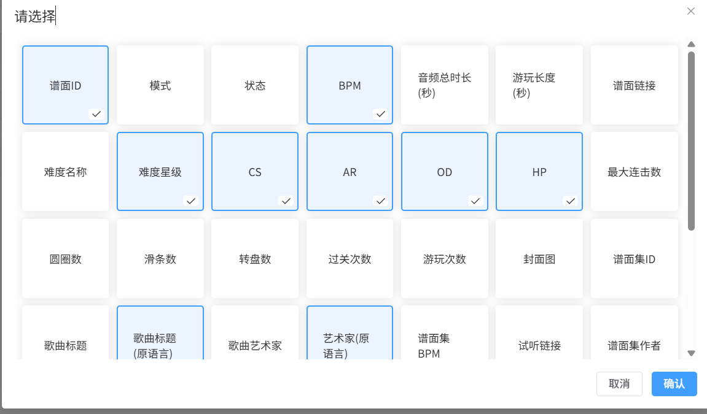

# osu! 谱面信息获取工具

[OsuTool](https://github.com/2710165659/OsuTool) 是一个基于 Vue3 和 Cloudflare Worker 的 osu! 谱面信息获取工具，支持通过谱面 ID 快速查询谱面详细信息。

## 项目简介

- **前端**：Vue3 + Vite + JavaScript
- **后端**：Cloudflare Worker（Serverless）
- **功能**：
  - 支持输入谱面 ID 查询识别谱面信息
  - 展示谱面基本信息（标题、作者、难度、时长、BPM、AR、OD、CS、HP 等）
  - 表格功能，支持添加行和列、拖拽排序、调整列宽、对齐等
  - 查询结果可一键复制
  - 可支持绝大部分谱面信息

## 在线体验

> [点击体验 Demo](https://osutool.xywork.top/)

## 使用方法

1. 输入 osu! 谱面 ID 或谱面链接
2. 选中行-右键菜单获取信息
3. 查看谱面详细信息，支持一键复制

## 截图预览


---



## 项目地址

- GitHub: [https://github.com/2710165659/OsuTool](https://github.com/2710165659/OsuTool)

## 部署说明

1. 克隆仓库
2. 安装依赖并构建前端
   ```sh
   npm install
   npm run build
   ```